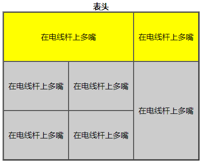

## 1、表格

### 1.1、标准结构

```html
<table>
  <caption>表格标题</caption>
  
  <thead>
    <tr>
    <td></td>
    <td></td>
    </tr>
  </thead>

  <tbody>
    <tr>
    <td></td>
    <td></td>
    </tr>
  </tbody>

  <tfoot>
    <tr>
    <td></td>
    <td></td>
    </tr>
  </tfoot>
</table>
```

> 写 `<thead> <tbody> <tfoot>`对SEO更好，不写也没问题。 


### 1.2、常见写法

```html
<table width="300px" height="300px" border="5" cellspacing="10px" cellpadding="0" bgcolor="pink" align="center" >
		<tr>
			<td>窗外的麻雀</td>
			<td>窗外的麻雀</td>
			<td>窗外的麻雀</td>
		</tr>
		<tr>
			<td>窗外的麻雀</td>
			<td>窗外的麻雀</td>
			<td>窗外的麻雀</td>
		</tr>
		<tr>
			<td>窗外的麻雀</td>
			<td>窗外的麻雀</td>
			<td>窗外的麻雀</td>
		</tr>
	</table>
```

>width（宽度）
>height（高度）
>border（边框宽度） 
>cellspacing（单元格与单元格的距离）
>cellpadding（内容距边框的距离）
>bgcolor（表格背景颜色）
>align=”left | right | center”
>​	如果直接给表格用align=”center” 表格居中
>​	如果给tr或者td使用 ，tr或者td内容居中。 


## 2、快速建表格的方式

`table>tr*3>td*5 + tab` ： 建立3行5列的表格 


## 3、表头

`<caption></caption>`：位于table标签和tr标签之间

```html
<table>
		<caption>表头</caption>
		<tr>
			<td></td>
			<td></td>
			<td></td>
		</tr>
		<tr>
			<td></td>
			<td></td>
			<td></td>
		</tr>
		<tr>
			<td></td>
			<td></td>
			<td></td>
		</tr>
	</table>
```


## 4、单元格合并

`<td colspan=“2”>填写内容</td>`：合并到同一行的单元格，合并行数为2 

`<td rowspan=“3”>填写内容</td>` ：合并到同一列的单元格，合并列数为3 

```html
<table border="2" cellspacing="0" width="400" height="100" align="center">
	<caption><strong>表头</strong></caption>
		<tr align="center" bgcolor="yellow" height="100">
			<td colspan="2">在电线杆上多嘴</td>
			<!-- <td><strong>2</strong></td> -->
			<td>在电线杆上多嘴</td>
		</tr>

		<tr align="center" bgcolor="#CCC" height="100">
			<td>在电线杆上多嘴</td>
			<td>在电线杆上多嘴</td>
			<td rowspan="2">在电线杆上多嘴</td>
		</tr>

		<tr align="center" bgcolor="#CCC" height="100">
			<td>在电线杆上多嘴</td>
			<td>在电线杆上多嘴</td>
			<!-- <td><strong>3</strong></td> -->
		</tr>
	</table>
```




## 5、表格标题

```html
<tr>
  <th></th>
  <th></th>
  <th></th>
</tr>
```

> 注意：将td改为th 
>
> 特点：标题的文字自动加粗水平居中对齐 


## 6、边框颜色

```html
<table bordercolor=""></table>
```


## 7、内容在上下方向的对齐方式

```html
<tr>
	<td valign="bottom">张三</td>
</tr>
```

> `valign="top | middle | bottom"`


## 8、补充

**细线表格：**

```html
<table width="500" height="300" bgcolor="green" cellspacing="1" >
		<tr bgcolor="white">
			<td></td>
			<td></td>
			<td></td>
			<td></td>
		</tr>
		<tr bgcolor="white">
			<td></td>
			<td></td>
			<td></td>
			<td></td>
		</tr>
		<tr bgcolor="white">
			<td></td>
			<td></td>
			<td></td>
			<td></td>
		</tr>
		<tr bgcolor="white">
			<td></td>
			<td></td>
			<td></td>
			<td></td>
		</tr>
	</table>
```

> 将背景作为边框来实现。


**单元格间隔**：

```css
border-spacing: 10px;
```


**无内容时单元格的设置：**

```css
empty-cells:show/hide  /* 当单元格无内容时，是否显示该单元格的边框区域*/
```

定义单元格行和列的算法（加快运行速度）

```css
table-layout:auto/fixed;
/*定义表格的布局算法，设置为fixed，内容超出单元格的宽度则固定不变，如果没有设置宽度则平均分配；设置auto时则随内容宽度而定。*/
```


**20181010 补充：**

设置表格较小，但是内容过大的话，为了不使的表格被撑大，可以设置一个属性：`table-layout:fixed;` 固定表格的宽高，加快计算机的运行速度。
