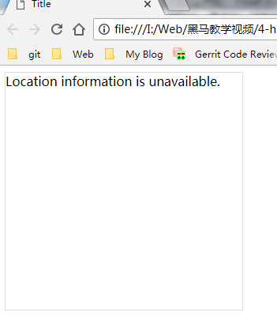
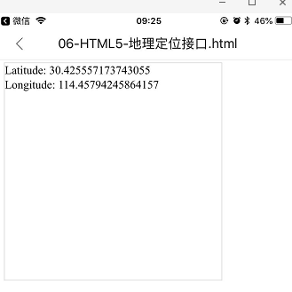

## 一、网络监听接口

-   ononline：网络连通时触发
-   onoffline：网络断开时触发

```js
window.addEventListener("online", function(){});
window.addEventListener("offline", function(){});
```


## 二、全屏接口

全屏操作的主要方法和属性：

**1、requestFullScreen();  开启全屏显示**

但是不同的浏览器需要添加的前缀不同：

chrome：webkit ， firefox：moz ，IE：ms

于是就变成了 `webkitRequestFullScreen()`， `mozRequestFullScreen()`， `msRequestFullScreen()`。由于使用的方法不同，所以要做兼容性处理。

**2、cancelFullScreen(); 退出全屏显示**

退出全屏的操作也要加前缀，**并且调用其的元素只能是 ducument**，而不能是其他元素。

**3、fullscreenElement；是否是全屏状态**

判断是否为全屏状态也要加前缀，并且**调用其的元素只能是 ducument，而不能是其他元素**。（注意只有 firefox是驼峰写法，最符合 html5 标准）


```html
<!DOCTYPE html>
<html lang="en">
<head>
    <meta charset="UTF-8">
    <title>Title</title>
</head>
<body>
<div>
    <br>
    <input type="button" value="进入全屏" id="btn1">
    <input type="button" value="退出全屏" id="btn2">
    <input type="button" value="是否全屏" id="btn3">
</div>

<script>
    // 开启全屏显示
    document.querySelector("#btn1").addEventListener("click", function () {
        var divObj = document.querySelector("div");
        if (divObj.requestFullscreen) {
            divObj.requestFullscreen();
        }
        else if (divObj.webkitRequestFullScreen) {
            divObj.webkitRequestFullScreen();
        }
        else if (divObj.mozRequestFullScreen) {
            divObj.mozRequestFullScreen();
        }
        else if (divObj.msRequestFullScreen) {
            divObj.msRequestFullScreen();
        }
    }, false);

    // 退出全屏显示
    document.querySelector("#btn2").addEventListener("click", function () {
        if (document.cancelFullscreen) {
            document.cancelFullscreen();
        }
        else if (document.webkitCancelFullScreen) {
            document.webkitCancelFullScreen();
        }
        else if (document.mozCancelFullScreen) {
            document.mozCancelFullScreen();
        }
        else if (document.msCancelFullScreen) {
            document.msCancelFullScreen();
        }
    }, false);

    // 是否是全屏状态
    document.querySelector("#btn3").addEventListener("click", function () {
        if (document.fullscreenElement || document.webkitFullscreenElement || document.mozFullScreenElement || document.msFullscreenElement) {
            console.log("yes");
        }
        else {
            console.log("no");
        }
    }, false);
</script>
</body>
</html>
```


## 三、应用程序缓存

主要应用在：当离线模式下，页面需要选择性缓存一些内容的时候。

```html
<!DOCTYPE html>
<!--manifest="应用程序缓存清单文件的路径  建议文件的扩展名是appcache,这个文件的本质就是一个文本文件"-->
<html lang="en" manifest="demo.appcache">
<head>
    <meta charset="UTF-8">
    <title>Title</title>
    <style>
        img{
            width: 300px;
            display: block;
        }
    </style>
</head>
<body>


</body>
</html>
```

demo.appcache 文件

```
CACHE MANIFEST
#上面一句代码必须是当前文档的第一句
#后面写注释

#需要缓存的文件清单列表
CACHE:
#下面就是需要缓存的清单列表
../images/l1.jpg
../images/l2.jpg
# *:代表所有文件

#配置每一次都需要重新从服务器获取的文件清单列表
NETWORK:
../images/l3.jpg

#配置如果文件无法获取则使用指定的文件进行替代
FALLBACK:
../images/l4.jpg ../images/banner_1.jpg
# /:代表所有文件

```


## 四、文件读取接口

**FileReader**：主要是读取文件内容。

使用 `new FileReader` 生成的对象有下列几个方法，用于读取文件：

-   `readAsText()`：读取文本文件，返回文本字符串，默认编码是UTF-8

-   `readAsBinaryString()`：读取任意类型的文件，返回二进制字符串。**这个方法不是用来读取文件展示给用户看，而是存储文件**。例如：读取文件的内容，获取二进制数据，传递给后台，后台接收了数据之后，再将数据存储。

-   `readAsDataURL()`：读取文件获取一段以data开头的字符串，这段字符串的本质就是DataURL。

    DataURL是一种**将文件(这个文件一般就是指图像或者能够嵌入到文档的文件格式)嵌入到文档的一种格式**。DataURL是**将资源转换为base64编码的字符串形式，并且将这些内容直接存储在url中，这样做可以优化网站的加载速度和执行效率。**

-   `abort()`：中断文件读取。


比如现在有一需求，选择图片并实时显示（类似在网页上更换头像，可以实时预览图片）：

```html
<body>
<!--需求：即时预览：
即时：当用户选择完图片之后就立刻进行预览的处理 >>onchange
预览：通过文件读取对象的readAsDataURL()完成-->
<form action="">
    文件： <input type="file" name="myFile" id="myFile" onchange="getFileContent();"> <br>
    <div></div>
    <input type="submit">
</form>

<script>
    var div=document.querySelector("div");
    function getFileContent(){
       /*1.创建文件读取对象*/
        var reader=new FileReader();
        /*2.读取文件，获取DataURL
        * 2.1.说明没有任何的返回值:void：但是读取完文件之后，它会将读取的结果存储在文件读取对象的result中
        * 2.2.需要传递一个参数（binary large object）:文件(图片或者其它可以嵌入到文档的类型)
        * 2.3:文件存储在file表单元素的files属性中，它是一个数组，当有 multiple 属性的时候这个数组的值会有多个。*/
        var file=document.querySelector("#myFile").files[0];
        reader.readAsDataURL(file);
        /*获取数据*/
        /*FileReader提供一个完整的事件模型，用来捕获读取文件时的状态
        * onabort:读取文件中断片时触发
        * onerror:读取错误时触发
        * onload:文件读取完成且成功时触发
        * onloadend:文件读取完成时触发，无论成功还是失败
        * onloadstart:开始读取时触发
        * onprogress:读取文件过程中持续触发*/
        reader.onload=function(){
            //console.log(reader.result);
            /*展示*/
            document.querySelector("img").src=reader.result;
        }
		// 模拟进度条显示
        reader.onprogress=function(e){
            var percent= (e.loaded/ e.total)*100+"%";
            div.style.width=percent;
        }
    }
</script>
</body>
```

>   onchange：就是当文件内容发生变化时触发的事件。


## 五、地理定位接口

方法：

```js
// 参数1：获取地理信息成功之后的回调函数
// 参数2：获取地理信息失败之后的回调函数
// 参数3：调整获取当前地理信息的方式
//       enableHighAccuracy:true/false:是否使用高精度
//       timeout:设置超时时间，单位ms
//       maximumAge:可以设置浏览器重新获取地理信息的时间间隔，单位是ms
navigator.geolocation.getCurrentPosition(success,error,option);
```

示例：

```html
<!DOCTYPE html>
<html lang="en">
<head>
    <meta charset="UTF-8">
    <title>Title</title>
    <style>
        .de {
            width: 300px;
            height: 300px;
            border: 1px solid #ddd;
        }
    </style>
</head>
<body>
<div id="demo" class="de"></div>
<script>
    var x = document.getElementById("demo");

    function getLocation() {
        /*能力测试*/
        if (navigator.geolocation) {
            navigator.geolocation.getCurrentPosition(showPosition, showError, {
                /*enableHighAccuracy:true,
                timeout:3000*/
            });
        }
        else {
            x.innerHTML = "Geolocation is not supported by this browser.";
        }
    }

    /*成功获取定位之后的回调*/
    function showPosition(position) {
        x.innerHTML = "Latitude: " + position.coords.latitude +
            "<br />Longitude: " + position.coords.longitude;
    }

    /*获取定位失败之后的回调*/
    function showError(error) {
        switch (error.code) {
            case error.PERMISSION_DENIED:
                x.innerHTML = "User denied the request for Geolocation."
                break;
            case error.POSITION_UNAVAILABLE:
                x.innerHTML = "Location information is unavailable."
                break;
            case error.TIMEOUT:
                x.innerHTML = "The request to get user location timed out."
                break;
            case error.UNKNOWN_ERROR:
                x.innerHTML = "An unknown error occurred."
                break;
        }
    }

    getLocation();
</script>

</body>
</html>
```

>   获取地理位置成功，将会把获取到的地理信息以参数的形式传递给回调函数：
>
>   position.coords.latitude 纬度
>   position.coords.longitude 经度
>   position.coords.accuracy 精度
>   position.coords.altitude 海拔高度

>   注意：由于地理位置属于用户的隐私信息，一般浏览器不允许获取，只有在浏览器中开启之后才能够获取。然而，在中国使用PC端的浏览器是不允许获取到用户的信息的，手机端可以。






>   那么怎么在PC端的浏览器获取到用户的位置信息呢？
>
>   调用百度地图，高德地图等第三方提供的API接口获取用户信息。


