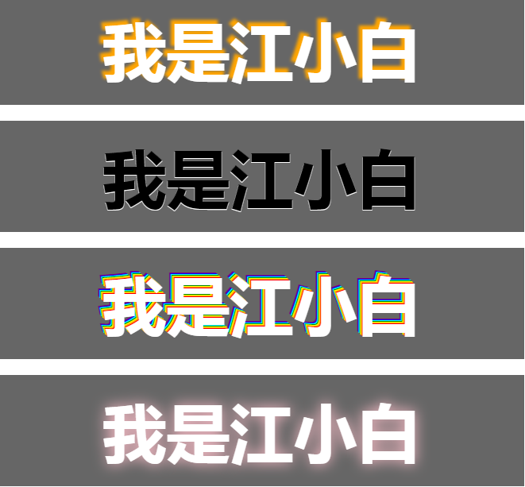
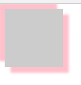

## 一、颜色模式

颜色模式有两种：

-   RGBA

`rgba(0,0,0,0.5); //黑色，透明度0.5`

-   HSLA（颜色(0~360)，饱和度(0%~100%)，明度(0%~100%)，透明度(0~1)）

**红橙黄绿青蓝紫红**：颜色从 0~360 顺序，各占30度。比如红色为0，黄色为120，绿色为240。

`HSLA(0, 100%, 50%, 1); // 红色不透明，饱和度100%，亮度50%`

明度默认是50%,一般建议保留50的值，如果加到100后，变成白色，降到0后为黑色。

>   注意：
>
>   1、RGBA和HSLA中的透明度**不会影响子元素的透明度，不具继承性；**
>
>   2、**opacity 会影响子元素的透明度，子元素会继承父元素的透明度。**
>
>   3、**transparent 不可调节透明度，始终完全透明。**（`color: transparent;`）


## 二、文字阴影

语法：

```css
/*阴影可以叠加，使用逗号隔开*/
text-shadow: offsetX offsetY blur color, 
			 offsetX1 offsetY1 blur1 color1, ...
```

>   `offsetX`：X方向偏移度
>
>   `offsetY`：Y方向偏移度
>
>   `blur`：阴影的模糊度
>
>   `color`：阴影颜色


示例：

```html
<!DOCTYPE html>
<html lang="en">

<head>
    <meta charset="UTF-8">
    <title>Title</title>
    <style>
        * {
            padding: 0;
            margin: 0;
        }

        .demo {
            width: 600px;
            padding: 30px;
            background-color: #666;
            margin: 20px auto;
            text-align: center;
            font: bold 80px/100% "微软雅黑";
            color: #fff;
        }

        /*添加阴影 text-shadow:offsetX offsetY blur color*/
        .demo1 {
            text-shadow: -5px -5px 5px orange;
        }

        .demo2 {
            color: #000;
            text-shadow: 0 1px 0 #fff;
        }
		/*立体浮雕效果*/
        .demo3 {
            text-shadow: -1px -1px 0 red, 
              			-2px -2px 0 orange, 
              			-3px -3px 0 yellow,
            			-4px -4px 0 green, 
              			-5px -5px 0 cyan, 
              			-6px -6px 0 blue, 
              			-7px -7px 0 purple;
        }
        .demo4 {
            text-shadow: 0 0 30px pink;
        }
    </style>
</head>

<body>
    <div class="demo demo1">我是江小白</div>
    <div class="demo demo2">我是江小白</div>
    <div class="demo demo3">我是江小白</div>
    <div class="demo demo4">我是江小白</div>
</body>

</html>
```




## 三、盒模型

1、在默认情况下，CSS 设置的盒子宽度仅仅是内容区的宽度，而非盒子的宽度。同样，高度类似。真正盒子的宽度（在页面呈现出来的宽度）和高度，需要加上一些其它的属性。例如：

-   padding + border + width = 盒子的宽度
-   padding + border + height = 盒子的高度

很明显，这不直观，很容易出错，造成网页中其它元素的错位。


2、CSS3中可以通过`box-sizing` 来指定盒模型，即可指定为`content-box、border-box`，这样我们计算盒子大小的方式就发生了改变。

-   `content-box`：对象的实际宽度等于设置的 width 值和 border、padding 之和。**（盒子实际的宽度 = 设置的 width + padding + border）**
-   `border-box`： 对象的实际宽度就等于设置的width值，即使定义有 border 和 padding 也不会改变对象的实际宽度。**（盒子实际的宽度 = 设置的 width）**，相应的盒子的内容的宽度或高度区间会变小。


3、浏览器的兼容性
IE8 及以上版本支持该属性，Firefox 需要加上浏览器厂商前缀 `-moz-`，对于低版本的 IOS 和 Android 浏览器也需要加上 `-webkit-`

欧朋浏览器：前缀 -o-

IE浏览器：前缀 -ms-


## 四、边框圆角

使用 `border-radius` 属性来设置圆角。

```css
/*添加边框圆角*/
/*1.设置一个值：四个角的圆角值都一样*/
border-radius: 10px;
border-radius: 50%;

/*2.设置两个值:第一个值控制左上/右下，第二个值控制右上/左下*/
border-radius: 10px 30px;

/*3.设置三个值：第一个值控制左上，第二值控制右上/左下，第三个值控制右下*/
border-radius: 10px 40px 60px;

/*4.设置四个值：左上  右上 右下 左下*/
border-radius: 10px 30px 60px 100px;

/*5.添加/是用来设置当前水平和垂直方向的半径值：水平x方向/垂直y方向*/
border-radius: 100px/50px;

/*6.添加某个角点的圆角*/
border-radius: 0px 50px 0px 0px;
/*或者：border-上下-左右-radius:*/
border-top-right-radius: 100px;
border-top-left-radius: 100px;*/
border-bottom-left-radius: 100px;
border-bottom-right-radius: 100px;

/*7.设置某个角点的两个方向上的不同圆角*/
border-top-right-radius: 100px 50px;  /*设置上偏移100px，右偏移50px样式的圆角*/
border-bottom-left-radius: 80px 40px; /*设置下偏移80px，左偏移40px样式的圆角*/
border-bottom-right-radius: 60px 30px;/*设置下偏移60px，右偏移30px样式的圆角*/
border-top-left-radius: 40px 20px;    /*设置上偏移40px，左偏移20px样式的圆角*/

/*8.如果想设置四个角点的不同方向上的不同圆角值*/
/*分别是水平方向的偏移：左上，右上，右下，左下 ，垂直方向的偏移：左上，右上，右下，左下*/
border-radius: 100px 0px 0px 0px/20px 0px 0px 0px;
```


## 五、边框阴影

语法：

```css
box-shadow:h v blur spread color inset
```

>   `h`：水平方向的偏移值（必填）
>   `v`：垂直方向的偏移值（必填）
>   `blur`：模糊度--可选，默认0 （必填）
>   `spread`：阴影的尺寸，扩展和收缩阴影的大小--可选 默认0
>   `color`：颜色--可选，默认黑色
>   `inset`：内阴影--可选,默认是外阴影


当然，box-shadow 和 text-shadow 一样，也是可以添加多个的，之间用逗号隔开。

```css
box-shadow: 10px 10px 5px pink (inset), 
		   -10px -10px 5px pink; /*spread等不需要，省略不写*/
```




