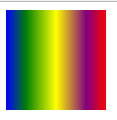
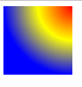
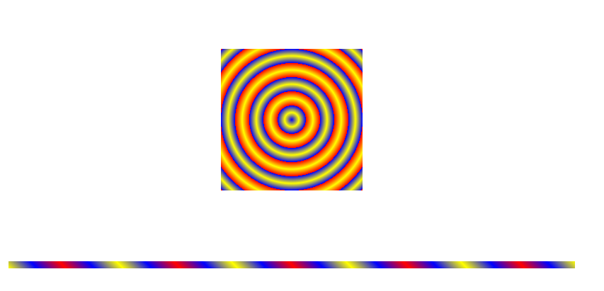
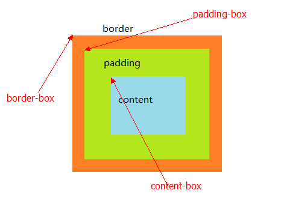

## 一、渐变

渐变是CSS3当中比较丰富多彩的一个特性，通过渐变我们可以实现许多炫丽的效果，有效的减少图片的使用数量，并且具有很强的适应性和可扩展性。可分为**线性渐变**、**径向渐变**。

### 1、线性渐变

线性渐变：**指沿着某条直线朝一个方向产生渐变效果。**

**语法：**

```css
background: linear-gradient(direction, color1, color2 [stop], color3...);
```

**参数说明**：

- `direction`：表示线性渐变的方向，
  - `to left`：设置渐变为从右到左。相当于: 270deg;
  - `to right`：设置渐变从左到右。相当于: 90deg;   
  - `to top`：设置渐变从下到上。相当于: 0deg;
  - `to bottom`：设置渐变从上到下。相当于: 180deg。这是默认值。
  - `45deg` : 45度方向渐变。
- `color1`：起点颜色。
- `color2`：过渡颜色，指定过渡颜色的位置 stop.
- `color3`：结束颜色。你还可以在后面添加更多的过渡颜色和位置，表示多种颜色的渐变。


**示例：**

```css
background: linear-gradient(to right, blue, green 20%, yellow 50%, purple 80%, red);
```




### 2、径向渐变

径向渐变：**指从一个中心点开始沿着四周产生渐变效果。**

**语法：**

```css
background: radial-gradient(shape size at position, start-color, ..., color [stop] ..., last-color);
```

**参数说明：**

- `shape`：渐变的形状。
  - `ellipse`表示椭圆形，
  - `circle`表示圆形。默认为**ellipse**，

    **如果元素宽高相同为正方形，则ellipse和circle显示一样；**

    	如果元素宽高不相同，默认效果为 ellipse。**

- size：渐变的大小，即渐变到哪里停止，它有四个值。
  - `closest-side`：最近边； 
  - `farthest-side`：最远边； 
  - `closest-corner`：最近角；
  - `farthest-corner`：最远角。默认是**最远角**。


- `at position`：渐变的中心位置。比如：
  - `at top left`: 中心为元素左上角位置
  - `at center center`：中心为元素中心位置
  - `at 5px 10px`: 中心为偏移元素左上角位置右边5px， 下边10px位置。


- `start-color` ：起始颜色
- `color` ：渐变颜色，可选起始位置 stop。
- `last-color`: 结束颜色。

>   注意：各个参数之间用**空格隔开**，而不是逗号隔开。


**示例：**

```css
background: radial-gradient(circle farthest-side at right top, red, yellow 50%, blue);
```




### 3、重复渐变

**语法：**

```css
repeating-linear-gradient /*线性重复渐变*/
repeating-radial-gradient /*径向重复渐变*/
```

重复的话，就需要**有一个重合的百分百**作为分界线。然后自动按照比例重复渐变。


**示例：**

```html
    <style>
        div:first-of-type {
            width: 200px;
            height: 200px;
            margin: 100px auto;
            /* border: 1px solid blue; */

            background: repeating-radial-gradient(circle closest-side at center center, 
                        blue 0%, yellow 10%, blue 20%,
                        red 20%, yellow 30%, red 40%);
        }

        div:last-of-type {
            width: 800px;
            height: 10px;
            margin: 100px auto;
            /* border: 1px solid blue; */

            background: repeating-linear-gradient(45deg,
                        yellow 0%, blue 5%, red 10%,
                        red 10%, blue 15%, yellow 20%);
        }
    </style>
</head>
<body>
    <div></div>
    <div></div>
</body>
```




## 二、background 属性

### 1、复习background属性

```css
/*添加背景颜色*/
background-color: #fff;

/*添加背景图片*/
background-image: url("./images/img.jpg");

/*设置背景平铺*/
background-repeat：repeat(默认) | no-repeat | repeat-x | repeat-y | round | space
/*新增两个值：
	round:会将图片进行缩放之后再平铺。保证图片完整紧凑排列。
	space:图片不会缩放平铺，只是会在图片之间产生相同的间距值。
*/

/*背景定位*/
background-position：left | right | center（默认） | top | bottom 

/*背景是否滚动*/
background-attachment:scroll（默认） | fixed 
/* 说明：
	scroll: 背景图的位置是基于盒子（假如是div）的范围进行显示；
	fixed：背景图的位置是基于整个浏览器body的范围进行显示，如果背景图定义在div里面，而显示的位置在浏览器范围内但是不在div的范围内的话，背景图无法显示。
*/
```

>   **local与scroll的区别**：当滚动的是当前盒子（div）里面的内容的时候，
>
>   `local`:背景图片会跟随内容一起滚动；
>
>   `scroll`:背景图片不会跟随内容一起滚动。


### 2、新增的background属性

#### 2.1、background-size

CSS里的 `background-size` 属性能够让程序员决定如何在指定的元素里展示，它通过各种不同是属性值改变背景尺寸呈现的大小。往往建议不要将图放大，如果有需要，尽量让图缩小，以保证图片的精度。

```css
/*设置背景图片的大小：宽度/高度   宽度/auto(保持比例自动缩放)*/
background-size: 100px 50px;
background-size: 100px;

/*设置百分比，是参照父容器可放置内容区域的百分比*/
background-size: 50% 50%;

/*设置contain:按比例调整图片大小，使用图片宽高自适应整个元素的背景区域，使图片全部包含在容器内
1.图片大于容器：有可能造成容器的空白区域,将图片缩小
2.图片小于容器：有可能造成容器的空白区域，将图片放大*/
*background-size: contain;

/*cover:与contain刚好相反，背景图片会按比例缩放自适应填充整个背景区域，如果背景区域不足以包含所有背景图片，图片内容会溢出
1.图片大于容器：等比例缩小，会填满整个背景区域，有可能造成图片的某些区域不可见
2.图片小于容器：等比例放大，填满整个背景区域，图片有可能造成某个方向上内容的溢出*/
background-size: cover;
```


#### 2.2、background-origin 

作用：**提升用户的响应区域。**

我们在 background-position 定位的时候，都是默认定位原点在元素的左上角来定位的。可不可以调节定位的位置呢？

`background-origin`：可以调节定位原点的位置。

**语法：**

```css
background-origin: padding-box|border-box|content-box;
```

- `border-box`：从border的左上角位置开始填充背景，会与border重叠；
- `padding-box`：从padding的左上角位置开始填充背景，会与padding重叠；
- `content-box`：从内容左上角的位置开始填充背景。




当设置 `background-origin：content-box;` 时，可以将要显示的图片放在盒子中间，如果这时图片是个精灵图的话，旁边会有其他的图干扰，怎么办呢，能不能只显示我需要的精灵图？看下面的 background-clip.


#### 2.3、background-clip

`background-clip`：属性**规定背景的绘制区域.**

虽然是设置裁切，但是控制的是显示。说白了，就是设置最终显示那些区域。

**语法：**

```css
background-clip: border-box|padding-box|content-box;
```

- `border-box`：只显示border及以内的内容
- `padding-box`：只显示padding及以内的内容
- `content-box`：只显示content及以内的内容


所以，回到 2.2 节最后的问题，这时我们再设置 `background-clip:content-box;` 就可以屏蔽其他不要的精灵图了。


**那么为什么要这么做呢？干嘛把 a 标签做的这么大，跟需要的精灵图一样大不好吗？**

还记得手机通讯录右侧的A-Z的列表吗？容易点吗？是不是很容易点错？

我这样做的目的就是**提升用户点击的范围**，但是显示的内容还是以前的，这样可以提高用户的使用体验啊。


#### 2.4、案例：精灵图的使用

需求：为一个块元素设置精灵图背景，精灵图很小，但是需要更大的展示区域，能够以更大的范围响应用户的需要，但是只需要显示指定的背景图片。

```html
<!DOCTYPE html>
<html lang="en">
<head>
    <meta charset="UTF-8">
    <title>Document</title>
    <style>
        /*提升移动端响应区域的大小*/
        a {
            display: block;
            width: 50px;
            height: 50px;   
            background: url("./images/sprites.png") -22px 0;
            background-repeat: no-repeat;
            padding: 15px;
            box-sizing: border-box;
            background-origin: content-box;
            background-clip: content-box;
        }
    </style>
</head>
<body>
    <a href="#"></a>
</body>
</html>
```


由图可见，返回箭头下 a 的范围变大了，那么用户点击的响应区域也就大了。


## 三、透明度

css3新增透明度属性：`opacity`

```css
opacity:0; /*全透明*/
opacity:1; /*不透明*/
```

为了兼容IE8及以下的浏览器，可以使用 filter 属性（谷歌浏览器不识别，仅IE浏览器识别）：

```css
filter: alpha(opacity=0);  等价于  opacity: 0;
filter: alpha(opacity=100);  等价于  opacity: 1;
```


