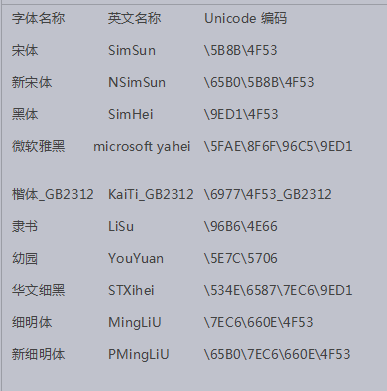
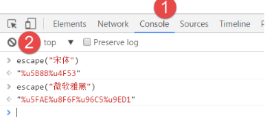
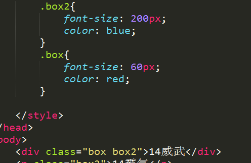
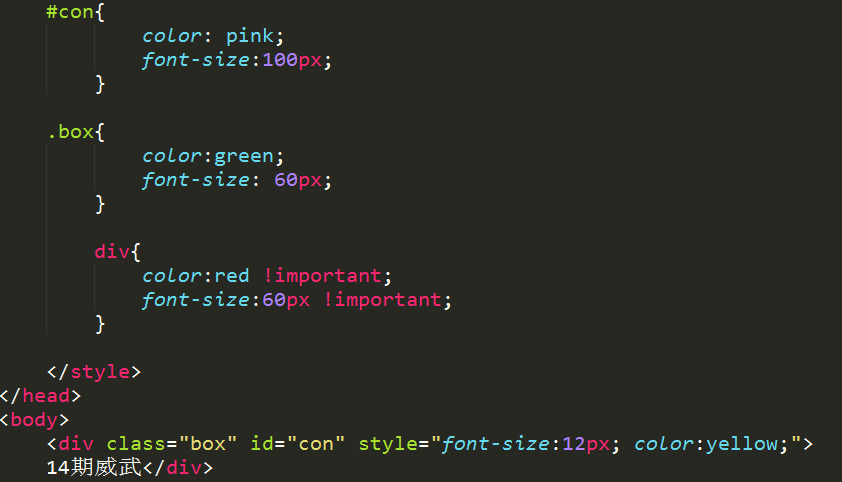
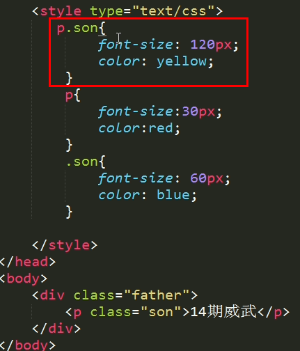
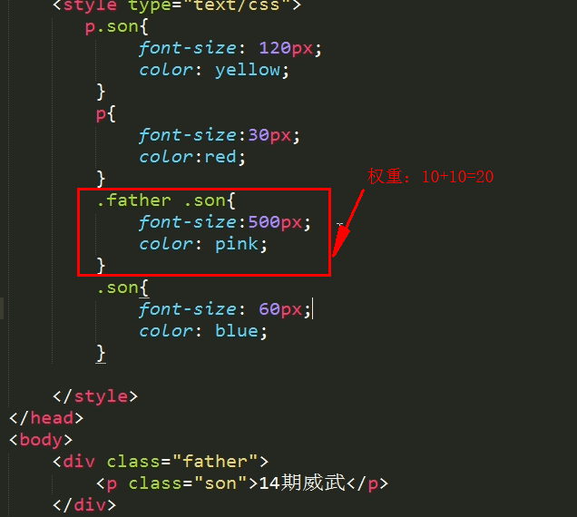
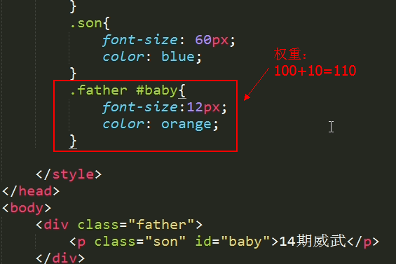

# 一、文本元素

## 1、属性

```css
font-size: 50px;         /*文字大小*/
font-weight: 700;       /*值从100-900，文字粗细,700约等于Bold，不推荐使用font-weight:bold; */
font-family:微软雅黑;    /*文本的字体*/
font-style: normal | italic;  /*normal:默认值  italic:斜体*/
line-height: 50px            /*行高*/
```


## 2、文本属性连写

```css
/* 格式：font: font-style font-weight  font-size/line-height  font-family; */
font: italic 700 50px/40px  微软雅黑;
```

> 注意：font:后边写属性的值。一定按照书写顺序。
> **PS：文本属性连写中文字大小和字体为必写项。**


## 3、文字的表达方式

**1. 直接写中文名称**

```css
font-family: 微软雅黑;
```

**2. 写字体的英文名称**

```css
font-family: microsoft yahei;
```

**3. unicode 编码（解析更快）**




> **如何找到某一字体相对应的unicode编码呢？**
>
> 第一步：一般打开浏览器，按F12
> 第二步：找到console
> 第三步：输入escape(“宋体”); 注意英文的括号和双引号。




**add 20180904：**

white-space: nowrap;  ：设置文本不换行。

text-overflow ：属性规定当文本溢出包含元素时发生的事情。 

- clip: 修剪文本
- ellipsis ：显示省略符号来代表被修剪的文本 
- string ：使用给定的字符串来代表被修剪的文本。 


# 二、标签分类

## 1、块元素

```css
/*典型代表:*/ div, h1-h6, p, ul, li, table, html5的结构标签
```

> **特点:**
> 1.独占一行；
> 2.可以设置宽高；
> 3.嵌套（包含）下，子块元素**宽度**（没有定义情况下）和父块元素**宽度**默认一致。

## 2、行内元素

```css
/*典型代表*/ a,span, b, strong, i, em
```

> **特点：**
> 1.在一行上显示；
> 2.不能直接设置宽高（需要转行内块）；
> 3.元素的宽和高就是内容撑开的宽高。

## 3、行内块元素(内联元素--置换元素)

```css
/*典型代表*/  input, img, textarea, select, button
```

> **特点：**
> 1.在一行上显示；
> 2.可以设置宽高。

PS：vertical-align 只对行内块元素生效。by 20180920.


## 4、三者相互转换

**1. 块元素转行内元素**

```css
display:inline;
```

**2. 行内元素转块元素**

```css
display:block;
```

**3. 块和行内元素转行内块元素（用的最多）**

```css
display:inline-block;
```


**add 20180905：**

`display:table;` 的几个用法：

原文链接：https://www.cnblogs.com/stephen666/p/6995388.html

display：table 解决了一部分需要使用表格特性但又不需要表格语义的情况。

**一、父元素宽度固定，想让若干个子元素平分宽度**

通常的做法是手动设置子元素的宽度，如果设置百分数不一定能整除，设置具体的数值又限制了父元素的宽度固定，很烦。

可以使用display：table来解决：

```css
.parent{display: table;  width: 1000px;}
.son{display: table-cell;}
```

如此一来，就算是三个或者六个元素也可以很方便均分父元素的宽度了。 


**二、块级子元素垂直居中** 

想让一个div或p在父元素中垂直居中一直是很多人头疼的问题（注意直接对块级元素使用vertical-align是不能解决这个问题的，vertical-align定义行内元素的基线相对于该元素所在行的基线的垂直对齐），同样可以使用display：table方便解决：

```css
.parent {display: table;}
.son {display: table-cell; vertical-align: middle;}
```

将块级子元素的display设置为table-cell之后再使用vertical-align就可以了。

注意：虽然display：table解决了避免使用表格的问题，但有几个需要注意的：

（1）display: table时padding会失效
（2）display: table-row时margin、padding同时失效
（3）display: table-cell时margin会失效。


# 三、CSS三大特性

## 1、层叠性

当多个样式作用于同一个（同一类）标签时，样式发生了冲突，总是执行后边的代码(后边代码层叠前边的代码)。**和标签调用选择器的顺序没有关系。**




## 2、继承性

  **继承性发生的前提是包含（嵌套关系）**
   ★ 文字颜色可以继承
   ★ 文字大小可以继承
   ★ 字体可以继续
   ★ 字体粗细可以继承
   ★ 文字风格可以继承
   ★ 行高可以继承
   **总结：文字的所有属性都可以继承。**


**特殊情况：**

1. h系列不能继承文字大小。（继承了但是不显示）

> 实际上：h1显示的是你设置的 font-size * 2；
> h2显示的是：你设置的 font-size * 1.5
> .......

2. a链接标签不能继承文字颜色（继承了但是不显示，链接标签默认是蓝色）


## 3、优先级

```html
 默认样式 < 标签选择器 < 类选择器 < id选择器 < 行内样式< !important  
 权重：      0         1            10        100      1000     1000以上
```

> **PS：这里的数字不是准确的，实际上100个标签选择器叠加的权重也比不过一个类选择器的权重。**



> 特点：
>
> 1.继承的权重为0（当没有自己的样式时，听继承的；有自己的样式时，继承的权重为0）
> 2.权重会叠加。



（上图：类选择器10+标签选择器1=11，所以最后14期威武显示的是黄色）







**add 20180905：**

IE6的兼容性：

- IE6有默认最小高度，类似于谷歌最小显示12px，此时可以通过overflow:hidden解决。
- 不支持min-height属性
- 不支持fixed效果

- 不支持important

- 不支持除a标签以外的hover
- 当子元素的高度或者宽度超过父元素给的宽高时，会直接撑大父元素*/

