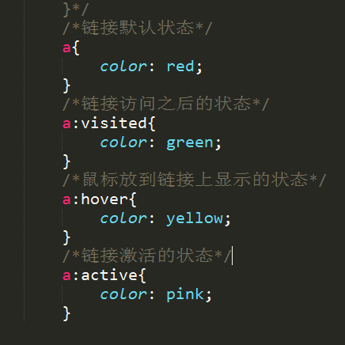
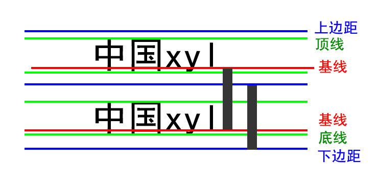
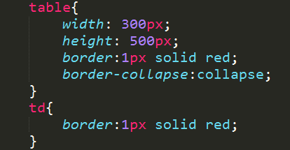
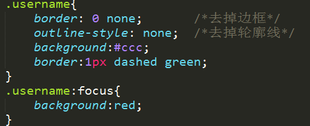
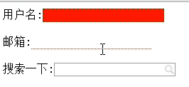
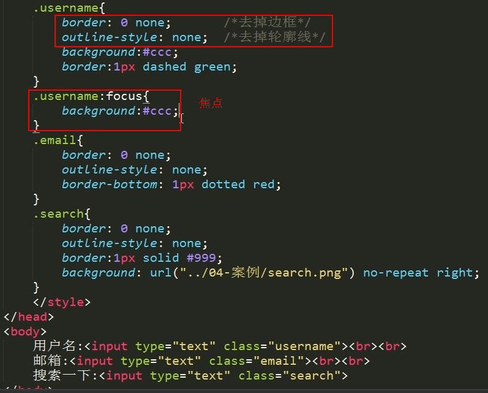
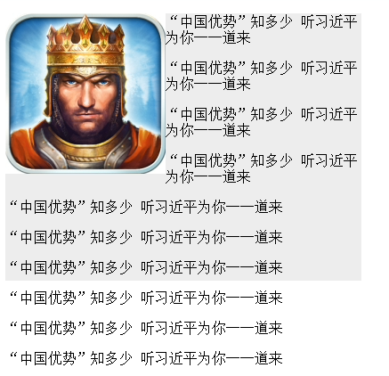
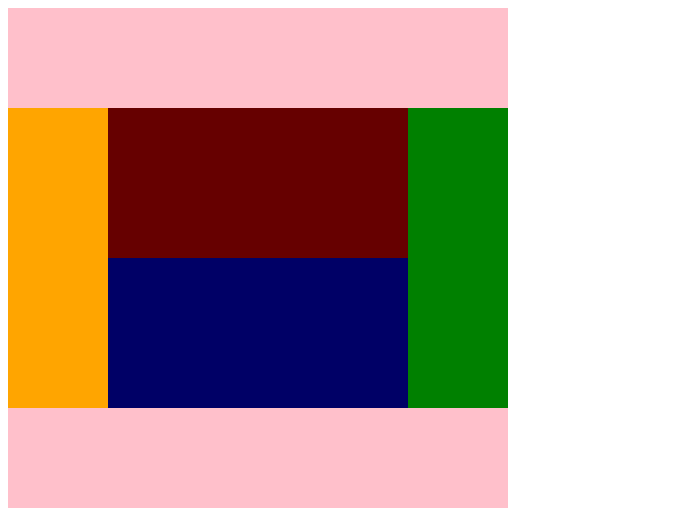
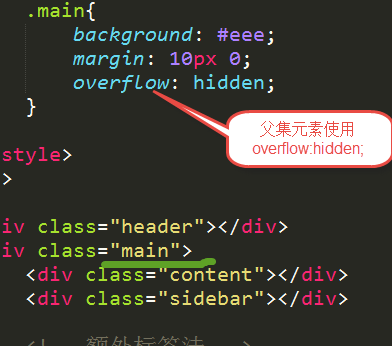
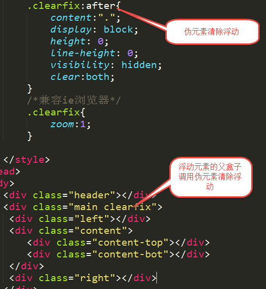

>大家好，这里是「 从零开始学 Web 系列教程 」，并在下列地址同步更新......
>
> - github：https://github.com/Daotin/Web
> - 微信公众号：[Web前端之巅](https://github.com/Daotin/pic/raw/master/wx.jpg)
> - 博客园：http://www.cnblogs.com/lvonve/
> - CSDN：https://blog.csdn.net/lvonve/
>
> 在这里我会从 Web 前端零基础开始，一步步学习 Web 相关的知识点，期间也会分享一些好玩的项目。现在就让我们一起进入 Web 前端学习的冒险之旅吧！


# 一、链接伪类	

```css
a:link{属性:值;}       /*链接默认状态	( a{属性:值}效果是一样的。)*/ 
a:visited{属性:值;}     /*链接访问之后的状态*/
a:hover{属性:值;}      /*鼠标放到链接上显示的状态*/
a:active{属性:值;}      /*链接激活的状态*/
：focus{属性:值；}     /*获取焦点*/
```

> **注意：**
> 1.`a:visited`之后要想回到之前的状态，需要清除缓存。
> 2.写的顺序要按照`link,visited,hover,active`的顺序来写，否则可能不显示。




- **文本修饰**

```css
text-decoration:  none | underline | line-through | ...... /* 链接下划线/删除线/...... */
```


# 二、背景属性

```css
background-color：    /*背景颜色*/
background-image：    /*背景图片*/
background-repeat：    repeat(默认)  |  no-repeat |   repeat-x   |  repeat-y     /*背景平铺*/
background-position：  left  |  right  |  center（默认）  |  top  | bottom  /*背景定位*/
background-attachment:   scroll（默认）  |  fixed   /*背景是否滚动*/
```

- background-position

>`background-position: right;` // 方位值只写一个的时候，另外一个值默认居中。
>`background-position: right bottom` // 写2个方位值的时候，顺序没有要求
>`background-position: 20px 30px` // 写2个具体值的时候，第一个值代表水平方向，第二个值代表垂直方向

- background-attachment 

> `scroll`: 背景图的位置是基于盒子（假如是div）的范围进行显示
> `fixed`：背景图的位置是基于整个浏览器body的范围进行显示，如果背景图定义在div里面，而显示的位置在浏览器范围内但是不在div的范围内的话，背景图无法显示。


## 1、背景属性连写

```css
background: red url("1.png") no-repeat 30px 40px scroll;
```

> PS：连写的时候没有顺序要求，url为必写项


---

# 三、行高

>浏览器默认文字大小：16px

```
行高：是基线与基线之间的距离
行高 = 文字高度+上下边距
```




## 1、行高的单位

| 行高单位 | 文字大小 | 值              |
| ---- | ---- | -------------- |
| 20px | 20px | 20px           |
| 2em  | 20px | 20px*2=40px    |
| 150% | 20px | 20px*150%=30px |
| 2    | 20px | 20px*2=40px    |

> **总结:**单位除了像素以外，行高都是与文字大小与前面数值的乘积。


| 行高单位 | 父元素文字大小（定义了行高） | 子元素文字大小（子元素未定义行高时） | 行高   |
| ---- | -------------- | ------------------ | ---- |
| 40px | 20px           | 30px               | 40px |
| 2em  | 20px           | 30px               | 40px |
| 150% | 20px           | 30px               | 30px |
| 2    | 20px           | 30px               | 60px |

> 总结:不带单位时，行高是和子元素文字大小相乘，em和%的行高是和父元素文字大小相乘。行高以像素为单位，就是定义的行高值。
>
> **PS: 推荐行高使用像素为单位。**


---

# 四、盒子模型

## 1、border（边框）

```css
border-top-style:  solid   /*实线*/
               		dotted  /*点线*/
               		dashed  /*虚线*/
                        none /*无边框*/
border-top-color   /*边框颜色*/
border-top-width   /*边框粗细*/
```

> 除了有`top`系列外还有`left,right,bottom`系列

- 边框属性的连写

```css
border-top: 1px solid #fff;
```

> 没有顺序要求，线型为必写项

- 四个边框值相同的写法

```css
border: 1px solid #fff;
```

> PS: 没有顺序要求，线型为必写项


### 边框合并（细线边框）

```css
border-collapse:collapse;
```




### 获取焦点




- label  for  id      获取光标焦点（效果：点击label也可以选择文本框）

```css
<label for="username">用户名：</label><input type="text" class="username" id="username"></input>
```






## 2、padding（内边距）

```css
padding-left |  right |  top  |  bottom
```

- padding连写

```css
padding: 20px;   /*上右下左内边距都是20px*/
padding: 20px 30px;   /*上下20px   左右30px*/
padding: 20px  30px  40px;  /* 上内边距为20px  左右内边距为30px   下内边距为40px*/
padding: 20px  30px   40px  50px;   /*上20px 右30px  下40px  左  50px*/
```


- 内边距撑大盒子的问题

> 盒子的宽度 = 定义的宽度 + 边框宽度 + 左右内边距

- 继承的盒子一般不会被撑大

> 包含（嵌套）的盒子，~~如果子盒子没有定义宽度~~，给子盒子设置左右内边距（内边距不大于子盒子宽度），不会撑大子盒子。至于设置了上下内边距的话是会撑大子盒子的。（不管怎样父盒子永不变）


## 3、margin（外边距）

```
margin-left   | right  |  top  |  bottom
```

- 外边距连写

```css
margin: 20px;    /*上下左右外边距20PX*/
margin: 20px 30px;   /*上下20px  左右30px*/
margin: 20px  30px  40px;     /*上20px  左右30px   下40px*/
margin: 20px  30px   40px  50px; /*上20px   右30px   下40px  左50px*/
```
>注意: 
>`margin: 0 auto;` 盒子居中对齐 
>`text-align:center` 是盒子里面的内容居中


- 垂直方向外边距合并（取最大值）

> 两个盒子垂直布局，一个设置上外边距，一个设置下外边距，取的设置较大的值，而不是相加。


- 嵌套的盒子外边距塌陷

> 嵌套的盒子，直接给子盒子设置垂直方向外边距的时候，会发生外边距的塌陷（父盒子跟着移动）

> **解决方法:**
>
> 1.给父盒子设置边框
>
> 2.给父盒子`overflow:hidden;  `


**add 20180904：**

注意：当父元素没有border-top或者padding-top再或者没有浮动的时候，子元素的margin-top会传递到父元素上面 

```html
<!doctype html>
<html>

<head>
    <meta charset="utf-8">
    <title>无标题文档</title>
    <style type="text/css">
        .a {
            width: 300px;
            height: 100px;
            background-color: red;
            margin-bottom: 140px;
        }

        .b {
            width: 100px;
            height: 40px;
            background-color: blue;
            margin-top: 50px;
        }

        .c {
            width: 300px;
            height: 100px;
            background-color: yellow;
            margin-top: 50px;
        }
    </style>
</head>

<body>
    <!--当父元素没有border-top或者padding-top再或者没有浮动的时候，子元素的margin-top会传递到父元素上面-->
    <div class="a">
        <div class="b"></div>
    </div>
    <div class="c"></div>
</body>

</html>
```


**解决办法：**

- 给父元素加`overflow:hidden;`
- 给父元素加透明边框：`border-top: 1px solid transparent; `


# 五、浮动

## 1、文档流（标准流）

元素自上而下，自左而右，块元素独占一行，行内元素在一行上显示，碰到父集元素的边框换行。


## 2、浮动布局

```css
float:  left   |   right /*浮动方向*/
```

> **特点：**
> 1.元素浮动之后不占据原来的位置（脱标）
> 2.浮动的盒子在一行上显示
> *3.行内元素浮动之后自动转换为行内块元素。*（不推荐使用，转行内元素最好使用`display: inline-block;`）


## 3、浮动的作用

-  文本绕图




- 制作导航（经常使用）

> 把无序列表 ul li 浮动起来做成的导航。

- 网页布局




## 4、清除浮动
清除浮动不是不用浮动，清除浮动产生的问题。
> 问题：当父盒子没有定义高度，嵌套的盒子浮动之后，下边的元素发生位置错误（占据父盒子的位置）。


### 方法一

**额外标签法：**在最后一个浮动元素后添加标签。

```css
clear: left  |  right  | both  /*用的最多的是clear:both;*/
```


### 方法二

给浮动元素的父集元素使用`overflow:hidden;`



> 注意：如果有内容出了盒子，不能使用这个方法。


### 方法三（推荐使用）

伪元素清除浮动。



> : after 相当于在当前盒子后加了一个盒子。


### 清除浮动总结：

- 给父元素高度，缺点：高度无法自适应
- 父元素加 overflow:hidden; 缺点：超出会被隐藏
- 父元素加定位，absolute/fixed，缺点：脱离文档流。
- 父元素加浮动，缺点：可能父元素的父元素继续塌陷
- 父元素加inline-block，缺点：行内块的缺点。
- 浮动元素的最后加一个额外标签，标签使用clear:both; 缺点：结果冗余
- 万能清除法，伪元素清除浮动。


