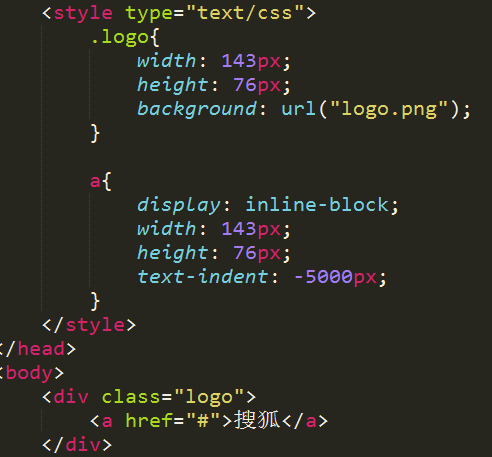
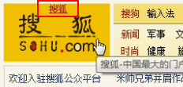
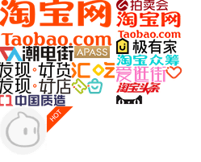
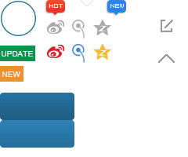

>大家好，这里是「 从零开始学 Web 系列教程 」，并在下列地址同步更新......
>
> - github：https://github.com/Daotin/Web
> - 微信公众号：[Web前端之巅](https://github.com/Daotin/pic/raw/master/wx.jpg)
> - 博客园：http://www.cnblogs.com/lvonve/
> - CSDN：https://blog.csdn.net/lvonve/
>
> 在这里我会从 Web 前端零基础开始，一步步学习 Web 相关的知识点，期间也会分享一些好玩的项目。现在就让我们一起进入 Web 前端学习的冒险之旅吧！


# 一、CSS可见性

```css
overflow: hidden;   /*溢出隐藏 */   
visibility: hidden;  /* 隐藏元素    隐藏之后还保留原来的位置。*/
display: none;      /*	隐藏元素    隐藏之后不保留原来的位置。*/
display: block;    /* 元素可见 */
```
> `display:none`  和`display:block`  常配合js使用（如：鼠标经过时出现，鼠标离开时消失）。


# 二、css之内容移除（logo优化）

## 1、方法一

```css
text-indent: -5000em;
```
> text-indent 属性规定文本块中首行文本的缩进。注意： 负值是允许的。如果值是负数，将向左缩进。





> 之所以要写着两个字是为了 SEO，因为背景图片 SEO 看不懂.


## 2、方法二

**将元素高度设置为0, 使用内边距将盒子撑开，给盒子使用 overflow:hidden; 将文字隐藏。**

```css
.box{
  width:300px;
  height:0;
  padding-top:100px;
  overflow:hidden;
  background:red;
}
```


# 三、CSS精灵图


上图所示为网页的请求原理图，当用户访问一个网站时，需要向服务器发送请求，网页上的每张图像都要经过一次请求才能展现给用户。

然而，一个网页中往往会应用很多小的背景图像作为修饰，当网页中的图像过多时，服务器就会频繁地接受和发送请求，这将大大降低页面的加载速度。为了有效地减少服务器接受和发送请求的次数，提高页面的加载速度，出现了CSS精灵技术（也称CSS Sprites）。

简单地说，CSS精灵是一种处理网页背景图像的方式。它将一个页面涉及到的所有零星背景图像都集中到一张大图中去，然后将大图应用于网页，这样，当用户访问该页面时，只需向服务发送一次请求，网页中的背景图像即可全部展示出来。

通常情况下，这个由很多小的背景图像合成的大图被称为精灵图，如下图所示为淘宝网站中的一个精灵图。




**工作原理：**
CSS 精灵其实是将网页中的一些背景图像整合到一张大图中（精灵图）。然而，各个网页元素通常只需要精灵图中不同位置的某个小图，要想精确定位到精灵图中的某个小图，就需要使用CSS的background-image、background-repeat和background-position属性进行背景定位，其中最关键的是使用`background-position`属性精确地定位。


**举例：**



```html
<!DOCTYPE html>
<html lang="en">
<head>
	<meta charset="UTF-8">
	<title>Document</title>
	<style type="text/css">
		body,ul,li{
			margin: 0;
			padding: 0;
		}

		ul, li{
			list-style: none;
		}

		.box{
			height: 48px;
			background: #222;
			margin-top: 50px;
		}

		.con{
			width: 1182px;
			height: 48px;
			margin: 0 auto;
			position: relative;
		}

		.con ul li{
			float: left;
			
		}

		.con ul li a{
			text-decoration: none;
			color: #fff;
			display: inline-block;
			height: 48px;
			font: 16px/48px microsoft yahei;
			padding: 0 18px;
		}

		.con ul li a:hover{
			background: #2774A2;
		}

		.con .hot{
			position: absolute;
			width: 31px;
			height: 21px;
			background: url("spirit.png") -58px 0;
			left:221px;
			bottom:35px;
		}

		.con .new{
			position: absolute;
			width: 31px;
			height: 21px;
			background: url("spirit.png") -135px 0;
			left:90px;
			bottom:35px;
		}
	</style>
</head>
<body>
	<div class="box">
		<div class="con">
			<ul>
				<li><a href="#">首页</a></li>
				<li><a href="#">Java</a></li>
				<li><a href="#">IOS</a></li>
				<li><a href="#">PHP</a></li>
				<li><a href="#">C/C++</a></li>
				<li><a href="#">UI设计</a></li>
				<li><a href="#">前端与移动开发</a></li>
				<li><a href="#">问答专区</a></li>
				<li><a href="#">Python</a></li>
				<li><a href="#">网络营销</a></li>
				<li><a href="#">活动专区</a></li>
			</ul>
			<div class="hot"></div>
			<div class="new"></div>
		</div>
	</div>
</body>
</html>
```


> PS：之所以选择con作为父盒子而不是box作为父盒子，是因为box的宽度不定，不同的显示器宽度不同，那么new和hot的定位就有问题。


# 四、属性选择器

```css
input[type="text"][class] {
  width: 20px;
  height: 20px;
}  
```

>  选择有 type 属性为 text，并且有 class 属性的标签。

```css
input[type="text"][class="id"] {
  width: 20px;
  height: 20px;
}  
```

> 选择有 type 属性为 text，并且有 class 属性，并且class属性为 id 的标签。


**自定义属性：**

```html
<style>
  p[bb="aa"] {
    font-size:100px;
  }
</style>
<body>
  <p bb="aa"></p>
</body>
```


# 五、CSS滑动门


特点：边上是这种圆弧型的或者其他形状的，可以变换长度的样式。

> PS：浮动之后宽度不是父盒子的宽度，而是内容撑开的宽度。

```html
<!DOCTYPE html>
<html lang="en">
<head>
	<meta charset="UTF-8">
	<title>Document</title>
	<style type="text/css">
		body,ul,li{
			margin: 0;
			padding: 0;
		}
		ul,li{
			list-style: none;
		}
		ul li{
			float: left;
		}
		ul li a{
			display: inline-block;
			height: 35px;
			background: url("bg_r1_c1.png") no-repeat;
			padding-left: 7px;
		}

		ul li a span{
			display: inline-block;
			height: 35px;
			background: url("bg_r1_c2.png") right;
			padding-right: 25px;
			color: #fff;
			line-height: 35px;
		}

		ul li a:hover{
			background: url("bbg_r1_c1.png");
		}

		ul li a:hover span{
			background: url("bbg_r1_c2.png") right;
		}
	</style>
</head>
<body>
	<ul>
		<li><a href="#"><span>网易云音乐</span></a></li>
		<li><a href="#"><span>微信</span></a></li>
		<li><a href="#"><span>蚂蚁花呗</span></a></li>
	</ul>
</body>
</html>
```


**微信案例：**


> 现象：鼠标经过时，背景凸起。

```html
<!DOCTYPE html>
<html lang="en">
<head>
	<meta charset="UTF-8">
	<title>Document</title>
	<style type="text/css">
		body,ul,li,a,span{
			margin: 0;
			padding: 0;
		}
		ul,li{
			list-style: none;
		}
		.nav{
			height: 74px;
			background: url("weixin_bg.jpg");
		}

		.nav-con{
			width: 600px;
			margin: 0 auto;
		}

		li{
			float: left;
			height: 74px;
			line-height: 74px;
			margin-right: 60px;
		}

		li a{
			display: inline-block;
			text-decoration: none;
			color: #fff;
			height: 33px;
			line-height: 33px;
			background: url("bg.png") no-repeat 0 -144px;
			padding-left: 13px;
		}

		a span{
			display: inline-block;
			height: 33px;
			background: url("bg.png") no-repeat right -144px;
			padding-right: 13px;
		}

		a:hover{
			background: url("bg.png") no-repeat 0 -192px;
		}

		a:hover span{
			background: url("bg.png") no-repeat right -192px;
		}
	</style>
</head>
<body>
	<div class="nav">
		<div class="nav-con">
			<ul>
				<li><a href="#"><span>首页</span></a></li>
				<li><a href="#"><span>下载文章</span></a></li>
				<li><a href="#"><span>微信公众公众公众助手</span></a></li>
			</ul>
		</div>
	</div>
</body>
</html>
```


> 注意：CSS滑动门仅适用于span的内容不会超过给定的精灵图的宽度，否则就有破绽。


