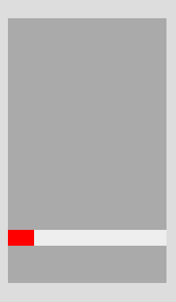
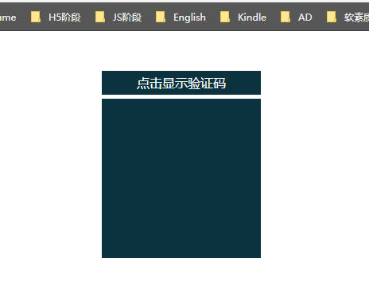

## 1、滑动解锁

要求：滑动滑块到末尾跳转页面，不成功，滑块回到起点。

```html
<!DOCTYPE html>
<html lang="en">

<head>
    <meta charset="UTF-8">
    <meta name="viewport" content="width=device-width, initial-scale=1.0">
    <meta http-equiv="X-UA-Compatible" content="ie=edge">
    <title>Document</title>
    <style>
        * {
            margin: 0;
            padding: 0;
            position: relative;
        }

        html,
        body {
            background-color: #ddd;
        }

        #box1 {
            width: 300px;
            height: 500px;
            margin: 50px auto;
            background-color: #aaa;
            overflow: hidden;
        }

        #box2 {
            width: 300px;
            height: 30px;
            margin-top: 400px;
            background-color: #eee;
            position: relative;
        }

        #box3 {
            width: 50px;
            height: 30px;
            background-color: red;
            /* border-radius: 15px; */
            position: absolute;
            left: 0;
            top: 0;
        }
    </style>
</head>

<body>
    <div id="box1">
        <div id="box2">
            <div id="box3"></div>
        </div>
    </div>
</body>
<script src="../js/daotin.js"></script>
<script>
    var box1 = document.getElementById("box1");
    var box2 = document.getElementById("box2");
    var box3 = document.getElementById("box3");

    var scrollLeft = document.documentElement.scrollLeft || document.body.scrollLeft;
    var scrollTop = document.documentElement.scrollTop || document.body.scrollTop;

    box3.onmousedown = function (e) {

        var evt = window.event || e;

        box3.style.transition = "none";

        var mouseLeft = evt.clientX + scrollLeft;
        var mouseTop = evt.clientY + scrollTop;

        // var box1Left = box1.offsetLeft;
        var box1Left = parseInt(getStyle(box1, "margin-left"));

        // var relaLeft = mouseLeft - parseInt(getStyle(box3, "left"));
        var relaLeft = mouseLeft - box1Left;
        // console.log(box1Left);


        document.onmousemove = function (e) {
            var evt = window.event || e;
            mouseLeft = evt.clientX + scrollLeft;

            box3.style.left = mouseLeft - relaLeft - box1Left + "px";

            var box3Left = parseInt(getStyle(box3, "left"));
            var dis = parseInt(getStyle(box1, "width")) - parseInt(getStyle(box3, "width"))


            if (box3Left >= dis) {
                console.log("OK");
                document.onmousemove = null;
                box1.style.backgroundColor = "red";
                box2.style.display = "none";
                box3.style.display = "none";

            }
        };

        document.onmouseup = function (e) {
            var evt = window.event || e;
            document.onmousemove = null;
            box3.style.left = 0;
            box3.style.transition = "1s";
        };

    };
</script>

</html>
```





## 2、滑动验证

要求：滑动图标到指定的位置完成验证。

```html
<!DOCTYPE html>
<html lang="en">

<head>
    <meta charset="UTF-8">
    <meta name="viewport" content="width=device-width, initial-scale=1.0">
    <meta http-equiv="X-UA-Compatible" content="ie=edge">
    <title>Document</title>
    <style>
        * {
            margin: 0;
            padding: 0;
            position: relative;
        }

        html,
        body {
            background-color: #ddd;
        }

        #box1 {
            width: 300px;
            height: 500px;
            margin: 50px auto;
            background-color: #aaa;
            overflow: hidden;
        }

        #box2 {
            width: 300px;
            height: 30px;
            margin-top: 300px;
            background-color: #000;
            position: relative;
        }

        #box3 {
            width: 30px;
            height: 30px;
            background-color: yellow;
            border-radius: 50%;
            position: absolute;
            left: 0;
        }

        #box4 {
            width: 30px;
            height: 30px;
            background-color: #fff;
            border-radius: 50%;
            position: absolute;
            left: 200px;
        }

        #box5 {
            width: 30px;
            height: 30px;
            background-color: red;
            border-radius: 50%;
            position: absolute;
            left: 0;
        }
    </style>
</head>

<body>
    <div id="box1">
        <div id="box2">
            <div id="box3"></div>
            <div id="box4"></div>
        </div>
        <div id="box5">
        </div>
    </div>
</body>
<script src="../js/daotin.js"></script>
<script>
    var box1 = document.getElementById("box1");
    var box2 = document.getElementById("box2");
    var box3 = document.getElementById("box3");
    var box4 = document.getElementById("box4");
    var box5 = document.getElementById("box5");

    var scrollLeft = document.documentElement.scrollLeft || document.body.scrollLeft;
    var scrollTop = document.documentElement.scrollTop || document.body.scrollTop;

    box5.onmousedown = function (e) {
        var evt = window.event || e;
        box3.style.transition = "none";
        box5.style.transition = "none";
        var mouseLeft = evt.clientX + scrollLeft;
        var mouseTop = evt.clientY + scrollTop;

        var box1Left = parseInt(getStyle(box1, "margin-left"));

        var relaLeft = mouseLeft - box1Left; // 点击后的相对距离

        document.onmousemove = function (e) {
            var evt = window.event || e;
            mouseLeft = evt.clientX + scrollLeft;

            var moveLeft = mouseLeft - relaLeft - box1Left;

            var dis = parseInt(getStyle(box2, "width")) - parseInt(getStyle(box3, "width"))
            if (moveLeft >= 0 && moveLeft <= dis) {
                box5.style.left = mouseLeft - relaLeft - box1Left + "px";
                box3.style.left = mouseLeft - relaLeft - box1Left + "px";
            }

        };

    };

    document.onmouseup = function (e) {
        var evt = window.event || e;

        document.onmousemove = null;
        var box5Left = parseInt(getStyle(box3, "left"));
        var disBox4 = parseInt(getStyle(box4, "left"));
        if (Math.abs(box5Left - disBox4) <= 1) {
            alert("OK");

        }
        box3.style.left = 0;
        box3.style.transition = "1s";
        box5.style.left = 0;
        box5.style.transition = "1s";
    };
</script>

</html>
```


## 3、顺序点击验证码

要求：按顺序点击验证码才可以验证成功。


代码：

```html
<!DOCTYPE html>
<html lang="en">

<head>
    <meta charset="UTF-8">
    <title>dom操作</title>
    <style>
        * {
            margin: 0;
            padding: 0;
            list-style: none;
        }

        #box {
            width: 200px;
            margin: 50px auto;
            position: relative;
        }

        #showrand {
            width: 200px;
            height: 30px;
            text-align: center;
            line-height: 30px;
            background-color: #0b333f;
            color: #ffffff;
        }

        #tip {
            position: absolute;
            height: 200px;
            width: 200px;
            left: 0;
            top: 35px;
            background-color: #0b333f;
        }

        #tip span {
            position: absolute;
            display: block;
            height: 30px;
            width: 30px;
            border-radius: 50%;
            text-align: center;
            line-height: 30px;
            background-color: #ff3333;
            color: #ffffff;
        }

        #tip span .num {
            position: absolute;
            left: 0;
            top: 0;
            display: block;
            height: 14px;
            width: 14px;
            background-color: #00FF00;
            text-align: center;
            line-height: 14px;
            font-size: 12px;
            color: red;
        }
    </style>
</head>

<body>
    <div id="box">
        <div id="showrand">点击显示验证码
        </div>
        <div id="tip">

        </div>
    </div>


</body>
<script src="../js/daotin.js"></script>
<script>
    var box = document.getElementById("box");
    var showRand = document.getElementById("showrand");
    var tip = document.getElementById("tip");

    var source = "我喜欢敲代码学习是我快乐";

    var NUM = 4;

    function resetCode(e) {
        showRand.innerHTML = getSecurityCode(source, NUM);

        for (let i = 0; i < NUM; i++) {
            if (tip.children[0]) {
                tip.removeChild(tip.children[0]);
                i--;
            }
        }

        for (let i = 0; i < NUM; i++) {
            var span = document.createElement("span");
            span.style.left = Math.floor(Math.random() * 170) + "px";
            span.style.top = Math.floor(Math.random() * 170) + "px";
            span.innerHTML = showRand.innerHTML[i];
            span.setAttribute("index", i);
            tip.appendChild(span);
        }
    };


    showRand.onclick = function (e) {
        resetCode();
        spanTap();
    };

    function spanTap() {
        var spanList = document.querySelectorAll("#tip span");
        var count = 0;
        var tmp = "";
        for (let j = 0; j < NUM; j++) {
            spanList[j].onclick = function (e) {
                tmp += this.innerHTML;
                var littleSpan = document.createElement("span");
                littleSpan.className = "num";
                littleSpan.innerHTML = count;
                this.appendChild(littleSpan);
                this.style.backgroundColor = "gray";
                count++;

                if (count == NUM) {
                    if (tmp == showRand.innerHTML) {
                        alert("success");
                    } else {
                        resetCode();
                        spanTap();
                    }
                }
            };
        }
    };
</script>

</html>
```


