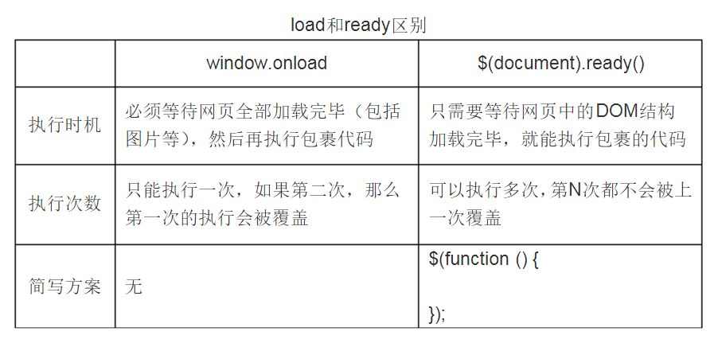

## 一、jQuery的概念

### 1、什么是 JavaScript 库？

JavaScript 开发的过程中，处理浏览器的兼容很复杂而且很耗时，于是一些封装了这些操作的库应运而生。这些库还会把一些常用的代码进行封装。

把一些常用到的方法写到一个单独的 js 文件，使用的时候直接去引用这js文件就可以了，这个 js 文件就是 JavaScript 库。（比如我们自己写的 common.js 就是一个 js 库。）

### 2、常见的 JS 库

常见的JavaScript 库：jQuery、Prototype、MooTools。其中jQuery是最常用的一个。

### 3、什么是 jQuery？

jQuery 就是一个 JavaScript 函数库，没有什么特别的。里面封装了一大堆的方法方便我们的开发，其实就是一个加强版的 common.js。因此我们学习jQuery，其实就是学习jQuery这个 js 文件中封装的一大堆方法。

### 4、jQuery 能做什么？

jQuery 本身就是一堆 JavaScript 函数，JavaScript 是做什么的，jQuery 就是做什么的。毕竟 jQuery 知识 JavaScript 编写的函数库而已，有些功能 jQuery 没有封装，则还需要通过自己写原生 JavaScript 来实现。

### 5、为什么要学 jQuery？

jQuery设计的宗旨是 ' Write Less，Do More '，即倡导写更少的代码，做更多的事情。

它封装JavaScript常用的功能代码，提供一种简便的操作，优化 HTML 文档操作、事件处理、动画设计和 Ajax 交互。

jQuery的核心特性可以总结为：

-   具有独特的链式语法和短小清晰的多功能接口；
-   具有高效灵活的css选择器，并且可对CSS选择器进行扩展；
-   拥有便捷的插件扩展机制和丰富的插件。
-   兼容各种主流浏览器。

极大地简化了 JavaScript 编程。

### 6、jQuery下载

[jQuery官网](http://jquery.com/)


## 二、jQuery 的顶级对象

jQuery 中的顶级对象是：`jQuery`，可以使用`$` 代替。

jQuery中所有属性和方法都可以使用`$.属性或方法` 的方式来使用。

大多数情况下，jQuery 中几乎都是方法，属性很少。


## 三、jQuery对象和DOM对象互转

> 注意：
>
> 通过 DOM 方式和 jQuery 方法获取的同一个元素，不是相同的对象。
>
> jq获取的是一个类数组的对象，这个对象就像一个数组一样，不过是个伪数组。就像数组里面的方法filter，some等，返回的集合是个伪数组。而伪数组是不能执行DOM对象的方法的，要将其转换成DOM对象才可以。


存在的问题：DOM对象调用jQuery的方法不能实现，jQuery对象调用DOM的方法也不能实现。所以要将DOM对象和jQuery对象互转。


**单个**DOM对象转jQuery对象：`$(DOM对象)`

**单个**jQuery对象转DOM对象：`jQuery对象[0]`，或者 `jq对象.get(0)`

> 注意：`$("div").eq(0)` 是选择jquery对象集合中的第1项，仍然是jquery对象，而不是DOM对象。


**为什么 DOM 和 jQuery 要互转，最开始就用 jQuery不好吗？**

因为有一些兼容或功能没有封装在 jQuery 里面，必须通过原生 js 操作，所以需要 jQuery对象转DOM对象。当这一步操作完之后，再次转回 jQuery 对象，可以更方便的操作页面元素。


### 1、案例：网页开关灯（使用类选择器方式）

```html
<!DOCTYPE html>
<html lang="en">
<head>
    <meta charset="UTF-8">
    <title>Title</title>
    <style>
        .cls {
            background-color: #000;
        }
    </style>
</head>
<body>

<input type="button" value="开/关" id="btn">

<script src="common.js"></script>
<script src="jquery-1.12.4.js"></script>
<script>
    // DOM原生方式
    document.getElementById("btn").onclick = function (ev) {
        if(document.body.className !== "cls") {
            document.body.className = "cls";
        } else {
            document.body.className = "";
        }
    }

    // jQuery转DOM方式
    $("#btn").click(function () {
        if ($("body")[0].className === "cls") {
            $("body")[0].className = "";
        } else {
            $("body")[0].className = "cls";
        }
    });

	// jQuery方式
    $("#btn").click(function () {
        if ($("body").hasClass("cls")) {
            $("body").removeClass("cls");
        } else {
            $("body").addClass("cls");
        }
    });

</script>
</body>
</html>
```

>   1、jQuery的方式绑定事件没有 on
>
>   2、className 是DOM对象的方法，jQuery不能调用。
>
>   3、hasClass 是否有某个类；removeClass 移除某个类；addClass 增加一个类。


### 2、案例：网页开关灯（使用CSS方式）

```js
$("#btn").click(function () {
  if($(this).val() === "关灯") {
    $("body").css("backgroundColor", "#000");
    $(this).val("开灯");
  } else {
    $("body").css("backgroundColor", "");
    $(this).val("关灯");
  }
});
```

>   1、this 是 DOM 的属性，所以要转成 jQuery 属性。
>
>   2、jQuery 控制 css 样式使用 `css("属性名字","属性值") `方法，属性的名字可以是DOM中的写法（比如：backgroundColor），可也以使用css样式写法（比如：background-color）。
>
>   3、`jQuery对象.val(); `表示获取该对象 value 属性的值；
>
>   4、`jQuery对象.val("值"); `表示设置该对象 value 属性的值；


## 四、页面加载事件

### 1、DOM中页面加载事件

```js
window.onload = function (ev) {
  console.log("1");
};
window.onload = function (ev) {
  console.log("2");
};
```

>   由于这是赋值的方式，所以只会打印第二个，第一个被覆盖了。
>
>   特点：整个页面的所有元素，文本，图片等全部加载完才会执行。


### 2、jQuery中页面加载事件

#### 2.1、方式一：DOM转jQuery方式

```js
$(window).load(function () {
  console.log("load:1");
});
$(window).load(function () {
  console.log("load:2");
});
```

>   load:1 和 load:2 都会打印，因为这相当于方法调用，调用多少次执行多少次。
>
>   特点：整个页面的所有元素，文本，图片等全部加载完才会执行。


#### 2.2、方式二：DOM转jQuery方式

```js
$(document).ready(function () {
  console.log("ready:1");
});
$(document).ready(function () {
  console.log("ready:2");
});
```

>   ready:1 和  ready:2 都会打印。
>
>   特点：不是整个页面的所有元素，而是页面中的基本元素加载完后就执行，所以比使用 load 的方式快一些。


#### 2.3、方式三：jQuery方式（推荐）

```js
$(function () {
  console.log("jQuery:1");
});
$(function () {
  console.log("jQuery:2");
});
```

>jQuery:1 和  jQuery:2 都会打印。
>
>$ 也可以换成 jQuery。
>
>特点：不是整个页面的所有元素，而是页面中的基本元素加载完后就执行，所以比使用 load 的方式快一些。


#### 2.4、onload 与 ready 的区别

