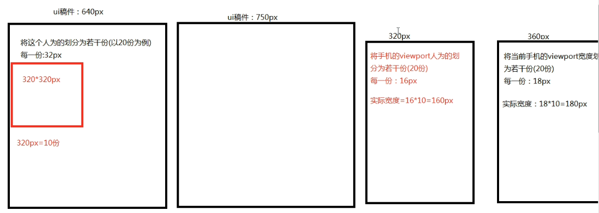

## 一、单位em与rem

`em`：就是一种长度单位，它是**参照当前元素的字号，如果没有设置，就参照父容器，一直到当前浏览器的默认字号。**

比如：当前浏览器默认字体大小为 16px，则 1em = 16px;


`rem`：css3新增的一种长度单位，它是**参照根元素(html)的字号**。

比如：当前浏览器默认字体大小为 16px，而 html 的字号为 20px，则 1rem = 20px;


**em 是相对长度单位（参照父元素）**，其参照当前元素字号大小，如果当前元素未设置字号则会继承其祖先元素字号大小。

例如：` .box {font-size: 16px;}` 则 1em = 16px 

`.box {font-size: 32px;} `则 1em = 32px，0.5em = 16px

**rem 相对长度单位（参照 html 元素）**，其参照根元素(html)字号大小。

例如 ：`html {font-size: 16px;}` 则 1rem = 16px 

`html {font-size: 32px;}` 则 1rem = 32px，0.5rem = 16px.


**vw：viewport width，视口宽度**  （1vw = 1%视口宽度）

**vh：viewport height   视口高度**  （1vh = 1%视口高度）


## 二、rem 的使用

一般情况下，美工给前端的移动端 UI 图的尺寸一般为 **640px** 和 **750px**。之后我们要设计的移动端的大小可能是 320px（iPhone5），375px（iPhone6），414px（iPhone6plus）等。

那么如何等比例的在这些移动端上进行一些元素布局的设计呢？

可以使用 em 吗？不好，不同浏览器可能默认字号大小不同，如果使用者对元素没有设置字号大小的话，就会参考父元素，可能一直到浏览器的默认字号大小。这样的话，可能不同的浏览器 1em 的大小不同。

所以，一般来说在移动端大多使用 rem 作为单位。

如何使用呢？

我们以 640px 的 UI 为例。**一般我们把 640px 的 UI 分成 20份，那么每一份的大小为 32px。**

那么 **750px 的 UI 分成 20份，那么每一份的大小为 37.5px。**

如何我们要在 320px 的屏幕上进行缩放的话，我们也将 320px 分成 20 份，每一份为 16px。

这时，我们想把 UI 上面一个 160px*160px 的矩形，缩放到 320px 的屏幕上的话，160 是占 UI 的5份，那么在 320px 上的矩形也应该占 16px 的 5 份。



所以，这个矩形在 320px 上的长度应该为：`160/32 * 16px  `，如何把 16px 换成 rem ？

rem 是按照 html 的字号决定的，那么我们可以这样做，我们先根据屏幕的大小，设置 html 的字号：

```css
@media screen and (device-width: 320px) {
  html {
    font-size: 16px;
  }
}
@media screen and (device-width: 360px) {
  html {
    font-size: 18px;
  }
}
@media screen and (device-width: 375px) {
  html {
    font-size: 18.75px;
  }
}
@media screen and (device-width: 414px) {
  html {
    font-size: 20.07px;
  }
}
```

之后，我们的代码可以改为：`160/32 rem` ，那么这份代码在不同屏幕的浏览器下，就有相应的大小，以保持不同屏幕下的不同缩放尺寸。


> 常见手机屏幕尺寸大全：https://strerr.com/screen.html


## 三、通用使用步骤

**1、设置各种屏幕尺寸下的 HTML 的字号大小。** 

**2、将 UI 下各个元素，不论是元素还是边距，边框等值全部除以每一份的大小，单位为 rem 即可得到在不同屏幕下的不同缩放大小。**

比如：640px 的 UI，设置为：`元素等/32 rem;`

750px 的 UI，设置为：`元素等/37.5 rem;`


示例：

```less
// UI稿件为640px
.item{
    height:218/32rem;
    border: 3/32rem dashed #dedede;
    background-color: #fff;
    padding-top:36/32rem;
    font-size: 104/32rem;
    box-sizing: border-box;
    a{
      color: #aeaeae;
      text-align: center;
    }
    span{
      font-size: 26/32rem;
      display: block;
      margin-top:16/32rem;
    }
}
```
>  Tips：把 rem 理解成`份`  的意思更好理解，你在640px上占多少份，在实际的屏幕上就占多少份。


