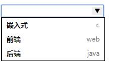
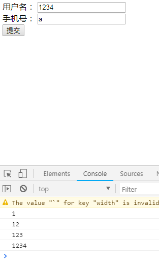
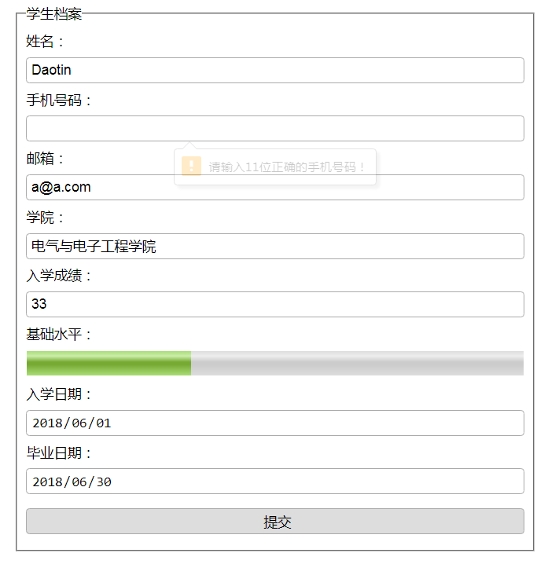

## 一、表单新增内容

### 1、表单新增属性

#### 1.1、type相关属性

-   email

```html
<!--email提供了邮箱的完整验证，必须包含@和后缀，如果不满足验证，会阻止表单提交-->
邮箱：<input type="email">
```

-   tel

```html
<!--tel并不是来验证手机号码的，因为全球手机号码格式的标准不同。它的目的是能够在移动端打开数字键盘，而数字键盘就限制了用户只能填写数字而不能填写其他字符。（在PC端无法展示）-->
手机：<input type="tel">
```

-   url

```html
<!--url 提供了网址的合法格式验证。必须包含 http:// 或者 https://-->
手机：<input type="url">
```

-   number

```html
<!--number只能输入数字和小数点，不能输入其他字符，并且输入框最右边有上下调节按钮-->
<!--value:默认值-->
<!--min:最小值-->
<!--max:最大值-->
<!--step:步伐-->
数量：<input type="number" value="50" min="0" max="100" step="5">
```

-   search

```html
<!--search可以在输入框输入文本后右边显示“x”，可以将输入的文本清除-->
搜索：<input type="search">
```

-   range

```html
<!--range范围-->
<!--step:步伐-->
范围：<input type="range" step="5">
```

-   color

```html
<!--color颜色选择器-->
颜色：<input type="color">
```


**时间日期相关**

```html
<!--时间：时分-->
<input type="time">
<!--日期：年月日-->
<input type="date">
<!--日期+时间：年月日时分-->
<input type="datetime-local">
<!--年+月-->
<input type="month">
<!--年+周-->
<input type="week">
```


#### 1.2、表单其他属性

```html
<!--提示用户输入信息-->
<input type="text" placeholder="请输入文本" autofocus autocomplete="on" required pattern="xxx">
```

>   1、placeholder：提示文本
>
>   2、autofocus：自动获取焦点
>
>   3、autocomplete：自动完成：on 打开，off 关闭。
>
>   前提：必须成功提交过；添加 autocomplete 的元素必须有 name 属性。
>
>   4、required：必须输入，如果未输入将阻止表单提交
>
>   5、pattern：正则表达式验证


```html
<input type="file" multiple>
```

>   multiple：可以一次选择多个文件（在 email中，multiple 允许填写多个邮件地址，中间用逗号隔开）


### 2、表单新增元素

**datalist 元素**

功能：拓展下拉菜单，可以手动输入选项。

```html
<input type="text" list="field">
<datalist id="field">
  <option value="嵌入式" label="c"></option>
  <option value="前端" label="web"></option>
  <option value="后端" label="java"></option>
</datalist>
```

>   1、因为能够手动输入选项，所以需要输入框；
>
>   2、输入框通过 list 属性和 datalist 关联起来；
>
>   3、value 为选中后输入框的内容，label 为 value 的辅助描述性内容。
>
>   **注意：如果 type 的类型为 url 网址的话，value 的值必须加 http:// 或 https:// 才能够显示出来。**





### 3、新增表单事件

-   **oninput**：当元素中的内容改变时，就会触发。
-   **oninvalid**：当验证不通过时触发。

```html
<body>
<form action="">
    用户名：<input type="text" placeholder="请输入用户名" id="user"><br>
    手机号：<input type="tel" id="phone" pattern="^((1[3,5,8][0-9])|(14[5,7])|(17[0,6,7,8])|(19[7]))\d{8}$"><br>
    <input type="submit"> <br>
</form>
<script>
    document.getElementById("user").oninput = function (ev) {
        console.log(this.value);
    };
    document.getElementById("phone").oninvalid = function (ev) {
        // 设置默认提示信息
        this.setCustomValidity("请输入正确的手机号码！")
    };
</script>

</body>
```

>   **setCustomValidity**：修改 pattern 校验失败时，默认的提示信息。





### 4、进度条

-   progress：

属性： max 最大值，value：当前值

-   meter（度量器）：

属性：

high：被界定为高的值的范围。
low：被界定为低的值的范围。
max：规定范围的最大值。
min：规定范围的最小值。
optimum：	规定度量的最优值。
value：规定度量的当前值。

```html
<progress max="100" value="30"></progress>
<br>
<meter max="100" min="0" high="70" low="30" value="20"></meter>
<meter max="100" min="0" high="70" low="30" value="50"></meter>
<meter max="100" min="0" high="70" low="30" value="90"></meter>
```


### 5、案例：表单总结

```html
<!DOCTYPE html>
<html lang="en">
<head>
    <meta charset="UTF-8">
    <title>Title</title>
    <style>
        * {
            padding: 0;
            margin: 0;
        }

        form {
            width: 600px;
            margin: 10px auto;
        }

        form > fieldset {
            padding: 10px 10px;
        }

        form > fieldset > meter,
        form > fieldset > input {
            width: 100%;
            height: 30px;
            margin: 8px 0;
            border: none;
            border: 1px solid #aaa;
            border-radius: 4px;
            font-size: 16px;
            padding-left: 5px;
            box-sizing: border-box; /*避免padding+border的影响*/
        }

        form > fieldset > meter {
            padding: 0;
        }

    </style>
</head>
<body>
<form action="">
    <fieldset>
        <legend>学生档案</legend>
        <label for="txt">姓名：</label>
        <input type="text" name="userName" id="txt" placeholder="请输入姓名" required>

        <label for="phone">手机号码：</label>
        <input type="tel" name="phone" id="phone" required
               pattern="^((1[3,5,8][0-9])|(14[5,7])|(17[0,6,7,8])|(19[7]))\d{8}$">

        <label for="em">邮箱：</label>
        <input type="email" name="myemail" id="em" required>

        <label for="collage">学院：</label>
        <input type="text" name="collage" id="collage" list="dl" required>
        <datalist id="dl">
            <option value="电气与电子工程学院"></option>
            <option value="经济与管理学院"></option>
            <option value="外国语学院"></option>
            <option value="艺术与传媒学院"></option>
        </datalist>

        <label for="num">入学成绩：</label>
        <input type="number" name="num" id="num" required max="100" min="0" value="0" step="0.5">

        <label for="level">基础水平：</label>
        <meter id="level" max="100" min="0" high="90" low="59"></meter>

        <label for="edt">入学日期：</label>
        <input type="date" name="dt" id="edt" required>

        <label for="ldt">毕业日期：</label>
        <input type="date" name="dt" id="ldt" required>

        <input type="submit" id="sub">
    </fieldset>
</form>
<script>
    document.getElementById("phone").oninvalid = function () {
        this.setCustomValidity("请输入11位正确的手机号码！");
    };
    document.getElementById("num").oninput = function () {
        document.getElementById("level").value = this.value;
    };
</script>
</body>
</html>
```




## 二、多媒体新增内容

-   audio：音频

**属性：**

src：播放的音频文件路径

controls：显示音频播放器的控制面板

autoplay：自动播放

loop：循环播放

```html
<audio src="mp4/1.mp3" controls autoplay></audio>
```


-   video

属性：

src：播放的音频文件路径

controls：显示音频播放器的控制面板

autoplay：自动播放

loop：循环播放

weight：宽度（一般只需要设置宽度或者高度，可以使视频等比例缩放。）

height：高度

poster：视频未播放时展示的画面。默认为视频第一帧的画面。

```html
<video src="mp4/2.mp4" controls autoplay width="500px" poster="1.jpg"></video>
```


-   source

由于不同浏览器支持的视频格式不同，所以我们在进行视频添加的时候，需要考虑浏览器是否支持。我们可以准备多种不同格式的视频文件，然后使用 **source** 标签，让浏览器选择支持的视频格式播放视频。

```html
<video controls>
    <source src="mp4/2.mp4" type="video/mp4">
    <source src="mp4/2.flv" type="video/flv">
    浏览器不支持该格式的视频文件
</video>
```

浏览器或从上至下，如果浏览器支持mp4格式就播放，不支持看下一个flv格式，如果都不支持就输出 “ 浏览器不支持该格式的视频文件”。


## 三、新增获取/操作元素

### 1、新增获取元素

```js
document.querySelector("选择器");
document.querySelectorAll("选择器");
```


### 2、新增操作元素类样式

```js
document.querySelector("选择器").classList.add("类样式"); // 添加类样式
document.querySelector("选择器").classList.remove("类样式"); // 移除类样式
document.querySelector("选择器").classList.toggle("类样式"); // 反转类样式（有则删除，无则添加）
document.querySelector("选择器").classList.contains("类样式"); //是否包含类样式
document.querySelector("选择器").classList.item(索引); // 获取类样式
```

>   PS：classList 的方式与 document.querySelector("选择器").className 的方法对比：
>
>   **classList 的方法添加和删除不会清除原来的 class 类样式，只是在其基础上添加和删除。而 className的方式直接对源类样式操作，容易遗漏和误操作。**


示例：

```html
<!DOCTYPE html>
<html lang="en">
<head>
    <meta charset="UTF-8">
    <title>Title</title>
    <style>
        .red {
            color: red;
        }

        .green {
            color: green;
        }

        .blue {
            color: blue;
        }
        .underline {
            text-decoration: underline;
        }
    </style>
</head>
<body>
<ul>
    <li>第一个li标签</li>
    <li class="green">第二个li标签</li>
    <li>第三个li标签</li>
    <li>第四个li标签</li>
</ul>

<input type="button" value="添加样式" id="btn1">
<input type="button" value="删除样式" id="btn2">
<input type="button" value="反转样式" id="btn3">
<input type="button" value="判断样式" id="btn4">

<script>
    // 点击第一个按钮给第一个标签添加样式
    document.querySelector("#btn1").onclick = function () {
        document.querySelector("li").classList.add("red");
        document.querySelector("li").classList.add("underline");
        // 获取样式：获取元素的样式，索引代表样式的位置
        var class1 = document.querySelector("li").classList.item(0);
        var class2 = document.querySelector("li").classList.item(1);
        console.log(class1 + "=====" + class2); // red=====underline
    };
    // 点击第二个按钮给第二个标签删除样式
    document.querySelector("#btn2").onclick = function () {
        document.querySelectorAll("li")[1].classList.remove("green");
    };
    // 点击第三个按钮给第三个标签反转样式
    document.querySelector("#btn3").onclick = function () {
        document.querySelectorAll("li")[2].classList.toggle("blue");
    };
    // 点击第四个按钮判断第四个标签是否包含某样式
    document.querySelector("#btn4").onclick = function () {
        var flag = document.querySelectorAll("li")[3].classList.contains("red");
        console.log(flag);
    };
</script>
</body>
</html>
```


## 四、自定义属性

定义：以 “**data-**” 开头，后面必须有至少一个字符，多个单词间用 “-” 连接。

建议：

1、名称中应该都是用小写字符；

2、名称中不要包含任何特殊符号；

3、名称中不要由纯数字组成。


```html
<p data-user-name="Daotin"></p>
```


获取自定义属性的值

```html
<script>
	var pObj = document.querySelector("p");
  	var value = p.dataset["userName"];
  	console.log(value); // Daotin
</script>
```

>   使用 "**元素.dataset[]**" 的方式获取自定义属性的值。其中自定义属性的名称要使用**驼峰命名法**填写。


