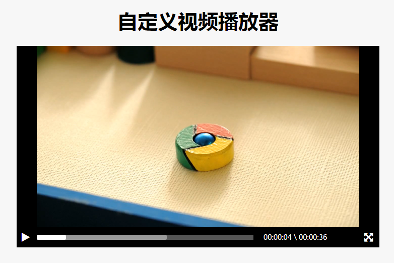

# 一、拖拽接口

**元素拖拽事件：**

`ondrag ` ：应用于拖拽元素，整个拖拽过程都会持续调用；
`ondragstart `：应用于拖拽元素，当拖拽开始时调用；
`ondragleave`：应用于拖拽元素，拖拽过程中，当鼠标离开拖拽元素范围时调用；
`ondragend` ：应用于拖拽元素，当拖拽结束时调用。


**目标拖拽事件：**

`ondragenter`：应用于目标元素，当拖拽元素进入时调用；
`ondragover`：应用于目标元素，当停留在目标元素上时调用；
`ondrop`：应用于目标元素，当在目标元素上松开鼠标时调用；
`ondragleave`：应用于目标元素，当鼠标离开目标元素时调用。


示例：**将一个div中的p标签拖拽到另一个p标签中**

```html
<body>
<div class="div1" id="div1">
    <!--在h5中，如果想拖拽元素，就必须为元素添加draggable="true". 图片和超链接默认就可以拖拽-->
    <p id="pe" draggable="true">试着把我拖过去</p>
</div>
<div class="div2" id="div2"></div>
<script>
    /*学习拖拽，主要就是学习拖拽事件*/
    var p=document.querySelector("#pe");
    var div2=document.querySelector("#div2");

    // 应用于被拖拽元素
    p.ondragstart=function(){
        console.log("ondragstart");
    }
    p.ondragend=function(){
        console.log("ondragend");
    }
    p.ondragleave=function(){
        console.log("被拖拽元素：ondragleave");
    }
    p.ondrag=function(){
        console.log("ondrag");
    }

    // 应用于目标元素的事件
    div2.ondragenter=function(){
        console.log("ondragenter");
    }
    div2.ondragover=function(e){
        console.log("ondragover");
        /*如果想触发ondrop事件，那么就必须在这个位置阻止浏览器的默认行为*/
        e.preventDefault();
    }
    /*浏览器默认会阻止ondrop事件：我们必须在ondragover中阻止浏览器的默认行为*/
    div2.ondrop=function(){
        console.log("ondrop");
        /*添加被拖拽的元素到当前目标元素*/
        div2.appendChild(p);
    }
    div2.ondragleave=function(){
        console.log("目标元素：ondragleave");
    }
</script>
</body>
```

>   1、被拖拽的元素必须添加 `draggable="true"` 属性。
>
>   2、浏览器默认会阻止目标元素的 ondrop 事件：我们必须在目标元素的 ondragover 中阻止浏览器的默认行为（使用事件参数对象的 `preventDefault() `方法），才能将拖拽的元素放到目标元素中。


**遗留问题：**如果有多个 div，那么每个 div 都必须写 ondragover 和 ondrop 事件触发的处理函数，也就是只能拖拽指定的元素到指定的元素中，这样代码的可用性就很低了。

**分析问题：**既然有多个被拖拽元素和多个目标元素存在，这些元素都存在于 document 中的，那么可不可以给 document 添加这些事件呢？

答案是可以的。

```html
<body>
<div class="div1" id="div1">
    <p id="pe" draggable="true">试着把我拖过去</p>
    <p id="pe1" draggable="true">试着也把我拖过去</p>
</div>
<div class="div2" id="div2"></div>
<div class="div3" id="div3"></div>
<script>
    var obj=null;//当前被拖拽的地元素

    //应用于被拖拽元素的事件
    document.ondragstart=function(e){
        obj= e.target;
    }

    //应用于目标元素的事件
    document.ondragover=function(e){
        /*如果想触发ondrop事件，那么就必须在这个位置阻止浏览器的默认行为*/
        e.preventDefault();
    }
    /*浏览器默认会阻止ondrop事件：我们必须在ondragover中阻止浏览器的默认行为*/
    document.ondrop=function(e){
        /*添加元素*/
        e.target.appendChild(obj);
    }
</script>
</body>
```

>   在事件参数对象中有一个 target 属性，其值为被拖拽的元素对象。


问题解决了，但是，又是但是......，但是一般少使用全局变量，全局变量谁都可以修改，容易误操作。

**在事件参数对象中有一个 `dataTransfer` 属性，通过 `dataTransfer` 来实现数据的存储与获取。**

dataTransfer  有两个方法：

`setData(format,data); `用于存储数据；

`getData(format,data); 用于取出数据；`**（取出数据必须在目标元素的 ondrop 事件中，其他事件中无法取到数据）**

format:数据的类型：`text/html`  ，` text/uri-list`
Data:数据:一般来说是字符串值

```html
<body>
<div class="div1" id="div1">
    <!--在h5中，如果想拖拽元素，就必须为元素添加draggable="true". 图片和超链接默认就可以拖拽-->
    <p id="pe" draggable="true">试着把我拖过去</p>
    <p id="pe1" draggable="true">试着也把我拖过去</p>
</div>
<div class="div2" id="div2"></div>
<div class="div3" id="div3"></div>
<script>

    //应用于被拖拽元素的事件
    document.ondragstart=function(e){
        // 把拖拽元素的id值存储起来
        e.dataTransfer.setData("text/html", e.target.id);
    };

    //应用于目标元素的事件
    document.ondragover=function(e){
        /*如果想触发ondrop事件，那么就必须在这个位置阻止浏览器的默认行为*/
        e.preventDefault();
    };
    /*浏览器默认会阻止ondrop事件：我们必须在ondragover中阻止浏览器的默认行为*/
    document.ondrop=function(e){
        /*添加元素*/
        /*通过e.dataTransfer.setData存储的数据，只能在drop事件中获取*/
        var id=e.dataTransfer.getData("text/html");
        // 通过id方式添加元素
        e.target.appendChild(document.getElementById(id));
    };
</script>
</body>
```


# 二、Web存储

用户在浏览网页的时候，可能需要存储一些数据在本地，之前是采用 Cookie 的方式存储，但是 Cookie 只能存储大小为 4k 以内的数据，再多的数据就存储不了。并且 Cookie 的解析也是很复杂的。

到了h5阶段，又提供了两种方式来存储 web 数据：sessionStorage 和 localStorage。


## 1、sessionStorage 

sessionStorage的使用：将存储数据到本地。存储的容量 **5MB** 左右。

注意：sessionStorage 的存储特点：

-   **这个数据本质是存储在当前页面的内存中，意味着其它页面和浏览器无法获取数据。**
-   **它的生命周期为关闭当前页面时，数据会自动清除。**

提供的方法：

- **setItem(key,value)** ：存储数据，以键值对的方式存储，

- **getItem(key)** ：获取数据，通过指定名称的key获取对应的value值，

- **removeItem(key)** ：删除数据，通过指定名称key删除对应的值，

- **clear()** ：清空所有存储的内容。

- **sessionStorage.length**，获取存储数据的个数，

  然后获取其中的key：`var tk = sessionStorage.key(i)`

  然后获取其中的value：`sessionStorage.getItem(tk)`


示例：

```html
<!DOCTYPE html>
<html lang="en">
<head>
    <meta charset="UTF-8">
    <title>Title</title>
</head>
<body>
<pre>
sessionStorage的使用
</pre><br>
<input type="text" id="userName"><br>
<input type="button" value="设置数据" id="setData">
<input type="button" value="获取数据" id="getData">
<input type="button" value="删除数据" id="removeData">
<script>
    /*存储数据*/
    document.querySelector("#setData").onclick=function(){
        /*获取用户名*/
        var name=document.querySelector("#userName").value;
        /*存储数据*/
        window.sessionStorage.setItem("userName",name);
    };
    /*获取数据*/
    document.querySelector("#getData").onclick=function(){
        /*如果找不到对应名称的key,那么就会获取null*/
        var name=window.sessionStorage.getItem("userName");
        alert(name);
    };
    /*删除数据*/
    document.querySelector("#removeData").onclick=function(){
        /*在删除的时候如果key值错误，不会报错，但是也不会删除数据*/
        window.sessionStorage.removeItem("userName");
    };
</script>
</body>
</html>
```

>   1、获取数据的时候，如果找不到对应名称的 key，那么获取的值为 null。
>
>   2、删除数据的时候，如果 key 值错误，不会报错，但是也不会删除数据。


## 2、localStorage

localStorage的使用：

-   存储的内容大概 **20MB** 大小
-   **不同浏览器不能共享数据。但是在同一个浏览器的不同窗口中可以共享数据；**
-   **永久生效，它的数据是存储在硬盘上，并不会随着页面或者浏览器的关闭而清除。如果想清除，必须手动清除**

`setItem(key,value)`:存储数据，以键值对的方式存储
`getItem(key)`:获取数据，通过指定名称的key获取对应的value值
`removeItem(key)`:删除数据，通过指定名称key删除对应的值
`clear()`:清空所有存储的内容

示例：

```html
<!DOCTYPE html>
<html lang="en">
<head>
    <meta charset="UTF-8">
    <title>Title</title>
</head>
<body>
<pre>localStorage的使用：</pre>
<br>
<input type="text" id="userName"><br>
<input type="button" value="设置数据" id="setData">
<input type="button" value="获取数据" id="getData">
<input type="button" value="删除数据" id="removeData">

<script>
    document.querySelector("#setData").onclick=function(){
        var name=document.querySelector("#userName").value;
        /*使用localStorage存储数据*/
        window.localStorage.setItem("userName",name);
    };
    /*获取数据*/
    document.querySelector("#getData").onclick=function(){
        var name=window.localStorage.getItem("userName");
        alert(name);
    };
    /*清除数据*/
    document.querySelector("#removeData").onclick=function(){
        window.localStorage.removeItem("userName");
    };
</script>
</body>
</html>
```


# 三、自定义播放器

我们知道不同的浏览器的音频视频的播放器控件显示样式有差异，那么我们怎么做一个在任何浏览器下都有相同样式的播放器呢？

**常用方法**：

-   `load()` 加载，
-   `play()`播放，
-   `pause()` 暂停。

>   注意：jQuery中没有提供对视频播放控件的方式，所以如果使用jQuery操作元素，必须将其转为原生 js 的方式来调用这些方法。

**常用属性**：

-   `currentTime`：视频播放的当前进度
-   `duration`：视频的总时长
-   `paused`：视频播放的状态

**常用事件**：

-   `oncanplay`：事件在用户可以开始播放视频/音频时出触发
-   `ontimeupdate`：通过该事件报告当前的播放进度
-   `onended`：播放完时触发


示例代码：

```html
<!DOCTYPE html>
<html lang="en">
<head>
    <meta charset="UTF-8">
    <title>Title</title>
    <link rel="stylesheet" href="https://cdn.bootcss.com/font-awesome/4.7.0/css/font-awesome.css">
    <link rel="stylesheet" href="./css.css">
</head>
<body>
<h3 class="playerTitle">自定义视频播放器</h3>
<div class="player">
    <video src="../mp4/2.mp4"></video>
    <div class="controls">
        <a href="javascript:void(0);" class="switch fa fa-play"></a>
        <a href="javascript:void(0);" class="expand fa fa-arrows-alt"></a>
        <div class="progress">    <!--总时长-->
            <div class="bar"></div> <!--用于点击选择进度-->
            <div class="loaded"></div> <!--已经加载的-->
            <div class="elapse"></div> <!--已经播放的时长-->
        </div>
        <div class="time">
            <span class="currentTime">00:00:00</span>
            \
            <span class="totalTime">00:00:00</span>
        </div>
    </div>
</div>
<script src="./jquery.min.js"></script>

<script>
    $(function () {
        // 获取播放器文件
        var video = $("video")[0];

        // 点击播放按钮播放视频文件
        $(".switch").click(function () {
            if (video.paused) {
                video.play();
            } else {
                video.pause();
            }
            $(this).toggleClass("fa-play fa-pause");
        });

        // 全屏操作
        $(".expand").click(function () {
            if (video.requestFullscreen) {
                video.requestFullscreen();
            }
            else if (video.webkitRequestFullScreen) {
                video.webkitRequestFullScreen();
            }
            else if (video.mozRequestFullScreen) {
                video.mozRequestFullScreen();
            }
            else if (video.msRequestFullScreen) {
                video.msRequestFullScreen();
            }
        });

        function getTime(total) {
            var hour = Math.floor(total / 3600);
            hour = hour > 10 ? hour : "0" + hour;
            var min = Math.floor((total % 3600) / 60);
            min = min > 10 ? min : "0" + min;
            var sec = Math.floor((total % 3600) % 60);
            sec = sec > 10 ? sec : "0" + sec;
            return hour + ":" + min + ":" + sec;
        }

        // 当视频加载完成后显示视频
        video.oncanplay = function () {
            this.style.display = "block";
            // 根据视频总时长，获取时分秒
            var total = getTime(this.duration);
            // 显示总时长
            $(".totalTime").html(total);
        };

        // 视频播放过程中，获取时分秒实时显示
        // 如果修改currentTime值也会触发这个事件，也就是只要currentTime值变化，就会触发这个事件
        video.ontimeupdate = function () {
            var current = getTime(this.currentTime);
            $(".currentTime").html(current);
            // 设置进度条
            var percent = this.currentTime / this.duration * 100 + "%";
            $(".elapse").css("width", percent);
        };

        // 点击进度条跳播
        $(".bar").click(function (e) {
            video.currentTime = e.offsetX / $(this).width() * video.duration;
        });

        // 播放完成后回到最初位置
        video.onended = function () {
            // 位置清零
            video.currentTime = 0;
            // 播放暂停状态为播放
            $(".switch").removeClass("fa fa-pause").addClass("fa fa-play");
        };
    });

</script>

</body>
</html>
```





>   1、视频控制器中的播放暂停按钮和全屏按钮都是来自在线字体图标 font-awesome。
>
>   2、进度条一栏实际上有4层，处理可以看到的总时长，缓存时长，播放时长外还有一个最顶层的透明层，用于点击进度条实现跳变功能。


