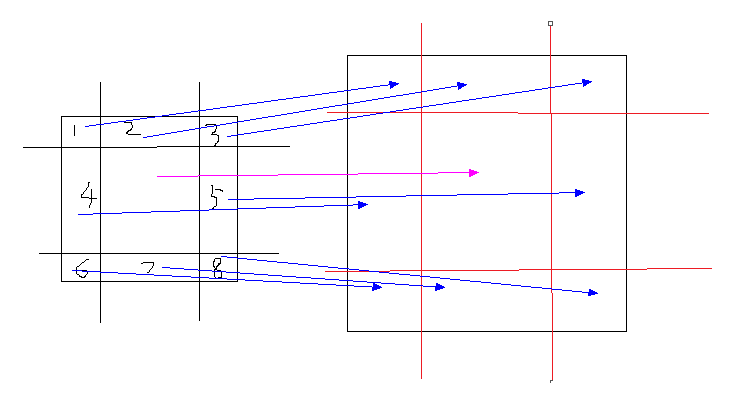
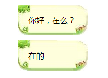
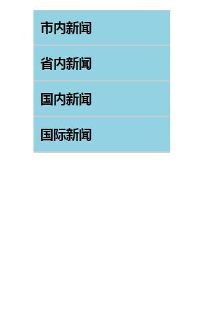

# 一、边框图片

边框图片：就是**给边框加图片背景**。

我们之前加的边框都是纯颜色的边框，那么我们怎么给边框加图片呢？


**原理：把一张图片分成九宫格的形式，然后一一对应到需要添加边框的元素上。**



并且，添加边框图片是**以背景的方式**添加的，所以会有**可能文字覆盖在边框**的情况，后面也会介绍处理方法。


**语法：**

```css
/* border-image-source:可以指定边框图片的路径,默认只是填充到容器的四个角点 */
border-image-source: url("../images/border1.png");

/* border-image-slice:设置四个方向上的裁切距离, fill:做内容的内部填充 */
border-image-slice: 27 fill;
/* 如果四个边框的宽度不同，可以设置4个值*/
border-image-slice: 27 10; /*左右27 上下10*/
border-image-slice: 27 20 15 5 fill; /*左27 下20 右15 上5*/

/*border-image-width:边框图片的宽度。如果没有设置这个属性，那么宽度默认就是元素的原始的边框宽度。
细节：
1.边框图片的本质是背景，并不会影响元素内容的放置  
2.内容只会被容器的border和padding影响
建议：一般将值设置为原始的边框的宽度*/
border-image-width: 27px;

/*border-image-outset:扩展边框：将边框扩大，但是会影响元素的大小，box-sizing也不可挽回，建议不使用。*/
border-image-outset: 0px;

/*border-image-repeat:
repeat:直接重复平铺，可能有不完整的图像
round:将内容缩放进行完整的重复平铺
stretch:将内容拉伸（此为默认值）*/
border-image-repeat: round;
```

以上的内容可以连写（**注意有的属性需要用 / 分隔**）：

```css
/*border-image: source slice / width / outset repeat;*/
border-image: url("../images/border1.png") 27 fill / 27px / 0px round;
```


## 案例：QQ气泡

我们在发QQ消息的时候，可以选择很多不同的气泡样式，而且当我们发消息的时候，不管文字的多少，气泡边框的样式不变，而只是中间内容的填充。如果只是简单的气泡拉伸的话，边角就会变得丑陋，所以就需要用到边框图片的技术。


```html
<!DOCTYPE html>
<html lang="en">
<head>
    <meta charset="UTF-8">
    <title>Document</title>
    <style>
        div{
            width: 100px;
            height: auto;
            margin:10px auto;
            border: 20px solid red;
            border-image: url("./images/timg.jpg");
            border-image-slice: 20 fill;
            border-image-width: 20px;
            border-image-outset: 0px;
            border-image-repeat: stretch;
        }
    </style>
</head>
<body>
    <div>你好，在么？</div>
    <div>在的</div>
</body>
</html>
```





# 二、过渡

通过过渡 `transition`,我们可以在不使用 Flash 动画或 JavaScript 的情况下，当元素从一种样式变换为另一种样式时为元素添加效果。

要实现这一点，必须规定两项内容：

- **1.规定希望把效果添加到哪个 CSS 属性上；**

- **2.规定效果的时长。**


## 1、基本语法

```css
/*1.transition-property:添加过渡效果的样式属性名称*/
transition-property: left;

/*2.transition-duration:过渡效果的耗时 以秒做为单位*/
transition-duration: 2s;

/*3.transition-timing-function:设置时间函数--控制运动的速度*/
transition-timing-function: linear;
/*
参数说明：
steps(n)：n代表次数，就是动画分几次走完。（比如秒针的走动）
linear：规定以相同速度开始至结束的过渡效果。
ease：规定慢速开始，然后变快，然后慢速结束的过渡效果。
ease-in：规定以慢速开始的过渡效果。
ease-out：规定以慢速结束的过渡效果。
ease-in-out：规定以慢速开始和结束的过渡效果。
*/

/*4.transition-delay:过渡效果的延迟，间隔多少时间后才开始动画。*/
transition-delay: 2s;

```

> 注意：添加过渡效果:过渡效果执行完毕之后，默认会还原到原始状态。


## 2、连写样式

```css
transition: property duration timing-function delay;
```

**参数说明：**

`property`：属性名称

`duration`：过渡时间

`timing-function`：时间函数

`delay`：延迟时间


为多个样式同时添加过渡效果：**（之间用逗号隔开）**

```css
transition: left 2s linear 0s,
			background-color 5s linear 0s;
```


为所有样式添加过渡效果：`all`：所有样式

```css
transition:all 2s steps(4);
```

>   缺点：
>
>   1. 所有样式的过渡效果一样。
>   2. 效率低下，它会去查询所有添加的样式。
>   3. 建议不要这么写。


## 3、使用建议

因为 transition 最早是有由 webkit 内核浏览器提出来的，mozilla 和 opera 都是最近版本才支持这个属性，而我们的大众型浏览器 IE 全家都是不支持，另外由于各大现代浏览器 Firefox,Safari,Chrome,Opera 都还不支持 W3C的标准写法，所以在应用 transition 时我们有必要加上各自的前缀，最好在最后写上我们 W3C 的标准写法，这样支持标准写法的浏览器会覆盖前面的写法，只要浏览器支持我们的 transition 属性，那么这种效果就会自动加上去，如：

```css
-moz-transition: all 1s ease;
-webkit-transition: all 1s ease;
-o-transition: all 1s ease;
transition: all 1s ease; /*放在最后*/
```


## 4、案例：手风琴效果

效果：鼠标放在每个标签上，会慢慢下拉出详细内容。

```html
<!DOCTYPE html>
<html lang="en">
<head>
    <meta charset="UTF-8">
    <title>Document</title>
    <style>
        * {
            margin: 0;
            padding: 0;
        }
        .menu {
            width: 200px;
            height: auto;
            margin: 100px auto;
        }
        .item {
            width: 100%;
            height: auto;
        }
        .item > h3 {
            height: 40px;
            line-height: 40px;
            background-color: rgb(146, 210, 226);
            padding: 5px 0 5px 10px;
            border-bottom: 2px solid #ccc;
        }
        .item > .itemBox {
            width: 100%;
            height: 0;
            background-color: rgb(248, 187, 233);
            overflow: hidden;
        }
        .itemBox > ul {
            list-style: none;
            padding: 10px 10px;
        }
        .item:hover > .itemBox {
            height: 110px;
            transition: height 0.5s;
        }
    </style>
</head>
<body>
    <div class="menu">
        <div class="item">
            <h3>市内新闻</h3>
            <div class="itemBox">
                <ul>
                    <li>深圳超市肉菜档遭抢</li>
                    <li>深圳超市肉菜档遭抢</li>
                    <li>深圳超市肉菜档遭抢</li>
                    <li>深圳超市肉菜档遭抢</li>
                </ul>
            </div>
        </div>
        <div class="item">
            <h3>省内新闻</h3>
            <div class="itemBox">
                <ul>
                    <li>深圳超市肉菜档遭抢</li>
                    <li>深圳超市肉菜档遭抢</li>
                    <li>深圳超市肉菜档遭抢</li>
                    <li>深圳超市肉菜档遭抢</li>
                </ul>
            </div>
        </div>
        <div class="item">
            <h3>国内新闻</h3>
            <div class="itemBox">
                <ul>
                    <li>深圳超市肉菜档遭抢</li>
                    <li>深圳超市肉菜档遭抢</li>
                    <li>深圳超市肉菜档遭抢</li>
                    <li>深圳超市肉菜档遭抢</li>
                </ul>
            </div>
        </div>
        <div class="item">
            <h3>国际新闻</h3>
            <div class="itemBox">
                <ul>
                    <li>深圳超市肉菜档遭抢</li>
                    <li>深圳超市肉菜档遭抢</li>
                    <li>深圳超市肉菜档遭抢</li>
                    <li>深圳超市肉菜档遭抢</li>
                </ul>
            </div>
        </div>
    </div>
</body>
</html>
```




