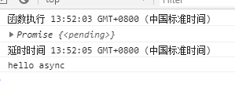

## 一、Generator

>   以下来自 [ECMAScript 6 入门 - 阮一峰](http://es6.ruanyifeng.com/)

Generator 函数是 ES6 提供的一种**异步编程**解决方案。

Generator 函数有多种理解角度。语法上，首先可以把它理解成，Generator 函数是一个状态机，封装了多个内部状态。

执行 Generator 函数会返回一个**遍历器对象**，也就是说，Generator 函数除了状态机，还是一个**遍历器对象生成函数**。返回的遍历器对象，可以依次遍历 Generator 函数内部的每一个状态。

形式上，Generator 函数是一个普通函数，但是有两个特征。

一是，`function`关键字与函数名之间有一个星号；

二是，函数体内部使用`yield`表达式，定义不同的内部状态（`yield`在英语里的意思就是“产出”）。

```js
function* myGenerator() {
  yield 'hello';
  yield 'world';
  return 'ending';
}
// 返回值是一个遍历器对象
var hw = myGenerator();
```

上面代码定义了一个 Generator 函数`helloWorldGenerator`，它内部有两个`yield`表达式（`hello`和`world`），即该函数有三个状态：hello，world 和 return 语句（结束执行）。

然后，Generator 函数的调用方法与普通函数一样，也是在函数名后面加上一对圆括号。不同的是，调用 Generator 函数后，该函数并不执行，返回的也不是函数运行结果，而是一个指向内部状态的指针对象，也就是上一章介绍的遍历器对象（Iterator Object）。

下一步，必须调用遍历器对象的`next`方法，使得指针移向下一个状态。也就是说，每次调用`next`方法，内部指针就从函数头部或上一次停下来的地方开始执行，直到遇到下一个`yield`表达式（或`return`语句）为止。换言之，Generator 函数是分段执行的，`yield`表达式是暂停执行的标记，而`next`方法可以恢复执行。

```js
hw.next()
// { value: 'hello', done: false }

hw.next()
// { value: 'world', done: false }

hw.next()
// { value: 'ending', done: true }

hw.next()
// { value: undefined, done: true }
```

总结一下，调用 Generator 函数，返回一个遍历器对象，代表 Generator 函数的内部指针。以后，每次调用遍历器对象的`next`方法，就会返回一个有着`value`和`done`两个属性的对象。`value`属性表示当前的内部状态的值，是`yield`表达式后面那个表达式的值；`done`属性是一个布尔值，表示是否遍历结束。


### 1、yield 表达式

由于 Generator 函数返回的遍历器对象，只有调用`next`方法才会遍历下一个内部状态，所以其实提供了一种可以暂停执行的函数。`yield`表达式就是暂停标志。

遍历器对象的`next`方法的运行逻辑如下：

（1）遇到`yield`表达式，就暂停执行后面的操作，并将紧跟在`yield`后面的那个表达式的值，作为返回的对象的`value`属性值。

（2）下一次调用`next`方法时，再继续往下执行，直到遇到下一个`yield`表达式。

（3）如果没有再遇到新的`yield`表达式，就一直运行到函数结束，直到`return`语句为止，并将`return`语句后面的表达式的值，作为返回的对象的`value`属性值。

（4）如果该函数没有`return`语句，则返回的对象的`value`属性值为`undefined`。

需要注意的是，`yield`表达式后面的表达式，只有当调用`next`方法、内部指针指向该语句时才会执行，因此等于为 JavaScript 提供了手动的“惰性求值”（Lazy Evaluation）的语法功能。


**`yield`表达式与`return`语句区别：**

相似之处在于，都能返回紧跟在语句后面的那个表达式的值。区别在于每次遇到`yield`，函数暂停执行，下一次再从该位置继续向后执行，而`return`语句不具备位置记忆的功能。

一个函数里面，只能执行一次（或者说一个）`return`语句，但是可以执行多次（或者说多个）`yield`表达式。

正常函数只能返回一个值，因为只能执行一次`return`；Generator 函数可以返回一系列的值，因为可以有任意多个`yield`。


### 2、与 Iterator 接口的关系

任意一个对象的`Symbol.iterator`方法，等于该对象的遍历器生成函数，调用该函数会返回该对象的一个遍历器对象。

由于 Generator 函数就是遍历器生成函数，因此可以把 Generator 赋值给对象的`Symbol.iterator`属性，从而使得该对象具有 Iterator 接口。

```js
var myIterable = {};
myIterable[Symbol.iterator] = function* () {
  yield 1;
  yield 2;
  yield 3;
};

[...myIterable] // [1, 2, 3]
```

上面代码中，Generator 函数赋值给`Symbol.iterator`属性，从而使得`myIterable`对象具有了 Iterator 接口，可以被`...`运算符遍历了。


### 3、next 方法的参数

`yield`表达式本身没有返回值，或者说总是返回`undefined`。`next`方法可以带一个参数，该参数就会被当作上一个`yield`表达式的返回值。

```js
function* f() {
  for(var i = 0; true; i++) {
    var reset = yield i;
    if(reset) { i = -1; }
  }
}

var g = f();

g.next() // { value: 0, done: false }
g.next() // { value: 1, done: false }
g.next(true) // { value: 0, done: false }
```

上面代码先定义了一个可以无限运行的 Generator 函数`f`，如果`next`方法没有参数，每次运行到`yield`表达式，变量`reset`的值总是`undefined`。当`next`方法带一个参数`true`时，变量`reset`就被重置为这个参数（即`true`），因此`i`会等于`-1`，下一轮循环就会从`-1`开始递增。


### 4、for...of 循环

`for...of`循环可以自动遍历 Generator 函数时生成的`Iterator`对象，且此时不再需要调用`next`方法。

```js
function* foo() {
  yield 1;
  yield 2;
  yield 3;
  yield 4;
  yield 5;
  return 6;
}

for (let v of foo()) {
  console.log(v);
}
// 1 2 3 4 5
```

上面代码使用`for...of`循环，依次显示 5 个`yield`表达式的值。这里需要注意，一旦`next`方法的返回对象的`done`属性为`true`，`for...of`循环就会中止，且不包含该返回对象，所以上面代码的`return`语句返回的`6`，不包括在`for...of`循环之中。


下面是一个利用 Generator 函数和`for...of`循环，实现斐波那契数列的例子。

```js
function* foo() {
      let [prev, current] = [0, 1];
      for (;;) {
        yield current;
        [prev, current] = [current, prev + current];
      }
    }

    for (let n of foo()) {
      if (n > 1000) break;
      console.log(n);
    }
```


**Generator小案例**

需求：

1、发送Ajax请求获取新闻内容

2、新闻内容获取成功再次发送请求获取对应的新闻评论内容

3、新闻内容获取失败则不需要再次发送请求。

```js
    function getNews(url) {
      $.get(url, function (data) {
        console.log(data);
        let urls = "http://localhost:3000" + data.commentUrl;
        // urls可以作为第一个yield的返回值
        // 执行第二条yeild语句，发送请求新闻评论
        // 获取的评论地址如何传入到 yield getNews(urls);靠的是第二次
        // 发送next时传入的参数，就是评论地址
        sx.next(urls);
      });
    }

    function* sendXml() {
      // 发送请求新闻内容
      let urls = yield getNews("http://localhost:3000/news?id=2");
      // 请求新闻评论内容
      yield getNews(urls);
    }

    let sx = sendXml();
    // 执行第一条yeild语句，发送请求新闻
    sx.next();
```


## 二、async

ES2017 标准引入了 async 函数，使得异步操作变得更加方便。

async 函数是什么？一句话，它就是 Generator 函数的语法糖。


**语法：**

```js
async function foo(){
  await 异步操作;
  await 异步操作；
}
```

**特点：**

1、不需要像Generator去调用next方法，**遇到await等待，当前的异步操作完成就往下执行**

2、**返回的总是Promise对象**，可以用then方法进行下一步操作

3、async取代Generator函数的星号*，await取代Generator的yield

4、语意上更为明确，使用简单，经临床验证，暂时没有任何副作用


举个栗子：

```js
    async function timeout(ms) {
      return new Promise(resolve => {
        setTimeout(resolve, ms);
      })
    }
    
    async function asyncPrint(value, ms) {
      console.log('函数执行', new Date().toTimeString());
      await timeout(ms);
      console.log('延时时间', new Date().toTimeString());
      console.log(value);
    }

    console.log(asyncPrint('hello async', 2000));
```



asyncPrint 执行的时候，先打印的是“函数执行”，之后进入到 timeout 函数，由于是异步执行，但是timeout未执行完成，所以 await 在等待，相当于挂起。而这一边 asyncPrint会立即返回一个 Promise对象。之后另一边timeout、执行完成，打印出“延时时间”，之后打印“hello async”。


`async`函数内部`return`语句返回的值，会成为`then`方法回调函数的参数。下面代码中，函数`f`内部`return`命令返回的值，会被`then`方法回调函数接收到。

```js
async function f() {
  return 'hello world';
}

f().then(v => console.log(v))
// "hello world"
```


### 1、await 命令

正常情况下，`await`命令后面是一个 Promise 对象。如果不是，会被转成一个立即`resolve`的 Promise 对象。

而 **resolve参数就是await的返回值。**

```js
async function f() {
  return await 123;
}

f().then(v => console.log(v))
// 123
```

`await`命令后面的 Promise 对象如果变为`reject`状态，则`reject`的参数会被`catch`方法的回调函数接收到。

```js
async function f() {
  await Promise.reject('出错了');
}

f()
.then(v => console.log(v))
.catch(e => console.log(e))
// 出错了
```


### 2、案例：获取新闻和评论内容

```js
async function sendXml(url) {
      return new Promise((resolve, reject) => {
        $.ajax({
          url,
          type: 'GET',
          success: data => resolve(data),
          error: error => reject(error)
        })
      })
    }

    async function getNews(url) {
      let result = await sendXml(url);
      let result2 = await sendXml(url);
      console.log(result, result2);
    }
    getNews('http://localhost:3000/news?id=2')
```


## 三、Class

JavaScript 语言中，生成实例对象的传统方法是通过构造函数。下面是一个例子。

```js
function Point(x, y) {
  this.x = x;
  this.y = y;
}

Point.prototype.toString = function () {
  return '(' + this.x + ', ' + this.y + ')';
};

var p = new Point(1, 2);
```

上面这种写法跟传统的面向对象语言（比如 C++ 和 Java）差异很大，ES6 提供了更接近传统语言的写法，引入了 Class（类）这个概念，作为对象的模板。通过`class`关键字，可以定义类。

```js
//定义类
class Point {
  constructor(x, y) {
    this.x = x;
    this.y = y;
  }

  toString() {
    return '(' + this.x + ', ' + this.y + ')';
  }
}
```

### 1、constructor 方法

`constructor`方法是类的默认方法，通过`new`命令生成对象实例时，自动调用该方法。一个类必须有`constructor`方法，如果没有显式定义，一个空的`constructor`方法会被默认添加。


Class 的继承

Class 可以通过`extends`关键字实现继承，这比 ES5 的通过修改原型链实现继承，要清晰和方便很多。

```js
class Point {
}
// ColorPoint 继承 Point
class ColorPoint extends Point {
}
```

上面代码定义了一个`ColorPoint`类，该类通过`extends`关键字，继承了`Point`类的所有属性和方法。

```js
class ColorPoint extends Point {
  constructor(x, y, color) {
    super(x, y); // 调用父类的constructor(x, y)
    this.color = color;
  }

  toString() {
    return this.color + ' ' + super.toString(); // 调用父类的toString()
  }
}
```

上面代码中，`constructor`方法和`toString`方法之中，都出现了`super`关键字，它在这里表示父类的构造函数，用来新建父类的`this`对象。

子类必须在`constructor`方法中调用`super`方法，否则新建实例时会报错。这是因为子类自己的`this`对象，必须先通过父类的构造函数完成塑造，得到与父类同样的实例属性和方法，然后再对其进行加工，加上子类自己的实例属性和方法。如果不调用`super`方法，子类就得不到`this`对象。


