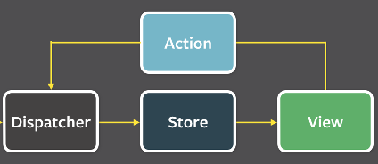
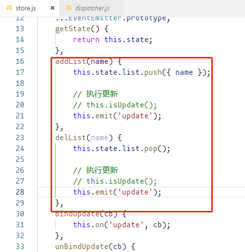
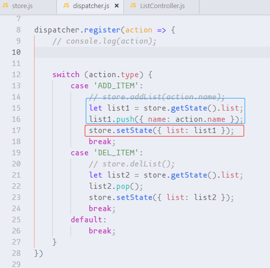
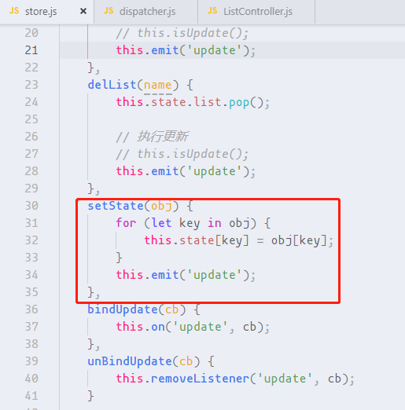

## 一、flux架构

什么是flux？

简单说，Flux 是一种架构思想，专门解决软件的结构问题。

一般**中大型react项目**会用到 Flux，便于管理数据模型。小型项目就没必要使用了。


### 1、基本概念

首先，Flux将一个应用分成四个部分。

- **View**： 视图层
- **Action**（动作）：视图层发出的消息，用来修改数据模型（比如mouseClick）
- **Dispatcher**（派发器）：用来接收Actions、执行回调函数
- **Store**（数据层）：用来存放应用的状态，一旦发生变动，就提醒Views要更新页面





> Flux 的最大特点，就是数据的"单向流动"。
>
>
>
> 1. 用户访问 View，（同时将View中视图更新的函数赋值给Store的监听函数subscribe）
> 2. View 发出用户的 Action
> 3. Dispatcher 收到 Action，要求 Store 进行相应的更新
> 4. Store 更新后，（触发Store的subscribe函数来更新View视图）


### 2、示例

效果：创建List组件显示列表，点击添加按钮添加数据，点击删除按钮删除最后一个数据。


#### 2.1、创建store，保存数据模型

```jsx
export let store = {
    state: {
        list: [
            { name: '商品1' },
            { name: '商品2' },
            { name: '商品3' },
            { name: '商品4' },
        ]
    },
}
```


#### 2.2、创建action

点击按钮的时候时候创建。

创建的时候添加`type`属性是为了分辨之后该如何操作store。

```jsx
// List.js
import { store } from './store'
import dispatcher from './dispatcher'
export class List extends React.Component {
    constructor() {
        super();
		// List加载的时候，通过store.getList()函数获取store的数据
        this.state = store.getList();
        this.add = this.add.bind(this);
        this.del = this.del.bind(this);
    }
    add() {
        // 创建action
        let action = {
            type: 'ADD_ITEM',
            name: '新的商品'
        }
    }
    del() {
        // 创建action
        let action = {
            type: 'DEL_ITEM'
        }
    }

    render() {
        let domList = this.state.list.map((item, i) => {
            return (
                <li key={i}>
                    {item.name}
                </li>
            );
        })
        return (
            <div>
                <button onClick={this.add}>添加</button>
                <button onClick={this.del}>删除</button>
                <ul>
                    {domList}
                </ul>
            </div>
        )
    }
}
```

> store的数据获取也不能直接操作，而是需要store自己提供自定义方法才可以。


#### 2.3、创建dispatcher

```jsx
// dispatcher.js
import flux from "flux";
import { store } from "./store";

let Dispatcher = flux.Dispatcher;
let dispatcher = new Dispatcher();
dispatcher.register(action => {
    // 参数action即是获取到action的值
    console.log(action);
})

export default dispatcher;
```

为了能获取到action，所以在创建action之后，还要发送给dispatcher：

```js
import dispatcher from './dispatcher'

add() {
    let action = {
        type: 'ADD_ITEM',
        name: '新的商品'
    }
    dispatcher.dispatch(action);
}
del() {
    let action = {
        type: 'DEL_ITEM'
    }
    dispatcher.dispatch(action);
}
```


#### 2.4、更新store

dispatcher获取到action后需要更新store。也需要调用store提供的自定义方法。

```jsx
// store.js
export let store = {
    state: {
        list: [
            { name: '商品1' },
            { name: '商品2' },
            { name: '商品3' },
            { name: '商品4' },
        ]
    },
    getList() {
        return this.state;
    },
    // 自定义操作store方法
    addList(name) {
        this.state.list.push({ name });
    },
    delList(name) {
        this.state.list.pop();
    },
}
```


```jsx
// dispatcher.js
import flux from "flux";
import { store } from "./store";

let Dispatcher = flux.Dispatcher;
let dispatcher = new Dispatcher();
dispatcher.register(action => {
	// 根据type来操作不同的store方法
    switch (action.type) {
        case 'ADD_ITEM':
            store.addList(action.name);
            break;
        case 'DEL_ITEM':
            store.delList();
            break;
        default:
            break;
    }
})

export default dispatcher;
```


#### 2.5、更新view

此时store已经更新，但是view没有更新，如何更新view？

> 在store定义一个变量bindUpdate，用来调用view的更新方法。在List加载时就把bindUpdate赋值为view的更新方法，只要store的数据一更新，就调用这个方法来更新视图。

```jsx
export let store = {
    state: {
        list: [
            { name: '商品1' },
            { name: '商品2' },
            { name: '商品3' },
            { name: '商品4' },
        ]
    },
    // 定义更新view变量
    bindUpdate: null,
    getList() {
        return this.state;
    },
    addList(name) {
        // 更新store
        this.state.list.push({ name });

        // 执行更新view
        this.bindUpdate();
    },
    delList(name) {
        // 更新store
        this.state.list.pop();

        // 执行更新view
        this.bindUpdate();
    },

}
```

```jsx
import { store } from './store'
import dispatcher from './dispatcher'
export class List extends React.Component {
    constructor() {
        super();

        this.state = store.getList();
        this.add = this.add.bind(this);
        this.del = this.del.bind(this);
    }
    componentDidMount = () => {
        // List加载完成后将bindUpdate赋值为更新方法
        store.bindUpdate = this.updateView.bind(this);
    }
    add() {
        let action = {
            type: 'ADD_ITEM',
            name: '新的商品'
        }
        dispatcher.dispatch(action);
    }
    del() {
        let action = {
            type: 'DEL_ITEM'
        }
        dispatcher.dispatch(action);
    }
    // 更新方法，获取store.state的最新数据进行更新
    updateView() {
        this.setState(store.state)
    }

    render() {
        let domList = this.state.list.map((item, i) => {
            return (
                <li key={i}>
                    {item.name}
                </li>
            );
        })
        return (
            <div>
                <button onClick={this.add}>添加</button>
                <button onClick={this.del}>删除</button>
                <ul>
                    {domList}
                </ul>
            </div>
        )
    }
}
```


于是乎，整个单向流动循环完成。


##### 优化view更新

之前view的更新是通过将List的一个更新方法赋值给store的一个变量，但是有个问题是，如果有很多个组件的话，就由很多个store，就需要很多个变量，那就太麻烦了，其名称头都起大了。

所以，我们可以通过node自带的event对象来做观察者模式。

```jsx
let EventEmitter = require('events').EventEmitter;
let event = new EventEmitter();

export let store = {
    state: {
        list: [
            { name: '商品1' },
            { name: '商品2' },
            { name: '商品3' },
            { name: '商品4' },
        ]
    },
    getList() {
        return this.state;
    },
    addList(name) {
        this.state.list.push({ name });
        // 每次数据模型有变更，触发update事件
        event.emit('update');
    },
    delList(name) {
        this.state.list.pop();
        // 每次数据模型有变更，触发update事件
        event.emit('update');
    },
    bindUpdate(cb) {
        // 监听update事件
        event.on('update', cb);
    },
    unBindUpdate(cb) {
        this.removeListener('update', cb);
    }
}
```

在List里面加载完成后进行绑定`bindUpdate`函数：

卸载的时候绑定`unBindUpdate`函数：

```js
componentDidMount = () => {
    store.bindUpdate(this.updateView.bind(this));
}
componentWillUnmount() {
    store.unBindUpdate(this.updateView.bind(this));
}
```

这时候不管有多少个组件，都可以使用bindUpdate和unBindUpdate进行视图更新。


##### 继续优化

我们使用event的时候，new了一个对象，可是就只用到了on和emit方法，太浪费内存了。

我们发现event对象中其实没有on和emit方法，这些方法都是EventEmitter原型对象中的，那么我们直接把EventEmitter原型对象拿过来就好了。

```jsx
let EventEmitter = require('events').EventEmitter;

export let store = {
    state: {
        list: [
            { name: '商品1' },
            { name: '商品2' },
            { name: '商品3' },
            { name: '商品4' },
        ]
    },
    // 把EventEmitter.prototype全部copy过来，就不需要new了。
    ...EventEmitter.prototype,
    getList() {
        return this.state;
    },
    addList(name) {
        this.state.list.push({ name });

        // 执行更新
        // this.bindUpdate();
        this.emit('update');
    },
    delList(name) {
        this.state.list.pop();

        // 执行更新
        this.emit('update');
    },
    bindUpdate(cb) {
        this.on('update', cb);
    }

}
```

调用的时候，直接使用this.on和this.emit就可以了。


##### 优化store和view更新

之前store的更新方式是在dispatcher中调用store的更新各个更新方法进行更新，如果方法很多的话，就要写很多方法比较麻烦。并且每个方法中都需要emit更新视图。





所以我们在store中增加一个类似react的setState方法，一次性更改所有store的state。






#### 2.6、视图分层

我们之前List组件视图的显示和逻辑处理代码是写在一起的，视图分层就是把他们分开。

分开后分为`容器组件`和`UI组件`

UI组件复负责视图显示；

容器组件包裹UI，并负责逻辑处理。

现在将List分层：

容器组件为：`ListController.js` 

UI组件为：`List.js`

```js
// List.js

export class List extends React.Component {
    constructor() {
        super();
    }
    render() {
        let domList = this.props.list.map((item, i) => {
            return (
                <li key={i}>
                    {item.name}
                </li>
            );
        })
        return (
            <div>
                <button onClick={this.props.add}>添加</button>
                <button onClick={this.props.del}>删除</button>
                <ul>
                    {domList}
                </ul>
            </div>
        )
    }
}
```


```jsx
//ListController.js

import { store } from '../store'
import dispatcher from '../dispatcher'
import { List } from './List'

export class ListController extends React.Component {
    constructor() {
        super();

        this.state = store.getState();
        this.add = this.add.bind(this);
        this.del = this.del.bind(this);
    }
    componentDidMount = () => {
        store.bindUpdate(this.updateView.bind(this));
    }
    componentWillUnmount() {
        store.unBindUpdate(this.updateView.bind(this));
    }

    add() {
        let action = {
            type: 'ADD_ITEM',
            name: '新的商品'
        }
        dispatcher.dispatch(action);
    }
    del() {
        let action = {
            type: 'DEL_ITEM'
        }
        dispatcher.dispatch(action);
    }
    updateView() {
        this.setState(store.state)
    }

    render() {
        // 调用List UI组件
        return <List list={this.state.list} add={this.add} del={this.del} />
    }
}
```


### 3、flux项目思路

1、将视图部分的页面组件拆分成容器组件和UI组件

容器组件可继承 封装好的 Controller 以自动实现绑定更新视图方法及卸载组件时自动解绑，避免所有容器组件写相同的代码。
（其中差异部分各个组件的store通过构造函数的第二个参数传入。）
```jsx
export class Controller extends React.Component {
    constructor(props, store) {
        super(props);
        this.store = store;
        this.state = this.store.getState();
        this.store.subscribe(this.updateView.bind(this));
    }

    updateView() {
        this.setState(this.store.getState());
    }

    componentWillUnmount() {
        this.store.unBindUpdate(this.updateView.bind(this));
    }
}
```
> Controller 之所以继承 React.Component是因为容器组件需要，但是又不能同时继承Controller和React.Component，所以采取这种嵌套继承的方式。


UI组件所有数据(点击等各种事件所调用的函数)均来自于props(由容器组件传入)
类似以下方式：
```jsx
render() {
    return <Home {...this.state} />
}
```
`<Home />` 即是UI组件。
this.state 哪里来呢？
来自对应的store：this.state = HomeStore.getState();
store的state来自哪里呢？
来自页面加载时ajax请求，请求到数据写入store。
既然要操作store，那么就要通过action->dispatcher->store->view的顺序来。


2、创建action工厂函数
- 定义一个初始化 的action工厂函数
- 请求需要的数据
- 将拿到的数据封装到 action中
- 将action发送到dispatcher (通过.dispatch()方法)


3、在派发器dispatcher中配置对应的case 
并且从action中拿到数据后，设置到对应store中即可
通过各自组件的类似`HomeStore.setState(action);`方式进行设置。
store的state更新了，注意需要在容器组件加载完成后绑定视图更新方法，视图更新方法就是组件获取最新store的state数据。


4、在容器组件的加载完成的生命周期函数中，调用上述步骤封装好的action工厂函数（也就是打开页面的时候进行ajax请求）


5、路由部分引入的组件 注意需要切换成容器组件。


## 简易flux项目

链接：https://github.com/Daotin/daotin.github.io/issues/132#issue-602918224
