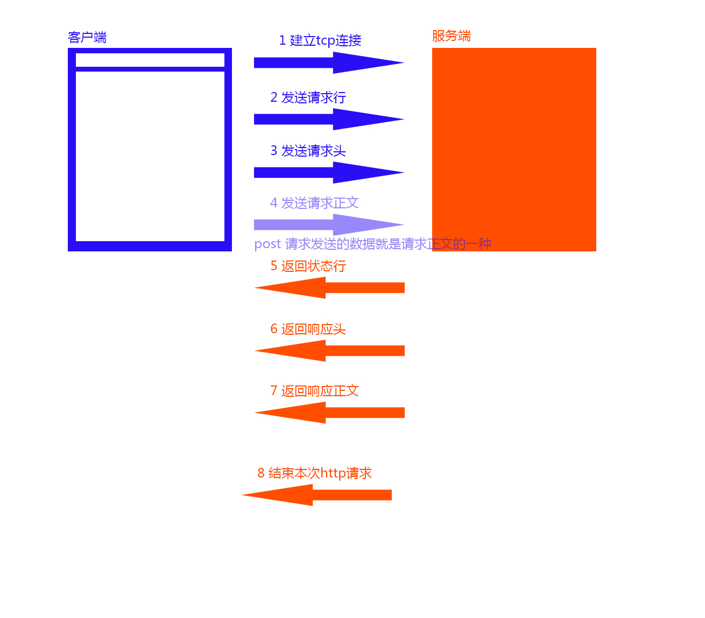

## 一、内置模块

### 1、url 

描述：可以对地址字符串进行解析

```js
let url = require("url");
let urlStr = "https://www.baidu.com/s?ie=utf-8&&wd=%E5%91%A8%E6%9D%B0%E4%BC%A6";
let urlObj = url.parse(urlStr); // 将字符串形式的地址转换成对象格式
console.log(urlObj);


// Url {
//     protocol: 'https:',  // 协议
//     slashes: true,      // 是否有"//"
//     auth: null,
//     host: 'www.baidu.com', 
//     port: null,
//     hostname: 'www.baidu.com',
//     hash: null,
//     search: '?ie=utf-8&&wd=%E5%91%A8%E6%9D%B0%E4%BC%A6',
//     query: 'ie=utf-8&&wd=%E5%91%A8%E6%9D%B0%E4%BC%A6',
//     pathname: '/s',
//     path: '/s?ie=utf-8&&wd=%E5%91%A8%E6%9D%B0%E4%BC%A6',
//     href: 'https://www.baidu.com/s?ie=utf-8&&wd=%E5%91%A8%E6%9D%B0%E4%BC%A6' 
//     }

console.log(url.format(urlObj));// 将对象形式的地址转换成字符串
// https://www.baidu.com/s?ie=utf-8&&wd=%E5%91%A8%E6%9D%B0%E4%BC%A6
```


在parse再加一个参数true的时候：query后面的值会变成对象形式：

```js
let urlObj = url.parse(urlStr,true);
//Url {
//     protocol: 'https:',
//     slashes: true,
//     auth: null,
//     host: 'www.baidu.com',
//     port: null,
//     hostname: 'www.baidu.com',
//     hash: null,
//     search: '?ie=utf-8&&wd=%E5%91%A8%E6%9D%B0%E4%BC%A6',
//     query: { ie: 'utf-8', wd: '周杰伦' },
//     pathname: '/s',
//     path: '/s?ie=utf-8&&wd=%E5%91%A8%E6%9D%B0%E4%BC%A6',
//     href: 'https://www.baidu.com/s?ie=utf-8&&wd=%E5%91%A8%E6%9D%B0%E4%BC%A6' }
```


如果在加一个参数：true，则可以解析不带’http’的地址：此时protocol字段为null。

```js
let urlObj = url.parse(urlStr, true, true);
// Url {
//     protocol: null,
//     slashes: true,
//     auth: null,
//     host: 'www.baidu.com',
//     port: null,
//     hostname: 'www.baidu.com',
//     hash: null,
//     search: '?ie=utf-8&&wd=%E5%91%A8%E6%9D%B0%E4%BC%A6',
//     query: { ie: 'utf-8', wd: '周杰伦' },
//     pathname: '/s',
//     path: '/s?ie=utf-8&&wd=%E5%91%A8%E6%9D%B0%E4%BC%A6',
//     href: '//www.baidu.com/s?ie=utf-8&&wd=%E5%91%A8%E6%9D%B0%E4%BC%A6' }
```


### 2、querystring 

描述：用户将地址栏传参的字符串类型转换成对象类型（类似jq的ajax传参的对象形式）

```js
let qs = require("querystring");

let obj = {
    user: "daotin",
    pwd: "123456"
}

/**
 * qs.stringify(args1 [, args2, args3])
 * args1: 需要转换成字符串的对象
 * args2: 指定每个键值对之间的间隔符
 * args3: 指定键和值之间的间隔符
 */
let str1 = qs.stringify(obj);
let str2 = qs.stringify(obj, "#");
let str3 = qs.stringify(obj, "#", ":");

console.log(str1); //user=daotin&pwd=123456
console.log(str2); //user=daotin#pwd=123456
console.log(str3); //user:daotin#pwd:123456

/**
 * qs.parse(args1 [,args2,args3])
 * 
 * args1: 需要转换成对象的字符串
 * args2: 指定每个键值对之间的间隔符
 * args3: 指定键和值之间的间隔符
 * 
 */

console.log(qs.parse(str1)); //{ user: 'daotin', pwd: '123456' }
console.log(qs.parse(str2, "#")); //{ user: 'daotin', pwd: '123456' }
console.log(qs.parse(str3, "#", ":")); //{ user: 'daotin', pwd: '123456' }
```

> 注意： 在转换的时候，如果不是标准地址传值参数的形式的字符串，需要转换成标准形式的字符串才能正确的转成对象。


querystring 还可以将地址栏中的中文转换成字符编码形式。

`escape`：中文转字符编码

`unescape`：字符编码转中文

```js
let qs = require("querystring");

let str = "周杰伦";
let tmp = qs.escape(str);  // 中文转字符编码
console.log(tmp);       //%E5%91%A8%E6%9D%B0%E4%BC%A6
console.log(qs.unescape(tmp)); // 周杰伦
```


### 3、events

描述：事件模块

```js
let EventEmitter = require("events").EventEmitter; //事件模块的构造函数
let event = new EventEmitter();

let myFunc = (str) => {
    console.log("event 事件触发1次" + str);
}

// 事件监听方式一
event.on("daotin", myFunc);
// 事件监听方式二
event.addListener("daotin", (str) => {
    console.log("event 事件触发2次" + str);
});

// 事件触发
event.emit("daotin", "我是参数");

setTimeout(() => {
    //移除事件监听（必须有函数名，不能像jq一样不写函数名，有点类似原生js）
    event.removeListener("daotin", myFunc);
    event.emit("daotin","我是参数");
}, 3000);
```

>**事假监听有三种：**
>`event.on("daotin", myFunc);`
>
>`event.addListener("daotin", (str) => {
>​    console.log("event 事件触发2次" + str);
>});`
>
>`event.once("daotin", (str) => {  **// event.emit抛发多次的时候只执行一次**
>​    console.log("event 事件触发2次" + str);
>});`
>
>
>
>**移除事件监听：**
>
>1、一定要有函数名
>
>2、不能使用off解绑
>
>`event.removeListener("daotin", myFunc);`
>
>`event.removeAllListeners("daotin")`  // 删除指定事件上的所有监听函数，此时不需要函数名。
>
>`event.removeAllListeners()` // 如果不传参数(事件名) 则所有事件的所有监听函数都会被删除
>
>
>
>**event.emit 可以传入两个参数：**
>
>参数1：事件名
>
>参数2：参数（如果是多个参数，可以传入一个对象）。


第一次 event.emit 触发 ‘daotin’事件的时候，打印两次结果。

第二次 event.emit 的时候，由于移除有函数名的事件监听对象，所以只打印第二次。


当向event中添加事件监听的时候，是有事件个数的限制的，如果绑定的事件超出了默认个数，会出现警告，但是不会报错，程序依然可以正常执行。如果我们想要改变警告上限，可以使用下面方式：

```js
event.setMaxListeners(40); // 设置绑定事件警告上限为40
```


### 4、fs

描述：文件操作模块。可以操作本地文件的增删改查，文件目录的新增修改删除等操作，还有文件读取流，文件写作流。


**文件相关操作：**

```js
let fs = require("fs");

// 创建一个目录
// err 是创建失败的参数，创建成功则为空
fs.mkdir("logs", err => {
    if (!err) {
        console.log("创建目录成功");
    }
});

// 创建或修改文件
// 参数1：文件名
// 参数2：文件的内容
// 参数3：成功或失败回调函数
fs.writeFile("logs/test", "这是一个测试文件", err => {
    if (!err) {
        console.log("文件创建/修改成功");
    }
});

/**
 * 文件追加内容
 */
fs.appendFile("logs/test", "这是一个新的测试文件", err => {
    if (!err) {
        console.log("文件追加成功");
    }
});
// 文件读取
fs.readFile("logs/1.txt", "utf-8", (err, data) => {
    if (!err) {
        console.log(data);
    }
});
/**
 * 删除文件
 */
fs.unlink("logs/test", err => {
    if (!err) {
        console.log("删除文件成功");
    }
});
```

> `fs.writeFile(filename,content,callback)` 替换文件内容/创建文件(当文件不存在时) 第一个参数代表文件名(可以包含文件路径)
>
> `fs.appednFile(filename,content,callback)` 向已存在的文件末尾添加文本内容
>
> `fs.readFile(filename,ecode,callback)` 读取文件内容，第二个参数代表读取时的字符编码集，回调有两个参数，第一个参数是失败时的打印信息；第二个参数是读取到的data数据。
>
> `fs.unlink(filename,callback)` 删除指定名字的文件


**文件夹相关操作：**

```js
/**
 * 修改目录名或文件名
 * 如果不是相同的目录，那么不仅修改文件名或目录名，并且移动其路径
 */
fs.rename("logs", "msg", err => {
    if (!err) {
        console.log("文件名修改成功");
    }
});

/**
 * 读取目录文件
 */
fs.readdir("msg", (err, data) => {
    if (!err) {
        console.log(data); // 结果是一个数组集合 [ '1.txt', 'log1.txt', 'log2.txt', 'test' ]
    }
});

/**
 * 删除目录
 * （目录必须为空才可以，没有强制删除其内容的指令）
 */
fs.rmdir("logs", (err, data) => {
    if(!err) {
         console.log(data);
    }
});

/**
 * 读取目录或文件的相关信息
 * 读取目录或文件相关信息，可通过回调函数的第二个形参的isFile()/ifDirectory()方法判断是否为文件或目录。
 * ifFile()：判断是否为文件，是文件返回true
 * ifDirectory()：判断是否为目录，是文件返回true
 */
fs.stat("msg/test", (err, info) => {
    if (!err) {
        if (info.isFile()) {
            console.log("文件类型");
        } else if (info.isDirectory()) {
            console.log("目录类型");
        }
    }
});
```

> `fs.mkdir(dirname,callback)` ：创建目录，第一个参数代表目录名
>
> `fs.rename(oldname,newname,callback)` ：修改文件或者目录名(路径一致时)/移动文件或者目录(路径不一致时))
>
> `fs.readdir(path,callback)` ：读取目录，(返回的结果为数组包含该目录中所有的文件名和目录名)
>
> `fs.rmdir(pathname,callback)` ：删除目录，(目录必须为空)
>
> `fs.stat(pathname,callback)` ：读取目录或文件相关信息，可通过回调函数的第二个形参的isFile()方法判断是否为文件  以及 isDirectory()来判断是否为目录。


**文件流**

当我们一个文件非常大的时候，就不能使用readFile的方式来读取了，需要采用数据流的方式来阶段性的读取。这时候就需要采用数据流的读取和写入模式。

```js
let fs = require("fs");

// 创建读取流对象
let rs = fs.createReadStream("msg/log1.txt");
// 创建写入流对象
let rw = fs.createWriteStream("msg/log2.txt");

let count = 0;
// 读取流每读取一定大小的数据就会触发“data”事件
rs.on("data", msg => {
    count++;
    if (count === 1) {
        console.log(msg.toString()); // 读取的数据时buffer类型的数据，需要先转换成字符串类型的数据
    }
});

// end事件表示，所有数据读取完全的时候触发。
rs.on("end", () => { 
    console.log(count);
});

// rs是数据读取流，读取到的数据可以使用接收流来接收数据，这时读取到的数据就流入到
// rw对应的文件中。
rs.pipe(rw);
```


> 所有文件的读取和写入都是异步操作的。

如果想要同步实现，可以加上下面一句话：

```js
fs.appendFileSync()
```


### 5、http

描述：用于创建web服务

下面创建一个简单的web服务：

```js
let http = require("http");
/**
 * 创建一个server服务
 * req：表示客户端请求的数据
 * res：表示服务器回应的数据
 */
let server = http.createServer((req, res) => {
    // 200是响应状态码
    //"Content-Type": "text/html; charset=utf8"是响应头中部分内容类型的数据，返回的是什么格式的文本，字符编码是什么。
    res.writeHead(200, {
        "Content-Type": "text/html; charset=utf8"
    });
    //返回响应正文
    res.write("hello world");
    // 服务器响应完毕
    res.end();
});

/**
 * 启动服务，监听端口
 * 参数1：端口号
 * 参数2：域名（省略则默认是locolhost）
 * 参数3：打印语句
 */
server.listen(3000, () => {
    console.log("server running at http://localhost:3000");
});
```


http请求过程如下：




请求行包括：

- 请求方式：get/post
- 请求路径：path 域名后面的内容
- http的请求版本号（常用HTTP/1.1）

请求头：JSON的字符串

请求正文：post的data地址参数对象。（get没有在地址中包含）

状态行：

- http版本号
- 状态码200/404等

响应头：JSON字符串

响应正文：


