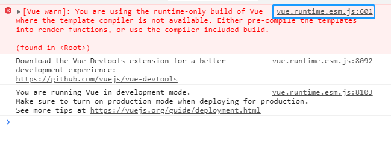

## 使用webpack开发vue


### 1、搭建webpack环境

```
npm init -y
```


这里只使用到html-webpack-plugin，ES6转换到ES5模块和vue模块

```
npm i html-webpack-plugin babel-loader@7.1.5 babel-core babel-preset-env webpack@3 -D
npm i vue -S
```


### 2、配置config文件

```js
let Hwp = require('html-webpack-plugin');

module.exports = {
    entry: __dirname + '/src/main.js',
    output: {
        path: __dirname + '/dist',
        filename: 'index.js'
    },
    devServer: {
        contentBase: __dirname + '/dist',
        port: 3000,
        inline: true
    },
    plugins: [
        new Hwp({
            template: __dirname + '/src/index.html',
            filename: 'index.html',
            inject: true
        })
    ],
    module: {
        rules: [
            { test: /\.js$/, exclude: /node_modules/, loader: 'babel-loader' }
        ]
    }
}
```


### 4、测试vue项目

```js
// main.js
import Vue from 'vue'

let app = new Vue({
    el: '#app',
    data: {
        username: 'daotin'
    },
    methods: {}
});
```

在index.html中

```html
<div id="app">
    <p>{{username}}</p>
</div>
```

这时候会报错：



原因是：

在node_modules的vue文件夹下的package.json中可以看到：

```json
"main": "dist/vue.runtime.common.js",
```

当我们使用import或者require的时候，默认引入的是vue.runtime.common.js，而不是vue/dist下的vue.js文件，引入这个vue.js才可以使用 new Vue({}) 的形式。


解决办法：

1、修改为`"main": "dist/vue.js",`，不推荐，别人拷贝的项目无法运行

2、`import Vue from 'vue/dist/vue.js'`，缺点是写法太low。

3、在配置文件起别名（推荐）

```json
resolve: {
    alias: {
        'vue': 'vue/dist/vue.js'
    }
}
```

> 注意：
>
> 如果上面引入的vue文件夹下package.json没有main属性，那么会引入vue文件夹下index.js文件，如果没有在尝试引入index.json文件，都没有？报错。


