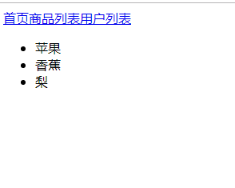
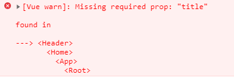
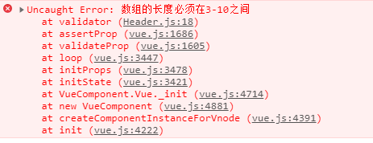

## 一、Vue组件

什么是组件： 组件的出现，就是为了拆分 Vue 实例的代码量的，能够让我们以不同的组件，来划分不同的功能模块，将来我们需要什么样的功能，就可以去调用对应的组件即可；

**组件化和模块化的不同：**

- 模块化： 是从代码逻辑的角度进行划分的；方便代码分层开发，保证每个功能模块的职能单一；
- 组件化： 是从UI界面的角度进行划分的；前端的组件化，方便UI组件的重用；


## 二、定义组件

### 1、定义全局组件

通过 `Vue.component(cname,option)`函数来定义

其中cname为字符串类型 代表组件名；option用于配置组件相关属性。

相关属性：例如:data computed methods template watch等等。

```js
// main.js
import Vue from 'vue'

// 全局组件
// 全局组件的定义一定要在new Vue之前。
// 定义之后到处可以使用，并且不需再声明
Vue.component('mydiv', {
    //不能在顶层元素使用v-for，因为顶层元素只能有一个
    template: `
        <div>
            <div v-for="item in goods">{{item.name}}</div>
        </div>
    `,
    data: function() {
        return {
            goods: [
                { name: 'Daotin', age: 18 },
                { name: 'lvonve', age: 19 },
                { name: 'wenran', age: 20 }
            ]
        }
    }
});

new Vue({
    el: '#app',
    data:{}
});
```
全局组件的使用：

```html
<!DOCTYPE html>
<html lang="en">

<head>
    <meta charset="UTF-8">
    <meta name="viewport" content="width=device-width, initial-scale=1.0">
    <meta http-equiv="X-UA-Compatible" content="ie=edge">
    <title>Document</title>
</head>

<body>
    <div id="app"></div>
    <!--全局组件的使用-->
    <my-login></my-login>
</body>

</html>
```


> 注意：
>
> 0、不论是全局组件还是局部组件，组件的 template 属性指向的模板内容，必须有且只能有唯一的一个顶层元素，否则会报错。
>
> 1、使用组件的时候，双标签和单标签的方式都可以。`<my-login></my-login>` 或者 `<my-login />`
>
> 2、组件的内部除了有 `template`，还有data，methods，watch，computed等所有vue实例的属性。
>
> 3、使用 Vue.component 定义全局组件的时候，组件名称使用了 驼峰命名（如myLogin），则在调用组件的时候，需要把大写的驼峰改为小写的字母，同时在两个单词之前，使用 - 链接（`<my-login></my-login>`）；如果不使用驼峰,则直接拿名称来使用即可；
>
> 4、全局组件定义之后可以可以直接使用，不需要import引入
>
> 5、定义组件的时候，data为一个匿名函数，其返回值为一个对象。在这个返回对象里面填写需要的数据。
>
> 6、定义全局组件的时候，必须在vue初始化之前完成，也就是必须放在new Vue()代码之前。


### 2、定义局部组件

通过components : { componentname:option} 的形式注册过一个子组件后才能在当前组件内使用该组件。

定义局部组件，就是再vue实例中定义组件。

```js
// main.js
import Vue from 'vue'

// 子组件定义的时候，如果提出组件的配置（比如c），那么也要放在new Vue之前。
let c = {
    template: `
        <div>
            <div v-for="item in names">{{item.name}}</div>
        </div>
    `,
    data: function() {
        return {
            names: [
                { name: 'good1' },
                { name: 'good2' },
                { name: 'good3' }
            ]
        }
    }
};

new Vue({
    el: '#app',
    data: {
        username: 'daotin'
    },
    // 定义局部组件
    components: { 
    	goods:c
    }
});
```
子组件的使用：
```html
<!DOCTYPE html>
<html lang="en">

<head>
    <meta charset="UTF-8">
    <meta name="viewport" content="width=device-width, initial-scale=1.0">
    <meta http-equiv="X-UA-Compatible" content="ie=edge">
    <title>Document</title>
</head>

<body>
    <div id="app"></div>
    <!--局部组件的使用-->
    <goods></goods>
</body>

</html>
```

> 注意：
>
> 1、局部组件要使用的话，**在哪个组件使用，就要在哪个组件中定义**，也叫注册。
>
> 2、定义子组件的时候，如果把option提出来写，也必须放在new Vue 之前。


## 三、动态组件

定义三个子组件`Home.js, Goods.js, Users.js`

> 一般组件的文件名首字母大写。

然后创建一个主组件App.js。在main.js里面这样做：

在main.js里面定义局部组件App，然后在main.js里面也可以定义template模板。

在main.js里面定义的模板会覆盖掉index.html里面的`<div id="app"></div>`

这里main.js里面的模板就是子组件App的内容，实际上这样写的目的就是在主页显示App的内容，所有其他组件比如Home.js等在App.js引入进行显示。

```js
new Vue({
    el: '#app',
    data: {},
    template: '<App/>',
    components: { App }
});
```

看看各个文件的内容：

```js
// Home.js
export let Home = {
    template: `
        <div>
            <h2>首页</h2>
        </div>
    `
}

// Goods.js
export let Goods = {
    template: `
        <div>
            <ul>
                <li v-for="good in goods">{{good.goodsName}}</li>
            </ul>
        </div>
    `,
    data() {
        return {
            goods: [
                { goodsName: '苹果' },
                { goodsName: '香蕉' },
                { goodsName: '梨' },
            ]
        }
    },
}

//Users.js
export let Users = {
    template: `
        <div>
            <ul>
                <li v-for="user in users">{{user.name}}</li>
            </ul>
        </div>
    `,
    data() {
        return {
            users: [
                { name: 'lvonve' },
                { name: 'daotin' },
                { name: 'wenran' },
            ]
        }
    },
}

```

主组件App.js：

```js
// 主组件
import { Home } from './pages/Home'
import { Goods } from './pages/Goods'
import { Users } from './pages/Users'

export let App = {
    template: `
        <div>
            <a href="javascript:;" @click="goPage(nav.name)" v-for="nav in navs">{{nav.text}}</a>
            
            <Component :is="currentPage" />
        </div>
    `,
    data() {
        return {
            currentPage: 'Goods',
            navs: [
                { text: '首页', name: 'Home' },
                { text: '商品列表', name: 'Goods' },
                { text: '用户列表', name: 'Users' }
            ]
        }
    },
    methods: {
        goPage(pagename) {
            this.currentPage = pagename;
        }
    },
    components: { Home, Goods, Users }
}
```

在主组件先import引入其他组件，然后使用局部组件的方式进行定义，之后使用`<Component is="Home" />` 类似于`<Home />` ，由于这里需要动态显示，所以is可变，就成了`<Component :is="currentPage" />`

这样点击不同的a标签就会显示不同的内容（默认显示Goods组件内容）。



## 四、组件间传值

### 1、父组件向子组件传值

有这样一个需求，我们的Home，Goods，Users组件都需要有一个相同的头部组件Header，但是需要Header里面的内容不同，这就需要父组件Home，Goods，Users传给子组件Header不同的值来显示不同的内容。

定义一个Header组件。

```js
// Header.js
export let Header = {
    template: `
        <div>
            <h3>
                我是Header组件
            </h3>
            
        </div>
    `
}
```

父组件怎么给子组件传值呢？

使用`props`。

父组件传递的方式：在子组件中自定义一个属性，名称随意，这里叫title，属性值为Home，

```js
template: `
        <div>
            <Header title="Home"/>
            <h2>首页</h2>
        </div>
    `,
```

然后在子组件里面接收父组件传来的数据：使用props接收来自父组件的数据，接收属性为一个数组，里面的值就是传过来的属性名。

既然是数组，就可以接收多个父组件传过来的数据。

```js
export let Header = {
    // 使用props接收来自父组件的数据，接收属性为一个数组，里面的值就是传过来的属性名
    props: ['title'],
    template: `
        <div>
            <h3>我是Header组件</h3>
            <p>我来自{{title}}</p>
        </div>
    `
}
```


#### 1.1、props类型验证

我们上面props传递的都是字符串，如果不小心传递的是数组啊，对象啊什么的，显示的时候也只会以字符串的显示显示，如何对props传递的数据进行类型声明呢？

我们需要在子组件里面进行props声明：

```js
export let Header = {
    props: {
        obj: Object,
        title: String
    },
    template: `
        <div>
            <h3>我是Header组件</h3>
            <p>我来自{{title}}</p>
            <p>{{obj}}</p>
        </div>
    `
}
```

父组件传值的时候和之前一样：

```js
import { Header } from '../components/Header'

export let Home = {
    data() {
        return {
            title: 'Home',
            obj: {
                username: 'Daotin'
            }
        }
    },
    template: `
        <div>
            <Header :title="title" :obj="obj"/>
            <h2>首页</h2>
        </div>
    `,
    components: { Header }
}
```


#### 1.2、props必填验证

还有个问题是当父组件不填写title值的时候，子组件不显示，但是不会报错。

**如何设置子组件声明的值为必填属性呢？**

子组件这样设置：

```js
export let Header = {
    props: {
        obj: Object,
        title: {
            type: String,
            required: true
        }
    },
    template: `
        <div>
            <h3>我是Header组件</h3>
            <p>我来自{{title}}</p>
            <p>{{obj}}</p>
        </div>
    `
}
```

父组件如果不写`title`属性的话，会报以下错误：




#### 1.3、props默认值

子组件：

```js
export let Header = {
    props: {
        obj: Object,
        title: {
            type: String,
            default: 'Home'
            // required: true
        }
    },
    template: `
        <div>
            <h3>我是Header组件</h3>
            <p>我来自{{title}}</p>
            <p>{{obj}}</p>
        </div>
    `
}
```

当子组件设置默认属性的时候，就不需要必填属性了，因为有了默认值肯定填写了。


#### 1.4、props自定义匹配规则

如果父组件传递的是个数组，我们想限制数组的长度怎么办？上面的属性都不可以限制，这时候就需要自定义匹配规则了。

这里我们限制传递过来的数组长度在3-10之间长度。

子组件：

```js
export let Header = {
    props: {
        obj: Object,
        title: {
            type: String,
            default: 'Default Home'
            // required: true
        },
        arr: {
            type: Array,
            required: true,
            validator: function(value) {
                // value就是父组件传递过来的数组
                if (value.length >= 3 && value.length <= 10) {
                    // 满足条件返回true
                    return true;
                } else {
                     // 不满足条件返回false
                    return false;
                }
            }
        }
    },
    template: `
        <div>
            <h3>我是Header组件</h3>
            <p>我来自{{title}}</p>
            <p>{{obj}}</p>
        </div>
    `
}
```

父组件这时传递个空数组：

```js
import { Header } from '../components/Header'

export let Home = {
    data() {
        return {
            title: 'Home',
            obj: {
                username: 'Daotin'
            },
            arr: []
        }
    },
    template: `
        <div>
            <Header :title="title" :obj="obj" :arr="arr"/>
            <h2>首页</h2>
        </div>
    `,
    components: { Header }
}
```

会报错如下，当我们传递的数组的长度满足的时候就不会报错了。


但是我觉得这个提示不明显，我们可以手动报错。

```js
export let Header = {
    props: {
        obj: Object,
        title: {
            type: String,
            default: 'Default Home'
            // required: true
        },
        arr: {
            type: Array,
            required: true,
            validator: function(value) {
                // value就是父组件传递过来的数组
                if (value.length >= 3 && value.length <= 10) {
                    return true;
                } else {
                    // return false;
                    throw new Error('数组的长度必须在3-10之间');
                }
            }
        }
    },
    template: `
        <div>
            <h3>我是Header组件</h3>
            <p>我来自{{title}}</p>
            <p>{{obj}}</p>
        </div>
    `
}
```



现在报错的信息就很明显了。


### 2、子组件向父组件传值

在此之前先介绍个插件`string-loader` ，这个插件可以让我们组件的template属性的值提出到单独的html页面，便于书写。

- 安装插件

```
npm i string-loader -D
```

- 配置config文件

```json
module: {
    rules: [
        { test: /\.html$/, loader: 'string-loader' }
    ]
},
```


## 三、组件切换

我们在登录注册一个网站的时候，经常看到两个按钮，一个登录，一个注册，如果你没有账号的话，需要先注册才能登录。我们在点击登录和注册的时候，网页会相应的切换，登录页面就是登陆组件，注册页面就是注册组件，那么点击登录和注册，如何实现组件的切换呢？


### 1、方式一

**使用`flag`标识符结合`v-if`和`v-else`切换组件**

```html
<!DOCTYPE html>
<html lang="en">

<head>
  <meta charset="UTF-8">
  <title>Document</title>
  <script src="./lib/vue-2.4.0.js"></script>
</head>

<body>
  <div id="box">
    <!-- 给a注册点击事件，切换flag状态 -->
    <a href="javascript:;" @click.prevent="flag=true">登录</a>
    <a href="javascript:;" @click.prevent="flag=false">注册</a>
    <!-- 使用v-if v-else切换组件 -->
    <login v-if="flag">
    </login>
    <register v-else="flag">
    </register>
  </div>

  <script>
    Vue.component('login', {
      template: '<h3>登录组件</h3>'
    });
    Vue.component('register', {
      template: '<h3>注册组件</h3>'
    });

    var vm = new Vue({
      el: "#box",
      data: {
        flag: true
      },
      methods: {}
    });
  </script>
</body>

</html>
```


**缺陷：**由于flag的值只有true和false，所以只能用于两个组件间 的切换，当大于两个组件的切换就不行了。


### 2、方式二

**使用 component元素的`:is`属性来切换不同的子组件**

使用 `<component :is="componentId"></component>`  来指定要切换的组件。

componentId：为需要显示的组件名称，为一个字符串，可以使用变量指定。

`componentId: 'login'`   // 默认显示登录组件。

```html
<!DOCTYPE html>
<html lang="en">

<head>
  <meta charset="UTF-8">
  <title>Document</title>
  <script src="./lib/vue-2.4.0.js"></script>
</head>

<body>
  <div id="box">
    <!-- 给a注册点击事件，切换flag状态 -->
    <a href="javascript:;" @click.prevent="componentId='login'">登录</a>
    <a href="javascript:;" @click.prevent="componentId='register'">注册</a>
    <component :is="componentId"></component>
  </div>

  <script>
    Vue.component('login', {
      template: '<h3>登录组件</h3>'
    });
    Vue.component('register', {
      template: '<h3>注册组件</h3>'
    });

    var vm = new Vue({
      el: "#box",
      data: {
        componentId: 'login'   // 默认显示登录
      },
      methods: {}
    });
  </script>
</body>

</html>
```


**为组件切换添加过渡：**

很简单，只需要**用 transition 将 component 包裹起来**即可。

```html
<transition>
  <component :is="componentId"></component>
</transition>
```

示例：

```html
<!DOCTYPE html>
<html lang="en">

<head>
  <meta charset="UTF-8">
  <title>Document</title>
  <script src="./lib/vue-2.4.0.js"></script>
  <link rel="stylesheet" href="./lib/animate.css">

  <style>
    .loginDiv {
      width: 200px;
      height: 200px;
      background-color: red;
    }

    .registerDiv {
      width: 200px;
      height: 200px;
      background-color: blue;
    }
  </style>
</head>

<body>
  <div id="box">
    <!-- 给a注册点击事件，切换flag状态 -->
    <a href="javascript:;" @click.prevent="componentId='login'">登录</a>
    <a href="javascript:;" @click.prevent="componentId='register'">注册</a>
    <transition mode="out-in" enter-active-class="animated bounceInRight" leave-active-class="animated bounceOutRight">
      <component :is="componentId"></component>
    </transition>
  </div>

  <template id="login">
    <div class="loginDiv">
    </div>
  </template>

  <template id="register">
    <div class="registerDiv">
    </div>
  </template>

  <script>
    Vue.component('login', {
      template: '#login'
    });
    Vue.component('register', {
      template: '#register'
    });

    var vm = new Vue({
      el: "#box",
      data: {
        componentId: 'login'
      },
      methods: {}
    });
  </script>
</body>

</html>
```

> `mode="out-in"`：可以设置切换组件的模式为先退出再进入。


## 四、组件传值

### 1、父组件向子组件传值

我们先通过一个例子看看子组件可不可以直接访问父组件的数据：

```html
<body>
  <div id="box">
    <mycom></mycom>
  </div>

  <template id="temp">
    <h3>子组件 --- {{msg}}</h3>
  </template>

  <script>
    var vm = new Vue({
      el: "#box",
      data: {
        msg: '父组件的msg'
      },
      methods: {},
      components: {
        mycom: {
          template: '#temp'
        }
      }
    });
  </script>
</body>
```

由于 components 定义的是私有组件，我们直接在子组件中调用父组件的msg会报错。


那么，怎么让子组件使用父组件的数据呢？

**父组件可以在引用子组件的时候， 通过 属性绑定（v-bind:） 的形式, 把需要传递给子组件的数据，以属性绑定的形式，传递到子组件内部，供子组件使用 。**

```html
<body>
  <div id="box">
    <mycom v-bind:parentmsg="msg"></mycom>
  </div>

  <template id="temp">
    <h3>子组件 --- 父组件：{{parentmsg}}</h3>
  </template>

  <script>
    var vm = new Vue({
      el: "#box",
      data: {
        msg: '父组件的msg'
      },
      methods: {},
      components: {
        mycom: {
          template: "#temp",
          // 对传递给子组件的数据进行声明，子组件才能使用 
          props: ['parentmsg']
        }
      }
    });
  </script>
</body>
```

注意：父组件绑定的**属性名称不能有大写字母**，否则不会显示，并且在命令行会有提示：


**组件data数据和props数据的区别：**

- data数据是子组件私有的，可读可写；
- props数据是父组件传递给子组件的，只能读，不能写。


**案例：发表评论功能**

父组件为评论列表，子组件为ID，评论者，内容和按钮的集合，在输入ID，评论者等内容，然后点击添加的时候，需要首先获取子组件的list列表，然后再添加新的列表项到列表中。

```html
<!DOCTYPE html>
<html lang="en">

<head>
  <meta charset="UTF-8">
  <title>Document</title>
  <script src="./lib/vue-2.4.0.js"></script>
</head>

<body>
  <div id="box">
    <mycom :plist="list"></mycom>

    <ul>
      <li v-for="item in list" :key="item.id">
        ID:{{item.id}} --- 内容：{{item.content}} --- 评论人：{{item.user}}
      </li>
    </ul>
  </div>

  <template id="tmp1">
    <div>
      <label>
        ID:
        <input type="text" v-model="id">
      </label>
      <br>
      <label>
        评论者:
        <input type="text" v-model="user">
      </label>
      <br>
      <label>
        内容:
        <textarea v-model="content"></textarea>
      </label>
      <br>
      <!-- 把父组件的数据作为子组件的函数参数传入 -->
      <input type="button" value="添加评论" @click="addContent(plist)">
    </div>
  </template>

  <script>
    var vm = new Vue({
      el: "#box",
      data: {
        list: [{
          id: Date.now(),
          user: 'user1',
          content: 'what'
        }, {
          id: Date.now(),
          user: 'user2',
          content: 'are'
        }]
      },
      methods: {},
      components: {
        mycom: {
          template: '#tmp1',
          data: function () {
            return {
              id: '',
              user: '',
              content: '',
            }
          },
          methods: {
            addContent(plist) {
              plist.unshift({
                id: this.id,
                user: this.user,
                content: this.content
              });
            }
          },
          props: ['plist']
        }
      }
    });
  </script>
</body>

</html>
```

把添加ID，评论人，内容作为子组件，把列表作为父组件，然后把添加的数据放到父组件列表上，由于要获取到父组件列表的数据，所以必然涉及到父组件向子组件传值的过程。这里还通过子组件方法参数来保存父组件的数据到子组件的数据中。


### 2、父组件向子组件传方法

既然父组件可以向子组件传递数据，那么也可以向子组件传递方法。

```html
<body>
  <div id="box">
    <mycom v-bind:parentmsg="msg" @parentfunc="show"></mycom>
  </div>

  <template id="temp">
    <div>
      <input type="button" value="调用父组件方法" @click="sonClick">
      <h3>子组件 --- 父组件：{{parentmsg}}</h3>
    </div>
  </template>

  <script>
    var vm = new Vue({
      el: "#box",
      data: {
        msg: '父组件的msg'
      },
      methods: {
        show(data1, data2) {
          console.log("这是父组件的show方法" + data1 + data2);
        }
      },
      components: {
        mycom: {
          template: "#temp",
          // 对传递给子组件的数据进行声明，子组件才能使用 
          props: ['parentmsg'],
          methods: {
            sonClick() {
              // 调用父组件的show方法
              this.$emit("parentfunc", 111, 222);
            }
          }
        }
      }
    });
  </script>
</body>
```

> 1、`@parentfunc="show"` 绑定父组件的show方法。
>
> 2、`<input type="button" value="调用父组件方法" @click="sonClick">` 点击按钮调用父组件的show方法
>
> 3、在 子组件的 sonClick 方法中使用 `this.$emit("parentfunc");` 来调用父组件的show方法
>
> 4、父组件的show方法也可以传参，在调用的时候，实参从 this.$emit 的第二个参数开始传入。
>
> **5、如果 this.$emit 的第二个参数传的是子组件的data数据，那么父组件的方法就可以获得子组件的数据，这也是把子组件的数据传递给父组件的方式。**


### 3、使用 ref 获取DOM和组件的引用

我们知道Vue不推荐直接获取DOM元素，那么在Vue里面怎么获取DOM及组件元素呢？

我们呢可以在元素上使用 `ref` 属性来获取元素。

```html
<!DOCTYPE html>
<html lang="en">

<head>
  <meta charset="UTF-8">
  <title>Document</title>
  <script src="./lib/vue-2.4.0.js"></script>
</head>

<body>
  <div id="box">
    <input type="button" value="获取元素" @click="getrefs" ref="mybtn">
    <h3 ref="myh3">这是H3</h3>
    <mycom ref="mycom"></mycom>
  </div>

  <template id="tmp1">
  </template>

  <script>
    // 定义组件
    Vue.component('mycom', {
      template: '#tmp1',
      data: function () {
        return {
          msg: '子组件的msg',
          pmsg: ''
        }
      },
      methods: {
        show(data) {
          console.log('调用子组件的show');
          this.pmsg = data;
          console.log(this.pmsg);
        },

      }
    });

    var vm = new Vue({
      el: "#box",
      data: {
        parentmsg: '父组件的msg'
      },
      methods: {
        getrefs() {
          console.log(this.$refs.myh3);
          console.log(this.$refs.mycom.msg);
          this.$refs.mycom.show(this.parentmsg);
        }
      }
    });
  </script>
</body>

</html>
```


**总结：**

1、ref 属性不仅可以获取DOM元素，也可以获取组件（无论全局还是私有组件）元素。

2、获取到组件元素后，就可以获取组件元素的data数据和methods方法。

**3、获取到组件中的方法后，可以传入VM的data数据，就可以把VM的data数据传入组件中。**


