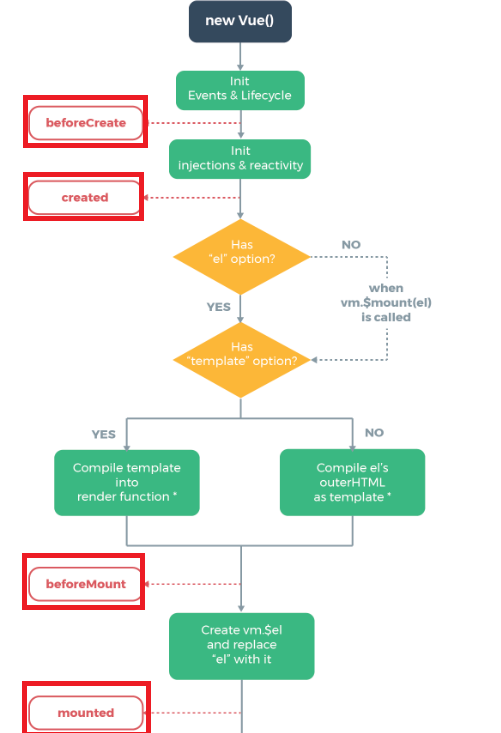
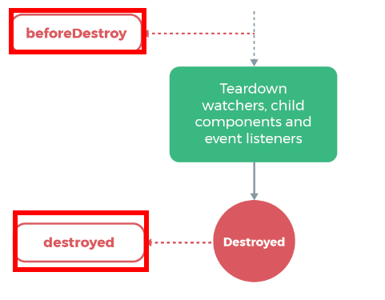

## 一、vue实例的生命周期

vue实例的生命周期指的是：**从Vue实例创建，运行，到销毁期间，会伴随着各种各样的事件，这些事件统称为生命周期。**

生命周期事件，也称生命周期函数，也称生命周期钩子。


## 二、生命周期函数三个阶段

### 1、实例化期和加载期

**创建期间的生命周期函数**：`beforeCreate` 和 `created`，`beforeMount` 和 `mounted`。




### 2、更新期

**运行期间的生命周期函数**：`beforeUpdate` 和  `updated`


### 3、卸载期

**销毁期间的生命周期函数**：`beforeDestroy` 和 `destroyed`




## 三、生命周期函数详解

**创建期间：**

- `beforeCreate`：表示实例完全被创建出来之前，会执行beforeCreate函数，这时data 和 methods 中的 数据都还没有没初始化，**如果调用data和methods的数据的话，会报错。**  
- `created`：实例已经在内存中创建OK，此时 data 和 methods 已经创建OK，此时还没有开始 编译模板。
- `beforeMount`：此时已经完成了模板的编译，但是还没有从内存挂载到页面中。

**注意：在 beforeMount 执行的时候，页面中的元素，还没有被真正替换过来，只是之前写的一些模板（比如插值表达式）还只是字符串的形式。**

- `mounted`： 此时，已经将编译好的模板，挂载到了页面指定的容器中显示。


**运行期间：**

- `beforeUpdate`：data数据更新之后，但是还未渲染到页面时执行的函数。**这时data数据已经更新，但是页面的数据还是旧的。**
- `updated`：updated 事件执行的时候，页面和 data 数据已经保持同步了，都是最新的。


**销毁期间：**

- `beforeDestroy`：实例销毁之前调用。在这一步，实例上的data，methods等仍然完全可用。
- `destroyed`：Vue 实例销毁后调用。调用后，Vue 实例指示的所有东西都会解绑定，所有的事件监听器会被移除，所有的子实例也会被销毁。


示例代码：

```js
export let User = {
    data(){
        return {
            username: "zhuiszhu",
            count : 0
        }
    },
    template : `
        <div>
            <h3 id="test">{{username}}</h3>
            <p>用户中心页页面内容</p>
            <p>{{count}}</p>
            <button @click="add">+</button>
        </div>
    `,
    methods : {
        add(){
            this.count ++
        }
    },
    // 声明周期函数
    beforeCreate(){
        console.log(this.username)
    },
    created(){
        console.log(this.username)
    },
    beforeMount(){
        let dom = document.getElementById("test")
        // console.log(dom)
    },
    mounted(){
        let dom = document.getElementById("test")
        // console.log(dom)
    },
    beforeUpdate(){
        // console.log("组件即将发生更新")
    },
    updated(){
        // console.log("组件已经发生更新")
    },
    beforeDestroy(){
        // console.log("组件即将被卸载")
    },
    destroyed(){
        // console.log("组件已经被卸载")
    }
}
```


**整个生命周期的图示为：**


