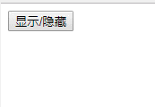
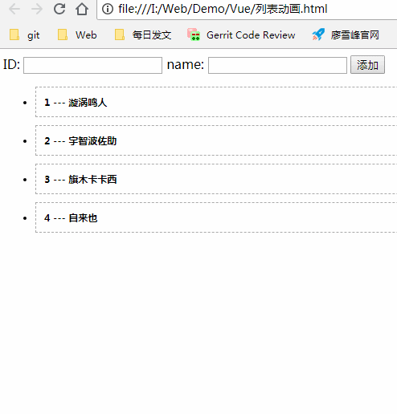
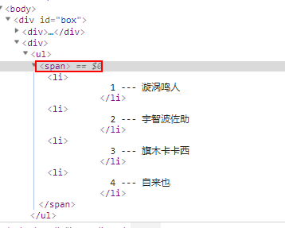
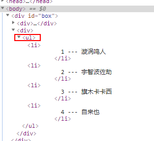

## 一、Vue的动画

为什么要有动画：动画能够提高用户的体验，帮助用户更好的理解页面中的功能；

Vue 中也有动画，不过远没有 css3 中的那么炫酷。只能有一些简单的变换，但是却可以配合第三方css动画库完成炫酷的变换。


### 1、过渡的类名

在进入/离开的过渡中，会有 6 个 class 切换。

- `v-enter`：定义**进入过渡的开始状态。**在元素被插入之前生效，在元素被插入之后的下一帧移除。
- `v-enter-active`：定义**进入过渡生效时的状态**。在整个进入过渡的阶段中应用，在元素被插入之前生效，在过渡/动画完成之后移除。这个类可以被用来定义进入过渡的过程时间，延迟和曲线函数。
- `v-enter-to`: 定义**进入过渡的结束状态。**在元素被插入之后下一帧生效 (与此同时 `v-enter` 被移除)，在过渡/动画完成之后移除。
- `v-leave`: 定义**离开过渡的开始状态**。在离开过渡被触发时立刻生效，下一帧被移除。
- `v-leave-active`：定义**离开过渡生效时的状态**。在整个离开过渡的阶段中应用，在离开过渡被触发时立刻生效，在过渡/动画完成之后移除。这个类可以被用来定义离开过渡的过程时间，延迟和曲线函数。
- `v-leave-to`: 定义**离开过渡的结束状态**。在离开过渡被触发之后下一帧生效 (与此同时 `v-leave` 被删除)，在过渡/动画完成之后移除。


要实现元素过渡，需要在添加过渡元素外边包裹上 `<transition> </transition>` 闭合标签。

然后将 `v-enter` 和  `v-leave-to` 分为一组，`v-enter-to` 和` v-leave `分为一组，`v-enter-active` 和 `v-leave-active` 分为一组。

`v-enter` 和  `v-leave-to` 设置动画的起始状态；

`v-enter-to` 和 `v-leave`  设置动画的结束状态；

`v-enter-active` 和 `v-leave-active` 设置动画的过渡时间和过渡效果。 


**示例：点击按钮实现标签的淡入淡出：**

```html
<!DOCTYPE html>
<html lang="en">

<head>
  <meta charset="UTF-8">
  <meta name="viewport" content="width=device-width, initial-scale=1.0">
  <meta http-equiv="X-UA-Compatible" content="ie=edge">
  <title>Document</title>
  <script src="./lib/vue-2.4.0.js"></script>
  <style>
    .v-enter,
    .v-leave-to {
      opacity: 0;
    }

    .v-enter-active,
    .v-leave-active {
      transition: opacity 1s ease;
    }
  </style>
</head>

<body>
  <div id="box">
    <input type="button" value="显示/隐藏" @click="flag=!flag">
    <transition>
      <h3 v-show="flag">这是一个H3标签</h3>
    </transition>
  </div>

  <script>
    var vm = new Vue({
      el: "#box",
      data: {
        flag: false
      },
      methods: {}
    });
  </script>
</body>

</html>
```



> 注意事项：
>
> 1、发生动画的元素必须被 `transition` 标签包裹。
>
> 2、动画的进入离开为css属性，写在style标签中。
>
> 3、对于这些在过渡中切换的类名来说，如果你使用一个没有名字的 `<transition>`，则 `v-`是这些类名的默认前缀。如果你使用了 `<transition name="my-transition">`，那么 `v-enter` 会替换为`my-transition-enter`。


### 2、使用插件实现动画

这里我们使用：`Animate.css` 第三方css插件。

官方网站：https://daneden.github.io/animate.css/


**使用方式：**

1、引入 animate.css 库文件

2、在 tramsition 标签中使用特定动画的类样式。

```html
<transition enter-active-class="animated zoomIn" leave-active-class="animated zoomOut" :duration="{ enter: 200, leave: 400 }">
  <h3 v-show="flag">这是一个H3标签</h3>
</transition>
```

> 注意：
>
> 1、类样式一定要加基础类样式 `animated` 
>
> 2、`enter-active-class` ：表示进入动画样式
>
> `leave-active-class`：表示离开动画样式
>
> `:duration="{ enter: 200, leave: 400 }" `： 表示进入和离开的动画时间，单位ms。
>
> 如果只写 `:duration="200" `则表示进入和离开的事件都为200ms。


### 3、半程动画

有的时候我们只想实现动画的进入，不想实现动画的退出。比如将物品加入购物车的动画，会有一个商品掉入购物车的动画效果，但是我们却不需要商品再从购物车出来的动画效果，那么如何实现动画的半程效果呢？


使用 JavaScript 钩子函数：**（写在 transition 标签中）**

```html
<transition
  v-on:before-enter="beforeEnter"
  v-on:enter="enter"
  v-on:after-enter="afterEnter"
  v-on:enter-cancelled="enterCancelled"

  v-on:before-leave="beforeLeave"
  v-on:leave="leave"
  v-on:after-leave="afterLeave"
  v-on:leave-cancelled="leaveCancelled"
>
  <!-- ... -->
</transition>
```

其中上面四个事件是进如动画的几个阶段：

- `before-enter` ：动画进入之前的状态
- `enter`：动画进入结束时的状态
- `after-enter`：动画进入完成后的操作。
- `enter-cancelled`：动画进入中断的操作（一般不使用）


既然是事件绑定函数，那么就有需要在 methods 中填写对应的事件处理函数：

```js
methods: {
  // --------
  // 进入中
  // --------

  beforeEnter: function (el) {
    // ...
  },
  enter: function (el, done) {
    // ...
    done()
  },
  afterEnter: function (el) {
    // ...
  }
```

> 其中：
>
> 1、参数 el 表示的是需要动画操作的 原生DOM对象。
>
> 2、当只用 JavaScript 过渡的时候，**在 enter 和 leave 中必须使用 done 进行回调**。enter中的done参数就相当于进入动画中的 afterEnter 函数，可以避免动画完成后的延迟。
>
> 3、这些钩子函数可以结合 CSS `transitions/animations` 使用，也可以单独使用。
>


**模拟商品掉入购物车过程**

```html
<!DOCTYPE html>
<html lang="en">

<head>
  <meta charset="UTF-8">
  <title>Document</title>
  <script src="./lib/vue-2.4.0.js"></script>
  <style>
    .ball {
      width: 20px;
      height: 20px;
      border-radius: 50%;
      background-color: blue;
      margin-top: 10px;
    }
  </style>
</head>

<body>
  <div id="box">
    <input type="button" value="快到碗里来" @click="flag = !flag">
    <transition @before-enter="beforeEnter" @enter="enter" @after-enter="afterEnter">
      <div class="ball" v-show="flag"></div>
    </transition>

  </div>

  <script>
    var vm = new Vue({
      el: "#box",
      data: {
        flag: false
      },
      methods: {
        beforeEnter(el) {
          el.style.transform = "translate(0, 0)";
        },
        enter(el, done) {
          // 这句话，没有实际的作用，但是，如果不写，出不来动画效果；
          el.offsetWidth;
          el.style.transform = "translate(100px, 400px)";
          el.style.transition = 'transform 1s';
          // 不使用的话，小圆点会停留一段时间才消失，不能立即调用 afterEnter 函数
          done();
        },
        afterEnter(el) {
          this.flag = !this.flag;
        }
      }
    });
  </script>
</body>

</html>
```

> 1、enter 中的 `el.offsetWidth;` 无实际作用，可以认为 el.offset系列语句会强制动画刷新。
>
> 2、`done(); ` 必须使用，相当于立即调用 afterEnter 函数。
>
> 3、既然是半程动画，那么意味着点击按钮的时候，每次小球都是从起始位置出发，而不会从终点位置回到其实位置的过程。


### 4、列表动画

列表增加，删除项的时候，显示动画效果。

```html
<!DOCTYPE html>
<html lang="en">

<head>
  <meta charset="UTF-8">
  <meta name="viewport" content="width=device-width, initial-scale=1.0">
  <meta http-equiv="X-UA-Compatible" content="ie=edge">
  <title>Document</title>
  <script src="./lib/vue-2.4.0.js"></script>
  <style>
    li {
      width: 100%;
      border: 1px dashed #aaa;
      margin: 10px 0;
      font: 700 12px/36px 'Microsoft YaHei';
      padding-left: 10px;
    }

    li:hover {
      border: 1px solid rgb(226, 22, 124);
      transition: border .5s;
    }

    /* 只对transition-group包裹的起作用*/

    .v-enter,
    .v-leave-to {
      opacity: 0;
      transform: translateY(-10px);
    }

    .v-enter-active,
    .v-leave-active {
      transition: transform 0.5s ease-out;
    }

    /*列表的过渡更加平缓柔和*/
    .v-move {
      transition: all 0.5s;
    }
	/*列表的过渡更加平缓柔和*/
    .v-leave-active {
      position: absolute;
    }
  </style>
</head>

<body>
  <div id="box">
    <div>
      <label for="">
        ID:
        <input type="text" v-model="id">
      </label>
      <label for="">
        name:
        <input type="text" v-model="name">
      </label>
      <input type="button" value="添加" @click="add">
    </div>

    <div>
      <ul>
        <!-- 1、使用transition-group包裹v-for渲染的li列表 -->
        <transition-group appear>
          <li v-for="(item, index) in list" :key="item.id" @click="del(index)">
            {{item.id}} --- {{item.name}}
          </li>
        </transition-group>
      </ul>
    </div>

  </div>

  <script>
    var vm = new Vue({
      el: "#box",
      data: {
        id: '',
        name: '',
        list: [{
            id: 1,
            name: '漩涡鸣人'
          },
          {
            id: 2,
            name: '宇智波佐助'
          },
          {
            id: 3,
            name: '旗木卡卡西'
          },
          {
            id: 4,
            name: '自来也'
          },
        ]
      },
      methods: {
        add() {
          this.list.push({
            id: this.id,
            name: this.name
          });
        },
        del(id) {
          this.list.splice(id, 1);
        }
      }
    });
  </script>
</body>

</html>
```

> 注意：
>
> 1、在实现列表过渡的时候，如果需要过渡的元素，是通过 `v-for` 循环渲染出来的，不能使用 transition 包裹，需要使用 `transition-group`.
>
> 2、如果要为 `v-for` 循环创建的元素设置动画，必须为每一个 元素 设置 `:key` 属性
>
> 3、过渡的类名：v-enter 等，这些类只对 `transition` 或者 `transition-group` 包裹起来的元素起作用。
>
> 4、`<transition-group>` 组件还有一个特殊之处。不仅可以进入和离开动画，**还可以改变定位**。要使用这个新功能只需了解新增的 `v-move` 特性，**它会在元素的改变定位的过程中应用**。实现删除动画的时候，后一个元素补到删除元素的位置也能动画，`v-move` 和 `v-leave-active` 结合使用，能够让列表的过渡更加平缓柔和：
>
> ```
> .v-move {
> 	transition: all 0.5s;
> }
>
> .v-leave-active {
> 	position: absolute;
> }
> ```
>
> 5、给 `transition` 或者 `transition-group` 添加属性：`appear` 可以实现页面开始加载的时候，实现动画效果。




我们发现一个问题就是，`transition-group` 会被默认当做 `span` 标签，这不是我们想要的样子鸭。



通过 为 transition-group 元素，设置 `tag` 属性，指定 `transition-group` 渲染为指定的元素，如果不指定 tag 属性，默认渲染为 span 标签，这就不符合语义了。所以我们可以把外层的 ul 去掉，然后加上` tag="ul" `来把  transition-group 标签作为 ul 标签。




*(added in 20190719)*

### 过渡模式

Vue 提供了 **过渡模式** ，用来决定元素进入和离开的顺序。

> transition 默认是元素的离开和进入同时进行。
>
> 也就是，如果 transition 包围的有两个元素，一个离开一个进入，一个离开过渡的时候另一个会同时开始进入过渡。

- `in-out`：新元素先进行过渡，完成之后当前元素过渡离开。
- `out-in`：当前元素先进行过渡，完成之后新元素过渡进入（对元素过度发生混乱的时候特别有效！）。

```html
<transition name="fade" mode="out-in">
  <!-- ... the buttons ... -->
</transition>


// 我在编写公司组件库的时候用到的，不加 out-in 的话，this.$getCode(); 会使得获取的代码混乱。(added in 20200115)
<div class="right-container">
    <transition name="fade" mode="out-in">
	<keep-alive>
	    <router-view></router-view>
	</keep-alive>
    </transition>
</div>
```

> 注意：过渡模式在 `transition-group` 中不可用，因为我们不再相互切换特有的元素。

