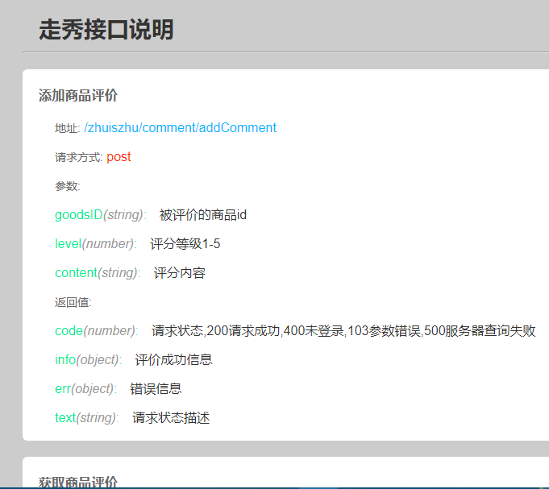
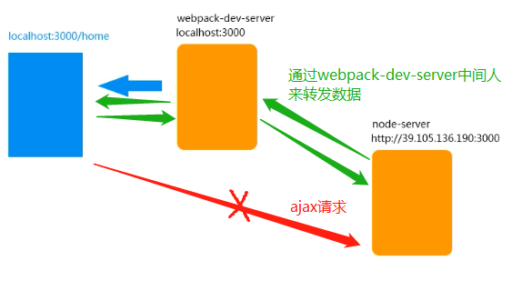

演示案例还是接着 **vue的组件**

---

## 一、http代理

走秀后台接口文档地址：<http://39.105.136.190:3000/>




现在想在我们的vue项目中调用ajax获取这些信息。

为了方便演示，我们按照jquery来使用ajax，仅仅是演示，一般vue项目不推荐使用jquery，后面还会介绍专门用来获取ajax的工具，比如：axios。


我们在首页Home请求商品列表：

```js
// Home.js
import $ from 'jquery'

export let Home = {
    template: `
        <div>
            <h1>首页</h1>
            <router-view></router-view>
            <router-view name="b"></router-view>
        </div>
    `,
    mounted() {
        $.ajax({
            url: 'http://39.105.136.190:3000/zhuiszhu/goods/getList',
            success(data) {
                console.log(data);
            }
        })
    },

}
```

这时候我们看到了一个熟悉的错误，这明显是跨域导致的。


现在我们项目ajax请求的图示如下：



### 1、什么是http代理

我们不能直接访问node-server的数据，但是可以把webpack-dev-server作为中间人，我们把ajax请求发给webpack-dev-server然后由它转发给node-server，由于服务器之间不存在同源策略的限制，所以这是行得通的。

node-server返回数据的时候也是一样的，借助webpack-dev-server来返回给我们vue项目。

这个模式就叫做http代理。


配置config文件：

```json
devServer: {
    contentBase: __dirname + '/dist',
    port: 3000,
    inline: true,
    // 每当我们访问/zhuiszhu地址的时候，就把请求转发给target地址的服务器。
    proxy: {
        '/zhuiszhu': {
            target: 'http://39.105.136.190:3000',
            secure: false,
            changeOrigin: true
        }
    }
}
```

在devServer属性中添加proxy属性，表示每当我们访问/zhuiszhu地址的时候，webpack-dev-server就把请求转发给target地址的服务器。

然后我们的ajax请求的url也要修改一下：

```js
import $ from 'jquery'

export let Home = {
    //...
    mounted() {
        $.ajax({
            url: '/zhuiszhu/goods/getList',
            success(data) {
                console.log(data);
            }
        })
    },

}
```

这样就可以打印数据了。


## 二、axios

我们说过vue项目中不要使用jquery，那么要发起ajax请求，还有一些比较好的插件，专门用来发送ajax请求的，axios就是其中一种。Axios 是一个基于 promise 的 HTTP 库，可以用在浏览器和 node.js 中。


安装axios

```
npm i axios -S
```


### 1、get

使用axios，我们获取到的值就在`data.data`里面，so easy 不是吗？

```js
axios.get('https://raw.githubusercontent.com/Daotin/pic/master/a.json').then(data => {
    console.log(data.data);
})
```


如何传参数呢？get或post的第二个参数是一个对象，在这个对象的params属性中传递参数id=2。

**（或者直接使用问号传参的方式也是可以的）**

```js
axios.get('https://raw.githubusercontent.com/Daotin/pic/master/a.json',{params:{id:2}}).then(data => {
    console.log(data.data);
})
```


### 2、post

post和get是一样的，只不过第二个参数不需要params，直接传递参数对象。

```js
axios.get('https://raw.githubusercontent.com/Daotin/pic/master/a.json',{id:2}).then(data => {
    console.log(data.data);
})
```

