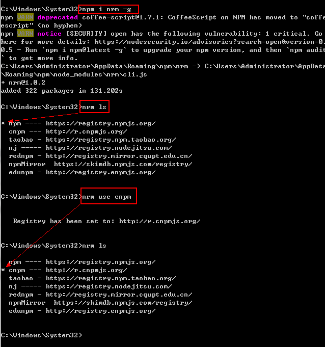

## 一、Vue的watch属性

我们需要实现这样一个案例：有三个文本框，第一个文本框是姓，第二个文本框是名，第三个文本框是前两个文本框的组合。需求是当前两个文本框数据变化的时候，第三个文本框自动组合。


**方式一：**

可以给第一，二个文本框添加`keyup` 事件，监听按键的抬起事件，然后拼接出第三个文本框的内容。

```html
<body>
  <div id="box">
    <input type="text" v-model="firstname" @keyup="keyup"> +
    <input type="text" v-model="lastname" @keyup="keyup"> =
    <input type="text" v-model="fullname">
  </div>

  <script>
    var vm = new Vue({
      el: "#box",
      data: {
        firstname: '',
        lastname: '',
        fullname: ''
      },
      methods: {
        keyup() {
          this.fullname = this.firstname + '·' + this.lastname;
        }
      }
    });
  </script>
</body>
```


**方式二：**

使用vm实例的 watch 属性，可以监视 data 中指定数据的变化，然后触发这个 watch 中对应的 function 处理函数。

function 处理函数有两个参数：

`newVal`：表示改变后的数据。

`oldVal`：表示改变之前的数据。

```html
<body>
  <div id="box">
    <input type="text" v-model="firstname"> +
    <input type="text" v-model="lastname"> =
    <input type="text" v-model="fullname">
  </div>

  <script>
    var vm = new Vue({
      el: "#box",
      data: {
        firstname: '',
        lastname: '',
        fullname: ''
      },
      methods: {},
      watch: {
        'firstname': function (newVal, oldVal) {
          this.fullname = newVal + '-' + this.lastname;
        },
        'lastname': function (newVal, oldVal) {
          this.fullname = this.firstname + '-' + newVal;
        },
      }
    });
  </script>
</body>
```


### 1、watch监视路由的改变

通过`$route.path` 来判断路由的改变。注意不要加 this。

```html
<body>
  <div id="box">
    <router-link to="/login">登陆</router-link>
    <router-link to="/register">注册</router-link>

    <router-view></router-view>
  </div>


  <script>
    // 3、创建组件模板对象
    var login = {
      template: '<h3>登录组件</h3>',
    };

    var register = {
      template: '<h3>注册组件</h3>'
    };

    // 2、创建路由对象
    var routerObj = new VueRouter({
      routes: [{
        path: '/',
        redirect: '/login'
      }, {
        path: '/login',
        component: login
      }, {
        path: '/register',
        component: register
      }],
    });

    var vm = new Vue({
      el: "#box",
      data: {},
      methods: {},
      // 4、将vm实例和路由对象联系起来
      router: routerObj,
      watch: {
        // 注意不要加 this.
        '$route.path': function (newVal, oldVal) {

          if (newVal === '/register') {
            console.log('注册页面');

          } else if (newVal === '/login') {
            console.log('登录页面');
          }
        }
      }
    });
  </script>
</body>
```


### 2、computed 监视 data数据的改变

除了 watch 之外，还有computed这个属性，可以用来监视data上的数据改变。

在 computed 中，可以定义一些 属性，这些属性，叫做 **计算属性**， 计算属性的本质，就是 一个方法，只不过我们在使用 这些计算属性的时候，是把它们的名称，直接当作属性来使用的，并不会把计算属性，当作方法去调用。

并且在计算属性的这个 function 内部，所用到的任何 data 中的数据，如果这些数据发送了变化，就会调用这个计算属性的 function 函数。

```html
<body>
  <div id="box">
    <input type="text" v-model="firstname"> +
    <input type="text" v-model="lastname"> =
    <input type="text" v-model="fullname">
  </div>

  <script>
    var vm = new Vue({
      el: "#box",
      data: {
        firstname: '',
        lastname: '',
      },
      methods: {},
      computed: {
        'fullname': function () {
          return this.firstname + '-' + this.lastname;
        }
      }
    });
  </script>
</body>
```

> 在我们的 data 里面就把 fullname去掉了。
>
> 然后在 computed 里面，只要firstname 或者 lastname 发生了改变，就会调用 fullname 这个名称的函数，但是 我们在 `<input type="text" v-model="fullname">` 中，fullname 却不需要加括号()。


### 计算属性缓存 vs 方法 

*added in 20190610.*

你可能已经注意到我们可以通过在表达式中调用方法来达到同样的效果：

```html
<body>
  <div id="box">
    <input type="text" v-model="firstname"> +
    <input type="text" v-model="lastname"> =
    <input type="text" v-model="fullname()">
  </div>

  <script>
    var vm = new Vue({
      el: "#box",
      data: {
        firstname: '',
        lastname: '',
      },
      methods: {
          fullname: function () {
              return this.firstname + '-' + this.lastname;
          }
      },
      computed: {}
    });
  </script>
</body>
```

我们可以将同一函数定义为一个方法而不是一个计算属性。两种方式的最终结果确实是完全相同的。然而，不同的是计算属性是基于它们的响应式依赖进行缓存的。只在相关响应式依赖发生改变时它们才会重新求值。这就意味着只要 message 还没有发生改变，多次访问 fullname 计算属性会立即返回之前的计算结果，而不必再次执行函数。

这也同样意味着下面的计算属性将不再更新，因为 Date.now() 不是响应式依赖：

```js
computed: {
  now: function () {
    return Date.now()
  }
}
```

相比之下，每当触发重新渲染时，调用方法将总会再次执行函数。

我们为什么需要缓存？假设我们有一个性能开销比较大的计算属性 A，它需要遍历一个巨大的数组并做大量的计算。然后我们可能有其他的计算属性依赖于 A 。如果没有缓存，我们将不可避免的多次执行 A 的 getter！

> **如果你不希望有缓存，请用方法来替代。**


### 计算属性的getter和setter

*added in 20190610*

```js
computed: {
    'fullName': function () {
        return this.firstname + '-' + this.lastname;
    }
}
```

上面例子的写法默认会解析成下面的形式：

```js
computed:{
    fullName:{
        get:function() {
            return this.firstname + '-' + this.lastname;
        }
    }
}
```

计算属性默认只有 getter ，不过在需要时你也可以提供一个 setter ：

```js
computed: {
  fullName: {
    // getter
    get: function () {
      return this.firstName + '-' + this.lastName
    },
    // setter
    set: function (newValue) {
      var names = newValue.split(' ')
      this.firstName = names[0]
      this.lastName = names[names.length - 1]
    }
  }
}
```

现在再运行 vm.fullName = 'John Doe' 时，setter 会被调用，vm.firstName 和 vm.lastName 也会相应地被更新。


### 3、watch，computed，methods的区别

- `computed`属性的结果会被缓存，除非依赖的响应式属性变化才会重新计算。主要当作属性来使用；
- `methods`方法表示一个具体的操作，主要书写业务逻辑；
- `watch`是一个对象，键是需要观察的表达式，值是对应回调函数。主要用来监听某些特定数据的变化，从而进行某些具体的业务逻辑操作；可以看作是`computed`和`methods`的结合体；


## 二、nrm 的安装使用

nrm指令作用：提供了一些最常用的NPM包镜像地址，能够让我们快速的切换安装包时候的服务器地址。

什么是镜像：原来包刚一开始是只存在于国外的NPM服务器，但是由于网络原因，经常访问不到，这时候，我们可以在国内，创建一个和官网完全一样的NPM服务器，只不过，数据都是从人家那里拿过来的，除此之外，使用方式完全一样，这个地址就是镜像地址。

1. 运行`npm i nrm -g`全局安装`nrm`包；
2. 使用`nrm ls`查看当前所有可用的镜像源地址以及当前所使用的镜像源地址；
3. 使用`nrm use npm`或`nrm use taobao`切换不同的镜像源地址；

> 注意： nrm 只是单纯的提供了几个常用的下载包的 URL地址，并能够让我们在这几个地址之间切换，很方便的进行切换，但是我们每次装包的时候，使用的装包工具，都是 npm




