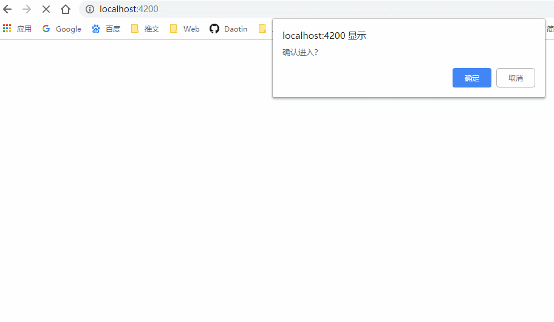

## 一、Angular中的路由

在创建项目的时候使用`--routing`参数可以使得项目自带路由模块。

```
ng new angularRouter --routing
```

生成的项目中有一个`app-routing.module.ts` 文件就是路由配置文件。


为了测试方便，创建Home和Goods，Detail页面：

```
ng g c pages/Home
ng g c pages/Goods
ng g c pages/Detail
```


路由配置：

```typescript
import { HomeComponent } from './pages/home/home.component';
import { GoodsComponent } from './pages/goods/goods.component';
import { DetailComponent } from './pages/detail/detail.component';

const routes: Routes = [
    {
        path: '',
        redirectTo: '/home',
        pathMatch: 'full'
  },
  {
    path: 'home',
    component: HomeComponent,
      children : [
          {
              path : "a",
              component : AComponent
          }
      ]
  },
  {
    path: 'goods',
    component: GoodsComponent
  },
  {
    path: 'detail',
    component: DetailComponent
  },
  // 路由不存在时匹配
  {
    path: '**',
    component: PageNotFoundComponent
  }
];
```

> 注意：
>
> 1、路径不加 `/`
>
> 2、路由不存在时匹配`**` 跳转到404页面。
>
> 3、重定位`redirectTo: '/home',`
>
> 4、pathmatch中的“full”，代表的是当path中是空时，redirectTo会转向主页的路径上


## 二、路由跳转

### 1、标签跳转

在主组件中点击a标签跳转到Home组件和Goods组件。

```html
<!-- app.component.html -->

<a [routerLink]="[ '/' ]">首页</a>
<a [routerLink]="[ '/goods' ]">商品详情页</a>
```

> 路由跳转：`[routerLink]="[ '/' ]`
>
> 第一个[]表示routerLink是可变的，路由也是数组，是为了在数组的第二个参数添加参数，比如跳转到详情页需要传入商品id。


### 2、编程式导航

在控制器（ts文件的类中）中，通过js跳转需要进行两步：

第一步:  在构造函数中声明 Router实例

例如:  constructor(private xxx:Router){}

第二部  调用Router实例的navigate()方法即可（注意,该方法接收的参数为数组类型）

例如:   this.xxx.navigate(["/home"]) 跳转到首页


示例：

```typescript
/*app.component.html*/
<button (click)="goPage('/')">首页</button>
<button (click)="goPage('/goods')">商品列表</button>

/*app.component.ts*/
import { Router } from "@angular/router";
constructor(private router: Router) { } // 注意导入Router

goPage(path) {
    this.router.navigate([path]); // 是个数组
}
```


## 三、路由传参

### 1、问号传参

goods页点击商品跳转到detail页面，商品id由地址栏传递：

```html
<!-- goods.component.html -->
<div>
    <ul>
        <li 
            *ngFor="let goods of list"
            [routerLink]="[ '/detail']" 
            [queryParams]="{goodsID:goods.id}"
        >
            <p>商品名：{{goods.name}}</p>
            <p>价格：{{goods.price}}</p>
        </li>
    </ul>

</div>
```

> 给元素添加属性  queryParams即可传递想要的数据

详情页detail从地址栏获取id：

```typescript
import { ActivatedRoute } from '@angular/router';

export class DetailComponent implements OnInit {
  constructor(
    private ar: ActivatedRoute
  ) { }

  ngOnInit() {
    let id = this.ar.snapshot.queryParams['goodsID'];
    console.log(id);
  }
}
```

> 给当前组件注入 ActivatedRoute，通过注入的服务实例来获取参数
>
> 注意：直接打印 this.ar.snapshot.queryParams 是一个对象，但是只能使用数组的方式获取。


### 2、路径传参

首先需要修改路由配置：

```json
{
    path: 'detail/:goodsID',
    component: DetailComponent
}
```

```html
<!-- goods.component.html -->

<div>
    <ul>
        <li 
        *ngFor="let goods of list" 
        [routerLink]="[ '/detail', goods.id]">
            <p>商品名：{{goods.name}}</p>
            <p>价格：{{goods.price}}</p>
        </li>
    </ul>
</div>
```

> 参数通过routerLink属性值的数组第二个元素进行传参

详情页获取id：

```typescript
import { ActivatedRoute } from '@angular/router';

export class DetailComponent implements OnInit {
  constructor(
    private ar: ActivatedRoute
  ) { }

  ngOnInit() {
    let id = this.ar.snapshot.params['goodsID'];
    console.log(id);
  }
}
```

> 获取的方式和问号传参唯一的区别：
>
> 需要通过 this.xxx.snapshot.params['goodsID']来获取数据。


**当从详情页跳转到详情页的时候，由于详情页组件没有进行组件的卸载和加载，所以不能使用上面参数快照的方式进行，而需要采用参数订阅的方式：**

```js
ngOnInit() {
    // let id = this.ar.snapshot.params['goodsID'];
    this.ar.params.subscribe(params => {
        console.log(params['goodsID']);
    })
}
```


## 四、辅助路由（多视图路由）

与vue等框架的区别在于，angular的对视图路由互相是独立的，A视图更换路由不会改变B视图的显示，反之亦然。


在主组件的html设置显示主路由和辅助路由。

```html
<!--app.component.html-->


<button (click)="goPage('/home')">首页</button>
<button (click)="goPage('/goods')">商品列表</button>

<a [routerLink]="[ {outlets:{box:'a'}} ]">辅助路由 1</a>
<a [routerLink]="[ {outlets:{box:'b'}} ]">辅助路由 2</a>

<div class="panel">
    <div class="main">
        <router-outlet></router-outlet>
    </div>
    <div class="box">
        <router-outlet name="box"></router-outlet>
    </div>
</div>
```

> 辅助路由定义一个name属性box。


修改路由：

```typescript
import { AComponent } from './components/a/a.component';
import { BComponent } from './components/b/b.component';

const routes: Routes = [
  //...
  {
    path: 'a',
    component: AComponent,
    outlet: 'box'
  },
  {
    path: 'b',
    component: BComponent,
    outlet: 'box'
  },
  //...
];
```

> 注意属性 `outlet: 'box'` 表示组件渲染的是名字为box的路由。


然后点击a标签进行辅助路由跳转：

```html
<a [routerLink]="[ {outlets:{box:'a'}} ]">辅助路由 1</a>
<a [routerLink]="[ {outlets:{box:'b'}} ]">辅助路由 2</a>
```

当点击a标签的时候，将box替换为a组件或者b组件。


可以看到：当点击主路由时不影响辅助路由的跳转，点击辅助路由时不影响主路由的跳转。并且辅助路由会以括号的形式显示在地址栏上。


## 五、路由守卫

常见的由进入的路由守卫和离开的路由守卫。**本质上来说，路由守卫就是类。**

在guards目录下新建一个进入路由守卫和一个离开路由守卫。**路由守卫其实就是一个类**，所以：

```
ng g cl guards/Enter
ng g cl guards/Leave
```


### 1、编写进入守卫模块

```typescript
import { CanActivate } from "@angular/router";

export class Enter implements CanActivate {
    canActivate(): boolean {
        // 返回true运行跳转，返回false禁止跳转
        return confirm('确认进入？');
    }
}
```

> 进入的路由守卫需要实现接口： CanActivate

### 2、将其注入到路由模块的providers属性中

```
providers: [Enter]
```

### 3、在需要监控的路由配置上添加对应的路由守卫。

```js
{
    path: 'home',
    component: HomeComponent,
    canActivate: [Enter]
  },
  {
    path: 'goods',
    component: GoodsComponent,
    canActivate: [Enter]
  },
```

如果有多个路由守卫的话，路由守卫会依次验证。


离开守卫：

离开的路由守卫需要实现接口 ：CanDeactivate (除了要实现接口，还得定义泛型)，其他都是相同的。

```js
import { CanDeactivate } from "@angular/router";
import { GoodsComponent } from "app/pages/goods/goods.component";

export class Leave implements CanDeactivate<GoodsComponent> {
    canDeactivate(): boolean {
        return confirm("你确定要离开吗?")
    }
}

```

> 注意：进入守卫和离开守卫的区别：
>
> **离开守卫除了要实现接口，还得定义泛型。**


注入：

```js
providers: [Enter,Leave]
```

添加相应的路由守卫：

```js
{
    path: 'home',
    component: HomeComponent,
    canActivate: [Enter],
    canDeactivate: [Leave]
  },
  {
    path: 'goods',
    component: GoodsComponent,
    canActivate: [Enter],
    canDeactivate: [Leave]
  },
```





