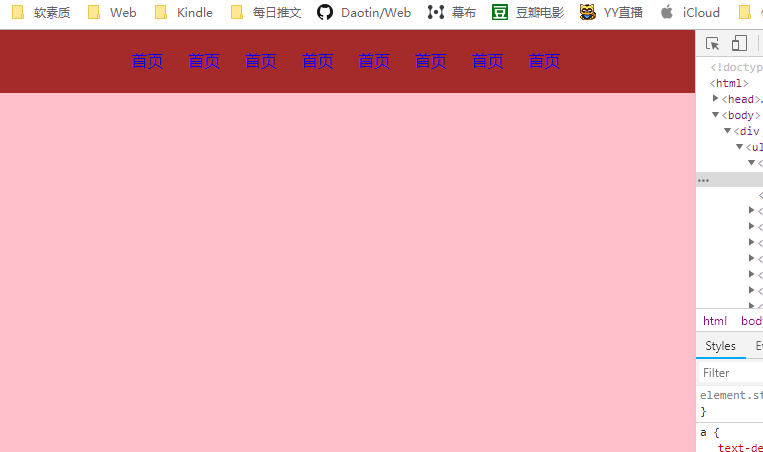

一屏网页


需要在css最开始加入下面核心代码：

```html
html,body {
	height:100%;
}
```


示例代码1：

```html
<!DOCTYPE html>
<html>

<head>
    <meta charset="UTF-8">
    <title>Document</title>
    <link rel="stylesheet" href="./css/base.css">
    <style>
        html,
        body {
            height: 100%;
        }

        .aic {
            height: 90%;
            background-color: pink;
        }

        .menu {
            height: 10%;
            background-color: brown;
        }

        .menu ul {
            width: 80%;
            height: 100%;
            background-color: #ff0;
            margin: 0 auto;

        }

        .menu li {
            float: left;
            height: 100%;
            width: 12.5%;
            position: relative;
        }

        .menu a {
            position: absolute;
            top: 50%;
            left: 50%;
            transform: translate(-50%, -50%);
        }
    </style>
</head>

<body>

    <div class="menu">
        <ul>
            <li>
                <a href="javascript:;">首页</a>
            </li>
            <li>
                <a href="javascript:;">首页</a>
            </li>
            <li>
                <a href="javascript:;">首页</a>
            </li>
            <li>
                <a href="javascript:;">首页</a>
            </li>
            <li>
                <a href="javascript:;">首页</a>
            </li>
            <li>
                <a href="javascript:;">首页</a>
            </li>
            <li>
                <a href="javascript:;">首页</a>
            </li>
            <li>
                <a href="javascript:;">首页</a>
            </li>

        </ul>
    </div>
    <div class="aic"></div>
</body>

</html>
```


上面这个不好，li的宽度设置百分比，li的个数确定了。


示例代码2：

下面的代码将ul的高度确定（比如设置为文字的高度），而不是百分比高度，然后将ul定位后，li就自动定位了，然后设置li的margin即可。

```html
<!DOCTYPE html>
<html>

<head>
    <meta charset="UTF-8">
    <title>Document</title>
    <link rel="stylesheet" href="./css/base.css">
    <style>
        html,
        body {
            height: 100%;
        }

        .aic {
            height: 90%;
            background-color: pink;
        }

        .menu {
            height: 10%;
            background-color: brown;
            position: relative;
        }

        .menu ul {
            width: 100%;
            height: 30px;
            line-height: 30px;
            text-align: center;
            position: absolute;
            top: 0;
            bottom: 0;
            margin: auto;

        }

        .menu li {
            display: inline-block;
            margin: 0 10px;

        }
    </style>
</head>

<body>

    <div class="menu">
        <ul>
            <li>
                <a href="javascript:;">首页</a>
            </li>
            <li>
                <a href="javascript:;">首页</a>
            </li>
            <li>
                <a href="javascript:;">首页</a>
            </li>
            <li>
                <a href="javascript:;">首页</a>
            </li>
            <li>
                <a href="javascript:;">首页</a>
            </li>
            <li>
                <a href="javascript:;">首页</a>
            </li>
            <li>
                <a href="javascript:;">首页</a>
            </li>
            <li>
                <a href="javascript:;">首页</a>
            </li>

        </ul>
    </div>
    <div class="aic"></div>
</body>

</html>
```





20181012

**上面的ul宽度是不确定的，而li需要一行显示并且居中显示，**

**那么就设置ul：text-align:center; 设置 li：display:inline-block.**

**此时有个问题就是 li 之间有间距，解决办法就是设置ul：font-size:0;**

vertical-align:top;是没法解决的，它解决的是上下的问题。


