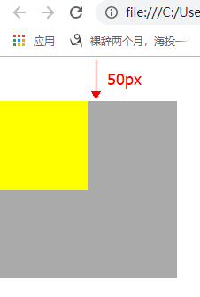

## 父元素与子元素之间的margin-top问题

原文链接：https://www.cnblogs.com/ranyonsue/p/5461749.html


### 问题描述

父元素的盒子包含一个子元素盒子，给子元素盒子一个垂直外边距margin-top的时候，父元素盒子也会往下走margin-top的值，而子元素和父元素的边距则没有发生变化，如下图：


 


源代码：

```html
<!DOCTYPE html>
<html lang="en">

<head>
  <meta charset="UTF-8">
  <meta name="viewport" content="width=device-width, initial-scale=1.0">
  <meta http-equiv="X-UA-Compatible" content="ie=edge">
  <title>Document</title>
  <style>
    body,
    html {
      padding: 0;
      margin: 0;
    }

    .parent {
      width: 200px;
      height: 200px;
      background-color: #aaa;
    }

    .children {
      width: 100px;
      height: 100px;
      background-color: yellow;
      margin-top: 50px;
    }
  </style>
</head>

<body>
  <div class="parent">
    <div class="children"></div>
  </div>
</body>

</html>
```


### 原文分析

官方介绍：

In this specification, the expression *collapsing margins* means that adjoining margins (no non-empty content, padding or border areas or clearance separate them) of two or more boxes (which may be next to one another or nested) combine to form a single margin. 

**所有毗邻的两个或更多盒元素的margin将会合并为一个margin共享之。**

毗邻的定义为：同级或者嵌套的盒元素，并且它们之间没有非空内容、Padding或Border分隔。

这就是原因了。“嵌套”的盒元素也算“毗邻”，也会 Collapsing Margins。这个合并Margin其实很常见，就是文章段落元素`<p/>`，并列很多个的时候，每一个都有上下1em的margin，但相邻的`<p/>`之间只会显示1em的间隔而不是相加的2em。


### 解决办法

这个问题的避免方法很多，只要破坏它出现的条件就行。给 **Outer Div** 加上 padding/border，或者给 **Outer Div / Inner Div** 设置为 float/position:absolute(CSS2.1规定浮动元素和绝对定位元素不参与Margin折叠)。


1、修改父元素的高度，增加 padding-top 样式模拟（padding-top：1px；常用）  

2、为父元素添加 overflow: hidden；样式即可（完美）  

3、为父元素或者子元素声明浮动（float：left；可用）  

4、为父元素添加 border-top（border-top: 1px solid transparent; 可用） 

 5、为父元素或者子元素声明绝对定位 。


